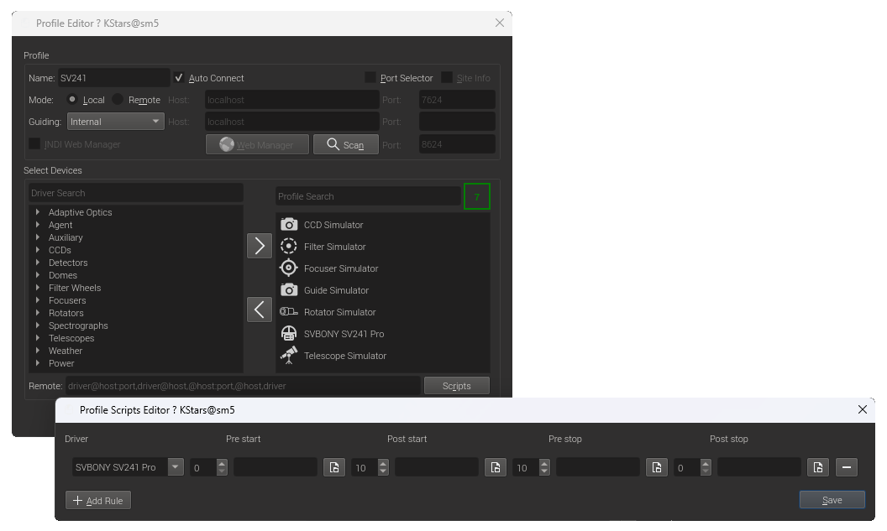
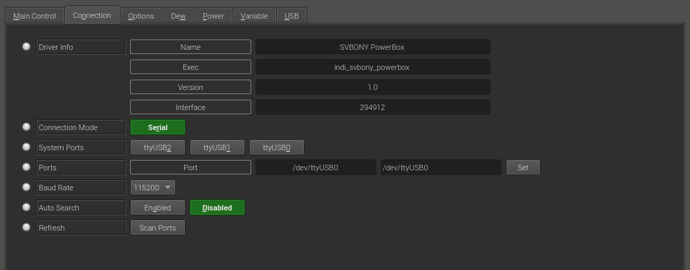
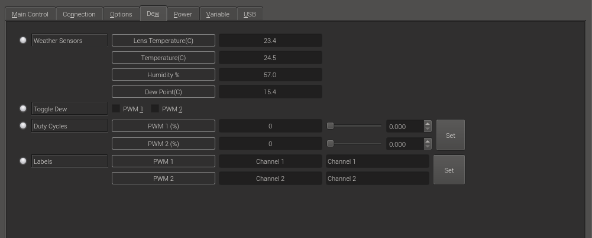
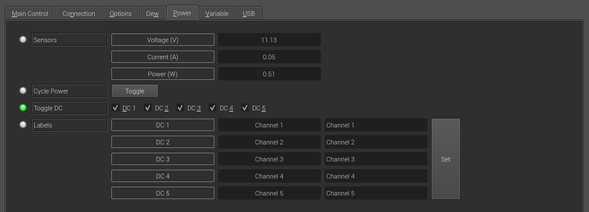
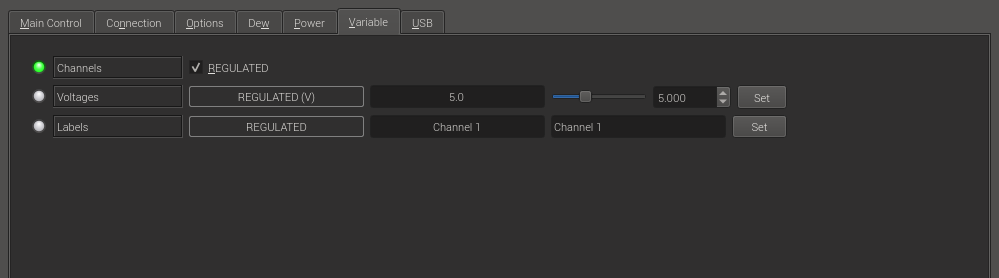
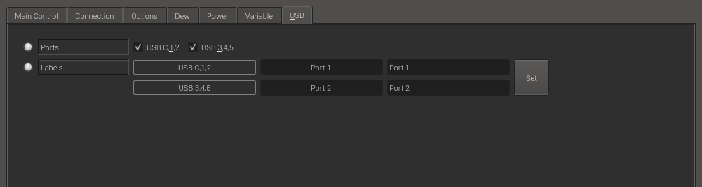

## Features

The SVBONY SV241 Pro features five 12V DC outputs with ON/OFF control, a variable voltage DC output capable of regulating up to 15.3V, one constant 12V DC output, and six USB ports supporting data communication, including Type-C. DC ports can connect to DSO cooled cameras, equatorial mounts, electronic focus controllers, motorized filter wheels, electronic field flatteners, and more.
Additionally, it features two RCA-format PWM outputs that can be connected to anti-condensation heaters. The SV241 Pro's sensors detect ambient temperature and humidity in real time, enabling automatic temperature control throughout the entire process.

The following controls are available with the INDI driver:

- PWM 12V 6A x 2 ports, cycle adjustment from 0 to 100%, ON/OFF switching possible
- DC5521 12V x 5 ports, ON/OFF switching possible
- REGULATED OUT 1 port, voltage adjustment from 0 to 15.3V
- USB
  - USB 2.0 x 4 (Type-C x 1, Type-A x 3)
  - USB 3.0 x 2 (Type-A x 2)
  - Two sets of connectors (Type-C connectors 1 and 2, and connectors 3, 4, and 5) can be switched ON/OFF

> ⚠️ **Note:**
>
>- If any device is connected to the SV241 Pro, Ekos must start the SV241 Pro before other devices when starting Ekos, and stop it after other devices when stopping Ekos.  
>- Refer to the Profile Script Editor in the Profile section described later for configuration.  
> - The SV241 Pro's INDI driver automatically connects upon startup. Manually connecting or disconnecting may cause previously connected devices to reconnect, potentially causing their INDI drivers to malfunction.

> ⚠️ **Note:**
>
> - Switching the power OFF/ON while any device is connected to the DC port or USB port may cause those devices to malfunction.

## Ekos > Profile > Script

As mentioned earlier, if there are devices connected to the SV241 Pro, you must start the SV241 Pro INDI driver and connect it before those devices.
To do this, open the Profile Scripts Editor from the [Scripts] button in the lower right corner of Ekos' Profile Editor and set a wait time to control the execution order of the SV241 Pro.

### Settings in Profile Script Editor

1. Add one rule using [Add Rule].
2. Specify Driver: “SVBONY SV241 Pro”.
3. Post start: Specify the wait time in seconds when launching the SV241 Pro INDI driver. With this setting, other drivers will wait for the specified number of seconds before launching.
4. Pre stop: Specify the wait time in seconds from Ekos [Stop] until SV241 Pro begins shutdown. Ensure sufficient time is set for other drivers to terminate. With this setting, SV241 Pro will shut down after the specified time elapses, meaning after other drivers have finished.

## Connection

In Connection, configure the connection settings between the computer and the SV241 Pro.

- System Ports: A list of available serial ports.
- Ports: You can enter the port name directly.
- Baud Rate: Fixed at 115200. Do not change this setting.
- Auto Search:
  - Enabled: Automatically detects the target serial port.
  - Disabled: Does not perform automatic serial port detection.
- Refresh > Scan Ports: Rescans the computer's current serial ports and refreshes the System Ports list.

## Dew

In Dew section, configure the PMW OUT settings.

- Toggle Dew: Switches PWM 1 and 2 ON/OFF.
- Duty Cycle: Sets the output level of PWM 1 and 2 from 0% to 100%. The set level is effective when Toggle Dew is ON.

## Power

In the Power section, configure the DC OUT settings.

- Cycle Power: Turns all DC 1-5 and USB connectors OFF continuously, then ON.
- Toggle DC: Switches DC 1 through 5 ON/OFF.

## Variable

In the Variable section, configure the REGULATED OUT settings.

- Channels: Toggle the ON/OFF state of REGULATED OUT.
- Voltage: Adjust the output voltage between 0 and 15.3. The set output voltage is active when Channels is ON.

## USB

In the USB section, set the USB ports.

- Ports: Switch between USB Type-C, 1, and 2, and USB 3, 4, and 5.