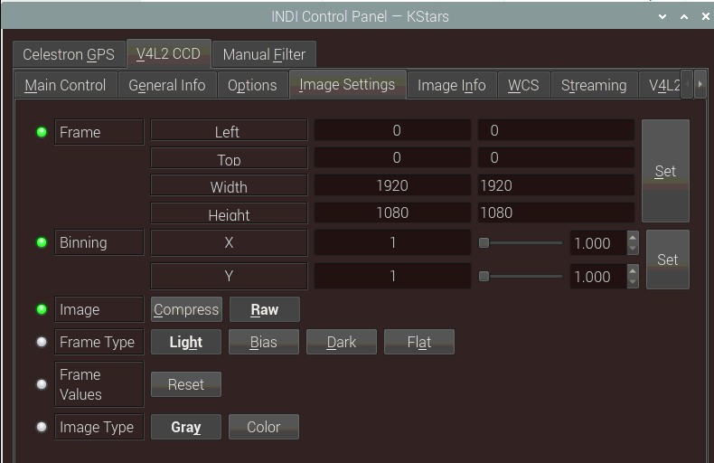
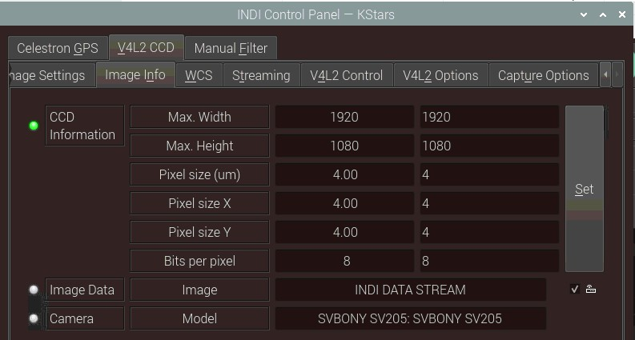
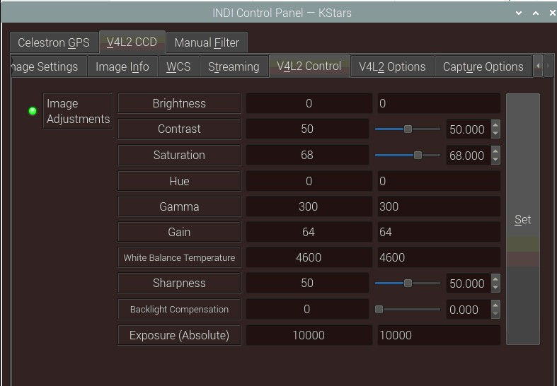
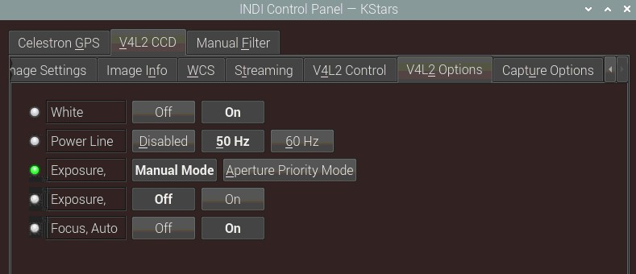
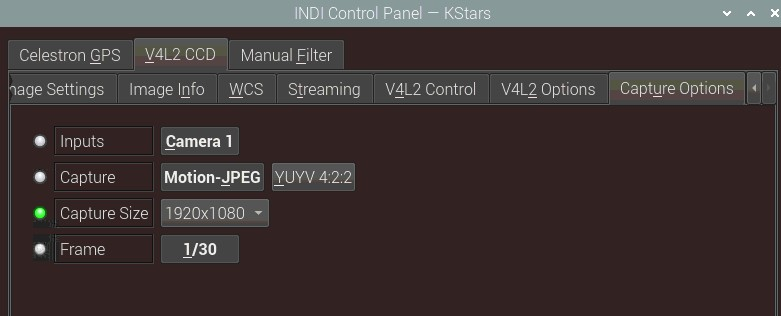

# 

UVC Web Cameras

## Features

The driver constructs all the controls provided by the underlying Video4Linux device such as brightness, gamma, contrast...etc in addition to any device-specific properties. Subframing and binning is supported in software. Both gray scale and color modes are supported. Pleas note that due to limitation in V4L2 framework, you cannot change the camera resolution unless you disconnect and reconnect again. Video streaming is supported as well as recording files in .SER format (Astronomy video format supported by many astronomy image processing software such as  [Registax](http://www.astronomie.be/registax/)  and  [Siril](http://free-astro.vinvin.tf/index.php/Siril)). The driver also supports simple stacking.

## Supported Cameras

Any UVC class camera is supported. These include many general-purpose web cameras and astronomy web cameras such as:

-   NexImage
-   Logitech
-   SVBONY
-   Skyris
-   iOptron iPolar

Depending on the camera capabilities, the driver would generate controls for image adjustments, exposure, and resolution controls accordingly.

## Operation

Once you're connected (default video port is /dev/video0), you can capture images as FITS from the camera, or use video streaming if supported by your client.

INDI will detect any extra options that your device may support and if found, INDI shall construct dynamic controls (knobs & switches) to control these features.

### Connecting to Camera

If you plugin a UVC class camera, the operating system would automatically assign it a video port starting with  **/dev/video0**  for the first camera, and  **/dev/video1**  for the second camera and so on.

Therefore, if you have one camera, there is no further action required to connect to the camera.

### Main Control Panel

You can specify the exposure in seconds. Many UVC cameras have limited exposures up to 1 second usually. Unless you camera supports long exposures, you would be limited to subsecond exposures.

To simulate longer exposures, you can use  **Stacking**  as explained below.

**Stacking:**

1.  Connect camera and choose capture format (use YUV formats if any).
2.  Be sure to use GRAY images (linearization is not handled and crashes when used with COLOR images).
3.  You may start streaming to adjust focus (I usually augment brightness to 200 here). You may check quantization (dealing with limited range colorspace quantization) and linearization buttons in the Capture tab to see the effects of those processings.
4.  Readjust your brightness to a middle value (I use default 128) and take a series of stacked exposures to determine the best exposure time which will suit your needs. Before using a stack mode, be sure to  **check**  linearization in the Capture Tab. It is made internally but as linear/stacked exposures are 16bit depth, checking this button sets buffer sizes as required(not yet automatic). Using my setup I use 1.8 second exposure (yielding in ~15 stacked frames, startup time is quite high).
5.  You may take a dark frame now using the corresponding stack mode and your desired exposure time. Don't forget to close your tube, select Take dark and start an exposure. This will create a dark frame which will be subtracted to all subsequent stacked exposures. You may reset this dark frame or take another one as needed.
6.  Use additive stack mode to perform subsequent exposures.

### Image Settings

Under image settings, you can select the Region-Of-Interest (ROI) or Frame for your image. Most clients (e.g. Ekos) already set this automatically for you, but it can be set here directly as well. By default, the image is sent uncompressed, you can select to compress it to test if capture or streaming performance can be improved. It is recommended to leave it to Raw.

The camera frame is transferred by default as a  **Gray**  scale image. To switch to RGB, click  **Color**  switch. Gray scale images would be more suitable for guiding applications.

### Image Info

The camera information is available under the Image Info Tab. It is very important to have all the information correct in the  **CCD Information**  property. Since UVC cameras do not share  **Pixel Size**  information (which is important to calculate the Field of View (FOV) of the camera), it is set manually depending on the detected camera model. If the camera model is recognized, it would be set automatically. Otherwise, you would get a message advising you to report the camera name and model to an  [INDI Forum thread](https://bit.ly/2S1Vxjq)  so that the pixel information can be added to the driver in future driver releases.

### Streaming & Recording

Almost all UVC cameras support video streaming. The INDI driver supports recording to the following file formats:

-   **SER**: LuCam Recorder file. SER files are used for planetary, lunar, and solar captures. It a lossless format so it reserves all the information in the image as-is. To view SER files, it is recommended to use the excellent  [SER Player](https://sites.google.com/site/astropipp/ser-player). Beware that SER file sizes can grow very big quite rapidly if the camera resolution and FPS are high.
-   **OGV**: OGV is a video container format which encodes video using Theora codecs. Unlike  _lossless_  SER, OGV Theora is a  _lossy_  format. Therefore, video frame details are inexact approximiation of the data in order to save size. This means you can get higher throughput (FPS) on limited hardware such as the raspberry pi, but with slightly less detail than a SER file.

You can think of  **SER**  vs  **OGV**  the same as  **PNG**  vs  **JPG**. The former produces high quality images but very large file sizes, while the latter produces excellent images at a much lower size. The decision to use which format depends on your requirements and goals.

The Expose property controls the streaming exposure parameters:

-   **Duration**: Specifies duration for 1 frame which is by default 1/10 seconds or 100 milliseconds (10 FPS). Please note that this only works for cameras that  **explicitly**  support  _manual_  exposure settings. On many cameras it is not possible to control the exact video streaming exposure duration and this setting is completely ignored.
-   **Divisor**: If the frame rate is high and the network bandwidth is limited, you can opt to skip frames. By default it is set to 1 which means no frames are skipped. Setting it to 2 means every  _other_  frame is skipped (30 FPS would then become 15FPS). Setting to 3 means a frame is skipped for every 3 frames and so on.

#### Streaming

By clickong on  **Stream On**, video streaming begins at the specified settings. If the image is gray scale, you can change it to Color in the  **Image Settings**  tab. The client must explicitly support video streaming, otherwise, you would end up with many files cluttering up the disk space. Supported clients include Ekos.

The  **Encoder**  property sets the video streaming encoding type. By default, all frames are sent as lossless RAW files. This reserves all the information, but at the expsene of lower FPS. On the otherhand, some cameras can support Motion JPEG video streaming which  _may_  significantly increases streaming performance.

#### Recording

Do not stream and record at the same time as this would significantly degrate the recording performance. Only record with streaming turned off

INDI supports recording video frames to the SER and OGV file formats. The recorded file name is dictacted by the Record File property.

-   **Dir**: Specify directory name. By default, it is stored in the user home directory with the prefix indi_D_ whereas D is the current date.
-   **Name**: Specificy file name. By default it is set as indi_record__T_ whereas T is the current time.

You can mix and match _D_ and _T_ in the file name template as desired.

Video recording can be specified using three options:

1.  **Record On**: This starts the video recording without any limits. To end recording, press  **Record Off**.
2.  **Record (Duration)**: Record video for this many seconds specificed in the  **Record Options**  property then stop.
3.  **Record (Frames)**: Record video for this many frames specificed in the  **Record Options**  property then stop.

### V4L2 Control

Set image adjustments for the video. Streaming and recording must be OFF when making the adjustments otherwise the changes will fail.

Do not adjust the Absolute Exposure property unless you want to manually control exposure directly yourself overriding the exposure duration property.

### V42L Options

Exposure and Focus settings include White balance automatic adjustments.

### Capture Options

Adjust the capture format and resolution. After changing the Capture size, make sure to  **Reset**  the frame so that the new resolution size is reflected in the settings. You should only change these settings when streaming and recording are OFF.

## Issues

Some users  [reported problems using the driver](https://stellarmate.com/). If you found a bug, please report it at INDI's  [bug tracking system](https://sourceforge.net/p/indi/bugs/)  at SourceForge. (You can log in with a variety of existing accounts, including Google, Yahoo and OpenID.)