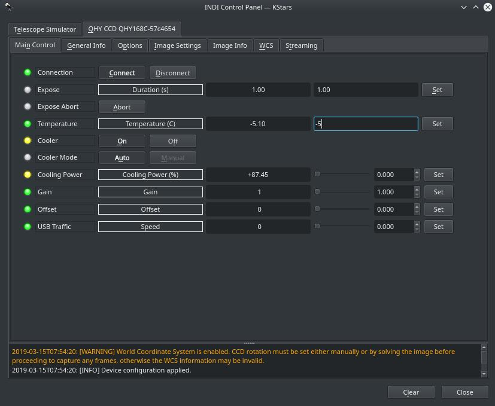
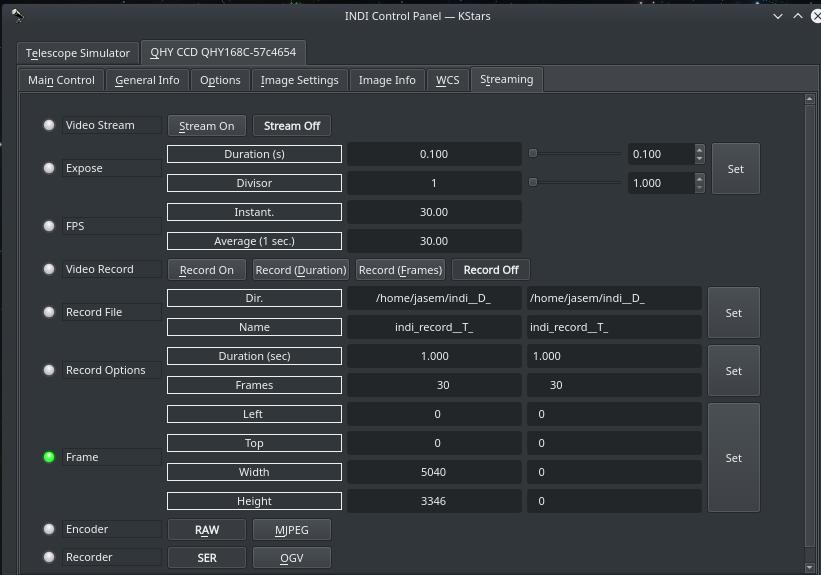

## Features

The driver supports capture, binning, setting temperature, gain and offset adjustment, subframing, and control of internal QHY Color-Filter-Wheel (CFW). Moreover, guiding via ST4 port is also supported.

For QHY cameras with built-in Filter Wheels (e.g. Minicam8) or Filter wheels that are connected  **directly**  to the camera body, then there is no need to specify a separate Filter Wheel driver in your equipment profile. Just the QHY CCD driver is sufficient. In your optical train setup, simply select the Filter Wheel as your camera.

Temperature control is available if the camera is equipped with TEC cooler. Depending on the camera, TEC cooler can be controlled either automatically or manually.

If you directly set the temperature, the driver switches to automatic cooler mode where the cooler power is adjusted by the driver until the desired temperature is reached and kept. Some camera allow manual TEC control where you can directly set the TEC cooler power. In this manual mode, the cooler power is kept constant regardless of the temperature. Manual mode can be useful for advanced users who wishes to slow the cooling process for their camera since the QHY driver starts cooling to 100% when a lower temperature is requested.

You can also enable video streaming and save recording in LuCam SER format or OGV format. When enabling video streaming, the  _Rate Divisor_  property decides how many frames to skip before sending it to the client while the FPS sets the desired frames-per-second requested. When tested on embedeed platforms like Raspbeerry PI, the frames due to USB 2.0 limitations are in the range of 12-18 FPS.

The driver can detect and run multiple devices, therefore you only need to run one instance of the driver even if you have multiple CCDs connected. i.e.

indiserver -v indi_qhy_ccd

## Operation

Once you're connected, you can capture images as FITS from the camera. You can also adjust gain and set temperature if cooling is supported. Images can be downloaded to the client or saved directly to the hard disk. If the CCD has an ST4 port, it should supported guiding via any INDI-compatible guiding application such as Ekos/PHD2.

### Amp Glow Control

Some cameras provide a toggle to enable or disable Amp-glow control. However, for most cameras, this setting is already enabled by default in the camera and no control is exposed. That is, amp-glow control is enabled all the time.