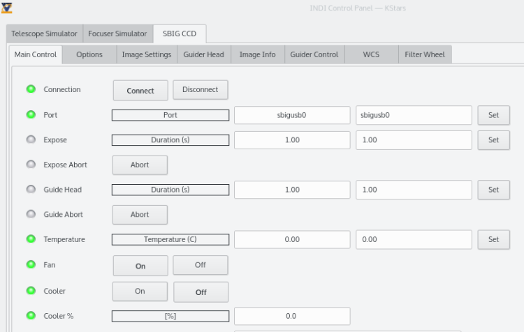
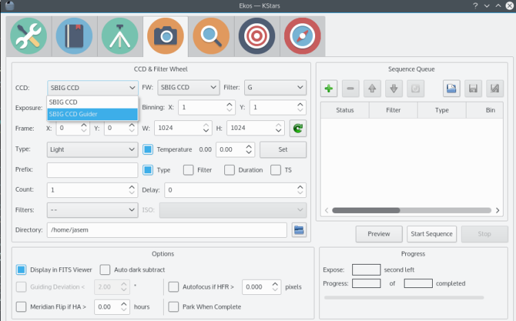

## Features

INDI SBIG driver supports all SBIG family of CCDs/Guider and Filter wheels. Both USB & Parallel Port versions are supported. Mono and color CCDs are fully supported as well. INDI SBIG drivers are available for x86 and ARM architectures in both 32bit and 64bit. The installer auto detects your architecture and installs the appropriate driver accordingly.

## Operation

Before connection, you verify the device port setting. If you are connected via USB, the port should be sbigusb0 or sbigusb1 (if you have more than one SBIG connected)...etc. For parallel port, the port should be sbiglpt0...etc.

Parallel port requires special setup and installing additional software. For more details please checkout this  [INDI forum post](https://www.indilib.org/forum/ccds-dslrs/11223-sbig-connection-problem-st7-parallel-port.html#83887).

Once you're connected, you can capture images as FITS from the camera, control temperature, and set image binning and frame subset. The driver will automatically upload these images to the client in FITS format. If your camera is equipped with a filter wheel, you can control the filter wheel from the  _Filter Wheel_  tab where you can change filters and set their respective names.

----------

The drivers supports saving World-Coordinate-System (WCS) information in the FITS header. WCS enables you to view the image coordinates (RA/DEC) in several FITS editors. Furthermore, if WCS is enabled, you can click any where inside your image and slew to the mount to that particular point which greatly facilitates framing.

Fan and cooler control can be set in the Main Control tab. If you are using the CCD as a guider, clients such as PHD2 and Ekos, can be used to guide your mount.

For CCDs that come with a guide head, you can set the parameters of the guide head in the  _Guider Head_  tab including subframing and image type.

