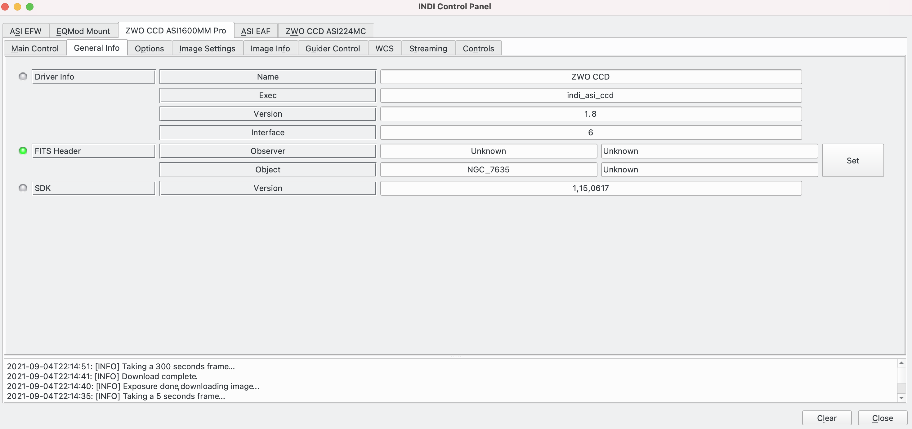
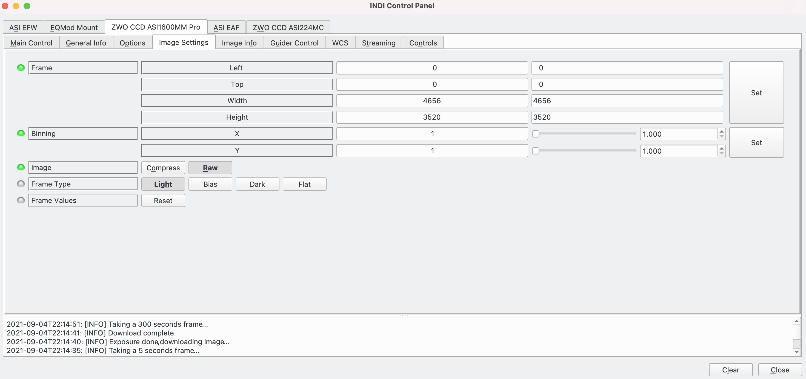
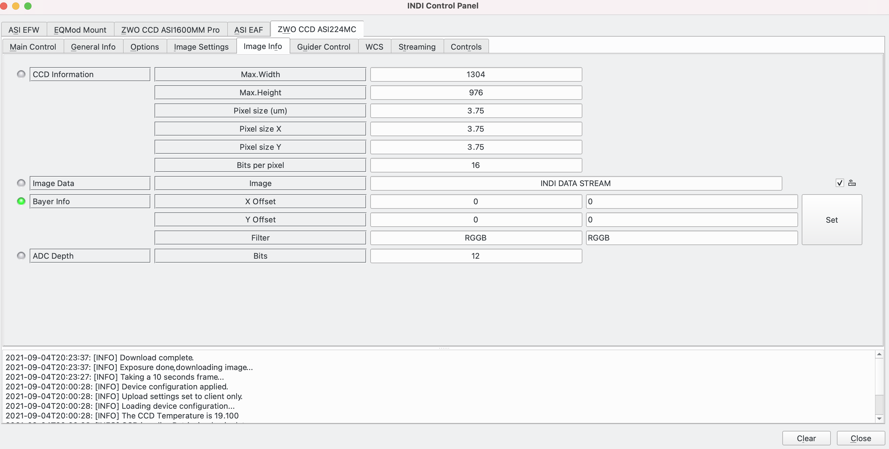
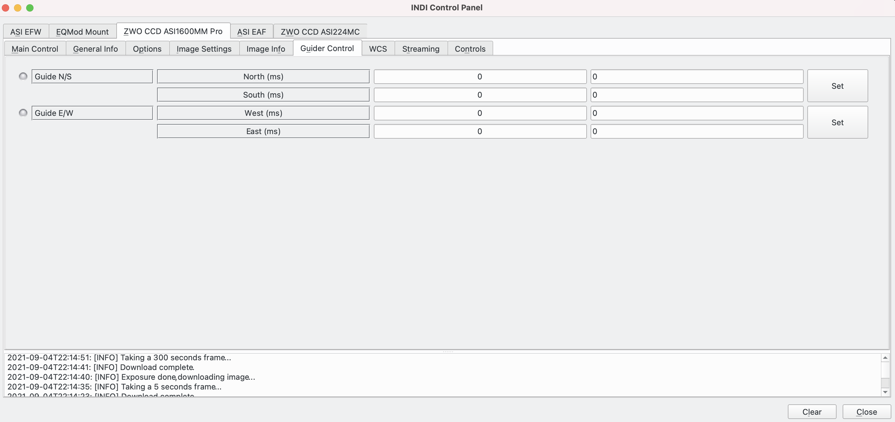
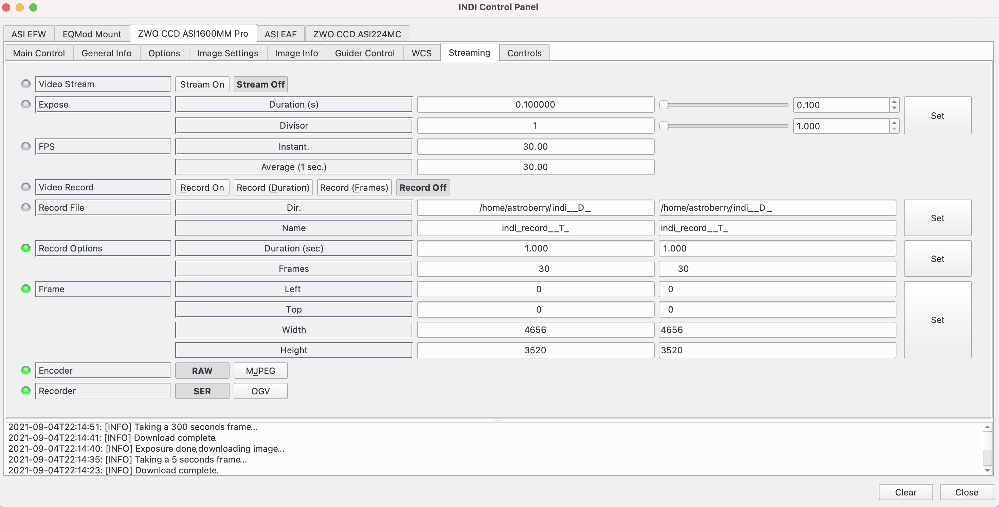

## Features

This is the INDI driver for ZWO ASI cameras. It supports all models. The camera  **must**  be powered on and connected before you run the INDI driver.

The INDI control panel exposes data associated with the device and permits parameters to be set. In normal operation, higher level software, such as EKOS, will control the ASI Camera, but this document will utilise the INDI control panel GUI to explain the available features.

Current features supported:

-   All ASI cameras including colour and monochrome cameras
-   Cooling support

## Connectivity

ZWO ASI cameras come with USB connectors. You may connect the cameras and accessories either directly to the PC via USB, or via a ZWO Camera onboard USB hub (if any). However, as a general rule of thumb, direct connection to PC is always more stable than through a hub.

There are two ZWO camera drivers available:

-   **ZWO CCD**: This is the standard  **Multi-Camera**  driver. By specifying this, a  **Single**  driver is controlling all the cameras connected to the PC. It is the default and recommended driver.
-   **ZWO Camera 1, 2, 3**: These are  _experimental_ **Single Camera Drivers**. These drivers cannot be intermixed with ZWO CCD, only one of them may be used at a time. The driver were created to address issues with operating multiple cameras simultaneously. While the ZWO SDK claims that it can support multiple cameras from a single driver instance, in reality when multiple cameras are streaming and downloading at the same time, the SDK may lag in performance. For example, when the primary camera is downloading an image, the guide camera download may get slower as a result. Therefore, these drivers can be used by specifying the primary camera in the equipment profile as ZWO Camera 1. If a Guide camera also exists, select ZWO Camera 2 for it. Once the driver starts, you can assign which physical camera is assigned to the driver. By default, the driver picks the cameras in order (i.e. ZWO Camera 1 picks the first camera detected on USB, ZWO Camera 2 picks the second camera detected and so forth).

## Operation

### Main Control Tab

[

The  **Main Control**  tab deals with the following parameters:

-   **Connection**: Displays and sets whether the driver is connected or not.
-   **Exposure**: The remaining time of the current exposure.
-   **Abort Exposure**: Allows the current exposure to be aborted.
-   **Temperature**: If the camera supports cooling, displays the current sensor temperature. In addition, a target temperature can be set.
-   **Cooling Power**: Displays the percentage of maximum power going to the camera.
-   **Cooler**: If the camera supports cooling, allows the cooler to be turned on / off.

The way cooling works is to set a target temperature. The cooler then adjusts the power to the cooler to firstly change the sensor temperature to the target temperature and then to maintain that temperature ongoing.

### General Info Tab

[
The  **General Info**  tab displays information about the driver:

-   **Driver Info**: Displays information about the driver.
-   **FITS Header**: Allows information to be added to the FITS header of captured images. This is typically useful in post processing of the images:
    -   **Observer**: Who is taking the photograph.
    -   **Object**: The target being photographed.
-   **SDK Version**:

### The Options Tab

The  **Options**  tab allows a number of parameters to be viewed and set.

-   **Polling**: Polling period in milliseconds.
-   **Debug**: Displays the debug status. Note that debug options are set in Ekos as described  [here](https://stellarmate.com/support/logs-submission.html). If set,  **Debug Levels**,  **Logging Levels** and **Log Output**  details are displayed.
-   **Simulation**: Enable / disable simulation mode for testing purposes. In Simulation mode, parameters can be changed but not sent to the device.
-   **Configuration**: Manage the driver configuration file.
    -   **Load**: Load the last saved settings.
    -   **Save**: Save the driver settings.
    -   **Default**: Restore default settings that were shipped with the driver.
    -   **Purge**: Delete the configuration file.
-   **Snoop devices:** The driver supports the ability to listen to, or snoop, on parameters of other drivers. For example, the device could get the RA / Dec coordinates from the mount driver to add to the FITS header of the captured image.
-   **Telescope**: Whether the camera is the main imaging camera or a guidescope.
-   **Upload**: Parameters that define where images will be sent:
    -   **Client**: Images are sent to the Indi server client.
    -   **Local**: Images are stored locally on the device running Indiserver and if so,  **Upload Settings**  defines where the images will be stored.
    -   **Both**: Images are stored locally and sent to the client.
-   **Upload Settings**: When images are to be stored locally, the directory to store them in.

### Image Setting Tab

[

The  **Image Settings**  tab allows parameters associated with the images taken by the device to be viewed and set:

-   **Frame**: Defines the Frame size of the image.
-   **Binning**: Defines the binning level.
-   **Image**: Save images either  **Compressed**  or  **Raw**.
-   **Frame Type**: The type of frame,  **Light**,  **Bias**,  **Dark**  or  **Flat**.
-   **Frame Values**: Allows changes made to the  **Frame**  size to be reset (to the sensor size).

### Image Info Tab

[

The  **Image Info**  tab displays information about the camera device:

-   **CCD information**:
    -   **Max Width / Height**: The sensor size in pixels. This determines the maximum  **Frame**  size.
    -   **Pixel Size**: Defines the pixel dimensions in microns.
    -   **Bits per pixel**: Bit depth per pixel.
-   **Image Data**: Allows image data to be sent on the INDI Data Stream.
-   **Bayer Info**: This is only relevant to colour cameras:
    -   **X / Y Offset**: X, Y offset for the matrix.
    -   **Filter**: The Bayer matrix.
-   **ADC Depth**: Bit depth of the camera's Analog to Digital Converter (ADC).

### Guider Control Tab

[

The  **Guider Control**  tab supports parameters associated with guiding from the camera to the mount if the camera has an ST4 port.

-   **Guide N/S**: North / South pulse duration in milliseconds.
-   **Guide E/W**: East / West pulse duration in milliseconds.

Note that generally people guide from a Guiding application (like PHD2 or Ekos internal guider) directly to the mount in preference to using an ST4 cable from the camera to the mount. In this case these parameters can be ignored.

### WCS Tab

The  **WCS**  tab displays and sets parameters associated with the World Coordinate System (WCS).

-   **WCS**: Allows WCS to be enabled / disabled.
-   **CCD FOV**: Dispays the rotation angle of the CCD as determined during the most recent plate solve.

In general, a WCS allows mapping between celestial coordinates and an image. Specifically here, it allows a real world mapping of space in RA / Dec coordinates to an image in FITS format. The mapping goes both ways.

If enabled, the FITS viewer in Ekos will, after a successful initial plate solve, not only display the pixel x, y coordinates as the mouse is moved across the image, but also the cooresponding RA / Dec coordinates. In addition a request can be made from the FITS viewed to slew the telescope to centre the FOV where the mouse is located.

The CCD FOV Rotator, dispays the rotation angle of the CCD as determined during the most recent plate solve.

### Streaming Tab

The  **Streaming**  tab displays and set parameters associated with video streaming:

-   **Video Stream**: Either  **Stream On**  or  **Stream Off**.
-   **Expose**: Parameters defining the current exposure length
-   **FPS**: Parameters defining the frames per second (FPS).
-   **Video Record**: How to take the video.
-   **Record File**: The directory and filename of the video.
-   **Record Options**:
    -   **Duration**: The duration in seconds of the video.
    -   **Frames**: The number of frames of the video.
-   **Frame**: The frame dimensions relative to the sensor size.
-   **Encoder**: Either  **Raw**  or  **MJPEG**.
-   **Format**: Video format, either  **SER**  or  **OGV**.

Typically video format is used in planetary photography and not in DSO photography.

### Controls Tab

[

The  **Controls**  tab allows for a number of parameters to be adjusted:

-   **Controls**:
    -   **Gain**: Camera gain.
    -   **Offset**: Camera offset.
-   **Bandwidth**: The percentage of the USB bus speed the camera will try to use. The higher the value the faster data will be transferred from the camera over USB. However, if set too high, data transfer problems like dropped frames will result. The appropriate setting will depend upon whether USB 2 or 3 is used, how good the cable is and how good the receiving computer is at receiving the data.
-   **Flip**: Flip the image:
    -   0 - no flip
    -   1 - Flip the image horizontally.
    -   2 - Flip the image vertically.
    -   3 - Flip the image both horizontally and vertically.
-   **AutoExpMaxGain**: For automatic exposures, the maximum gain.
-   **AutoExpMaxExpMs**: For automation exposures, the maximum exposure in milliseconds.
-   **AutoExposureTargetBrightness**: For automatic exposures the target brightness.
-   **HardwareBin**: For cameras that support hardware binning. If you intend to use this please read the manual for your camera as there could be side effects, such as the camera changing the way the ADC is read to use a different bit depth.
-   **HighSpeedMode**: Some cameras have the ability to record ADC values in two modes. For example, the ASI1600mm pro can record in either 12bit ADC or 10bit ADC. Recording in 10bit mode loses bit depth but is faster. Setting **HighSpeedMode**  allows the camera to record in 10bit mode. This feature would normally be used for planetary imaging when combined with a  **Format**  of 8bit in order to maximise the frames / second.
-   **PatternAdjust**:
-   **Set Auto**:
    -   **Gain**: For Auto exposure automatically set the  **Gain**.
    -   **Bandwidth**: Automatically determine the  **Bandwidth**  parameter.
-   **Format**: Can be set to either  **Raw 8bit**  or  **Raw 16bit**.
-   **Blink**: A blink inserts a delay between consecutive exposures.
    -   **Blinks before exposure**: The number of blinks before the next exposure.
    -   **Blink duration**: The duration in seconds of each blink.

For colour cameras the INDI control panel looks slightly different with additional parameters:

Additional parameters:

-   **WB_R / B**: These parameters set the white balance of a colour image by adjusting the red channel (WB_R) and blue channel (WB_B) relative to the green channel. Usually ZWO recommend WB_R to be set to 52 and WB_B to 95 but consult your camera manual in case other values are recommended.
-   **MonoBin**: Whereas binning a colour camera will result in pixels of the same colour being combined, mono-binning will ignore the bayer pattern and bin in the same way a monochrome camera would, resulting in a monochrome image.
-   Format: In addition to **Raw 8bit**  or  **Raw 16bit**  there are 2 additional options:
    -   **RGB 24**: Store the red channel as 8bit, same from green and blue making 24 bits in total.
    -   **Luma**: The Luma format can be used for videos.