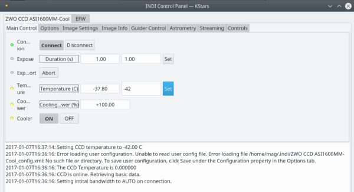

## Features

This is the INDI driver for the ZWO Optics ASI cameras and filter wheels. It supports all models. The camera  **must**  be powered and connected before you run the INDI driver,

## Operation

You can set the exposure time, and control cameras properties including gain, offset, brightness..etc. Other parameters include USB bandwidth control and auto adjustments. For example on ARM systems it's advised to set a value of 40 if you find problems with many broken frames.

Once you're connected, you can capture images as FITS from the camera, control temperature, and set image binning and frame subset. The driver will automatically upload these images to the client in FITS format.

You can enable video streaming which is only available in the  **Luma**  video format. It can record videos in SER format. You can set the exposure time for the video stream in the  **Streaming**  tab.

For models equipped with ST4 port, the driver supports pulse guiding.