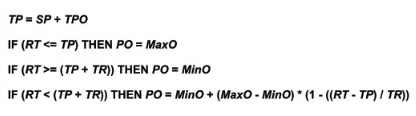
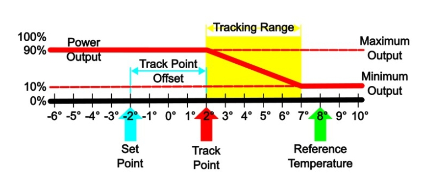
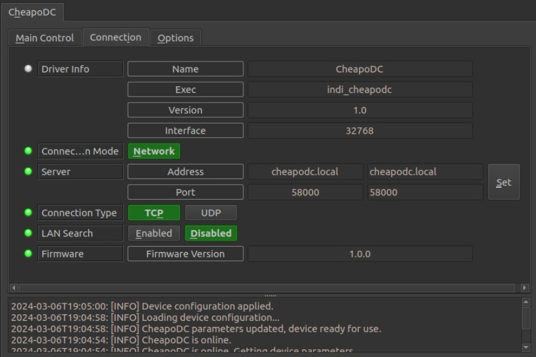
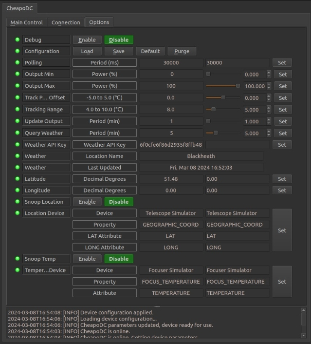
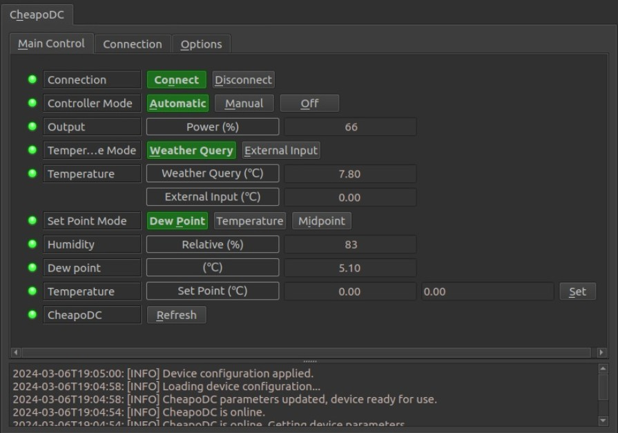

## Installation

INDI CheapoDC driver is included with libindi 2.0.7+.

## Features

The Cheapo Dew Controller, or CheapoDC, is a low-cost, low-component count, easy-to-build DIY dew controller based on an ESP32-C3 mini. Parts required include the ESP32-C3 mini, one or two MOSFET modules, a 12V to a 5V buck converter, some protoboard, a couple of RCA sockets, a 12V barrel socket, and wire. The cost of the parts should be less than $20 for a unit that controls 2 dew heater straps. Details for the build and operation of CheapoDC can be found on the  [project site](https://github.com/hcomet/CheapoDC).

Current features include:

-   Automated tracking using either  [OpenWeather](https://openweathermap.org/)  or  [Open-Meteo](https://open-meteo.com/)  to retrieve ambient temperature, humidity and dew point.
-   Designed to work with Indilib with the ability to leverage geographic coordinates from your mount and temperature from your focuser temperature probe.
-   Controller modes supporting both Automated and Manual operation.
-   Flexible tracking modes supporting multiple methods to calculate output power to the two output channels.
-   Can operate in WiFi Access Point mode in either a semi-Automated or Manual mode if no network or Internet connectivity is available. But the CheapoDC does work best with internet connectivity,

A primary goal was to keep the build simple with minimal parts. This is done by leveraging the ESP32 WiFi capability to query one of the open weather service APIs. API queries are used for ambient temperature, humidity and dew point. This is then used for calculating CheapoDC's power output. No additional integrated components, such as temperature or humidity probes, are required. Many astrophotographers already have temperature probes for their electronic focuser and these may be leveraged through the INDI driver. The responsiveness and aggressiveness of the controller can be adjusted through the CheapoDC configuration settings. All temperature values reported in the driver interface are in degrees celsius.

When running the driver for the first time, the default Server Address,  **cheapodc.local**, should work. If not, go to the  **Connection**  tab to change the Server Address. Enter your CheapoDC IP address or modified hostname then retry the connection using the Connect button on the  **Main Control**  tab. After connecting succesfully go to the  **Options**  tab and save the settings.

## Controller Power Output Calculation

Controller output is calculated by determining the position of a reference temperature withing a tracking range. This is outlined below.

### Output Calculation Variables:

-   **Set Point**  =  **_SP_**
    -   a temperature point set using the  **Set Point Mode**  selection.
-   **Reference Temperature**  =  **_RT_**
    -   as set using the  **Temperature Mode**  selection.
-   **Track Point**  =  **_TP_**
    -   the calculated temperature point where the  **Tracking Range**  starts. A  **Reference Temperature**  less than or equal to the  **Track Point**  will cause the controller to use  **Maximum Output**.
-   **Track Point Offset**  =  **_TPO_**
    -   a temperature offset applied to the  **Set Point**  when calcualting the  **Track Point**  relative to the  **Set Point**. The  **Track Point Offset**  may be set from -5.0°C to 5.0°C. The default is 0.0°C.
-   **Tracking Range**  =  **_TR_**
    -   the temperature range, with the lower end starting at the  **Track Point**. The controller output ramps up from  **Minimum Output**  at the high end of the range to  **Maximum Output**  at the low end of the range. The range may be set to values from 4.0°C to 10.0°C. The default is 4.0°C.
-   **Power Output**  =  **_PO_**
    -   the percentage of power the controller is outputting to the dew straps. It varies from the  **Minimum Output**  setting to the  **Maximum Output**  setting.
-   **Minimum Output**  =  **_MinO_**
    -   the minimum percent power setting for the controller to output when not in the  **Off****Controller Mode**. Defaults to 0%.
-   **Maximum Output**  =  **_MaxO_**
    -   the maximum percent power setting for the controller to output when at full output. Defaults to 100%.

### Output Calculation

### Output Example

The Power Output (PO) curve is shown relative to the Track Point (TP) and the Tracking Range (TR). While the Reference Temperature (RT) is greater than the high end of the Tracking Range the Power Output is set to Minimum Output (MinO). The Power Output ramps up linearly through the Tracking Range from the Minimum Output to the Maximum Output (MaxO) as the Reference Temperature drops.

-   This example shows a Reference Temperature, RT = 8°C, which is greater than the upper end of the Tracking Range, causing Power Output to be set to Minimum Output. In this case Minimum Output is set to 10%.
-   The upper end of the Tracking Range, at 7°C, is determined from the Set Point (SP = -2°C) plus the Track Point Offset (TPO = 4°C), creating a Tack Point, TP = 2°C, plus the Tracking Range (TR = 5°C).

**Note**  The Set Point and the Reference Temperature values may vary from one output calculation to the next with each weather update.

## Operation

### Connection

Connection details are based on the configuration of the hostname set in the CheapoDC CDCWiFi.json file installed on the controller. Only TCP/IP network connections are supported.

-   **Network**: Use TCP with the default port number of 58000. CheapoDC uses mDNS with a default hostname of  **cheapodc.local**  which should allow for an automatic connection. If you changed CheapoDC hostname you will need to update the server address.

### Options

Under the Options tab, you can configure parameters to optimize the operation of the dew controller.

-   **Debug**: Not currently supported.
-   **Configuration**: Load/Save/set to Default/Purge the configuration for connection setup as well as Snoop Location and Snoop Temperature settings. CheapoDC controller settings are automatically saved in the controller.
-   **Polling**: Polling defines the period in milliseconds that the driver uses to retrieve data from the dew controller. The default is 30,000 milliseconds or 30 seconds. This is the recommended polling period with an Update Output period of 1 minute.
-   **Output Min**: Minimum % power level to output to both channels. 0 to (Output Maximum - 1) (Default 0).
-   **Output Max**: Maximum % power level to output to both channels. (Output Minimum + 1) to 100 (Default 100).
-   **Track Point Offset**: Number of degrees celsius to adjust the Track Point. -5.0 to 5.0 (Default 0.0).
-   **Tracking Range**: Number of degrees celsius over which the Output Power will ramp when the Reference Temperature is in this range. 4.0 to 10.0 (Default 5.0).
-   **Update Output**: Period for recalculation of the Output Power in minutes. 1 to 20 (Default 1).
-   **Query Weather**: Period for weather service API queries in minutes. 1 to 20 (Default 5).
-   **Weather API Key**: An API key is required to use  [OpenWeather](https://openweathermap.org/)  which can be acquired after registering for a free OpenWeather account. If  [Open-Meteo](https://open-meteo.com/)  is used then no API key is needed and this property will not be displayed.  
    **Note**: Weather service selection is done as part of the firmware  [build configuration](https://github.com/hcomet/CheapoDC/blob/main/CheapoDC/README.md).
-   **Weather Location Name**: If using OpenWeather this is the name of the weather station found closest to the location coordinates provided below. If using Open-Meteo then this is the location name set through the CheapoDC Web UI.
-   **Weather Last Updated**: The date and time of the last weather report update from the weather service. OpenWeather is in local time as configured on the CheapoDC. Open-Meteo is in GMT.
-   **Latitude**: The Latitude in digital degrees for your location. If Snoop Location is Enabled then this will be Read-only and the value taken from the snooped device. -90.00 to 90.00.
-   **Longitude**: The Longitude in digital degrees for your location. If Snoop Location is Enabled then this will be Read-only and the value taken from the snooped device. -180.00 to 180.00
-   **Snoop Location**: Enable/Disable getting the Latitude and Longitude automatically from another device. Generally the other device would be a mount. The configuration of the active device to snoop is done with the Location Device settings. (Default Disable).
-   **Location Device**: Settings for getting geographic coordinates from another active device:
    -   **Device**: Name of device to snoop. Usually the same as the device's tab name in the INDI Control Panel. Info - Name. (Default Telescope Simulator).
    -   **Property**: The property name used for snoop configuration. The default, GEOGRAPHIC_COORD, is specified by INDI as the standard property name for geographic coordinates.
    -   **LAT Attribute**: The attribute to use for the Latitude value. The default, LAT, is specified by INDI as the standard attribute name for Latitude in geographic coordinate properties.
    -   **LONG Attribute**: The attribute to use for the Longitude value. The default, LONG, is specified by INDI as the standard attribute name for Longitude in geographic coordinate properties.
-   **Snoop Temperature**: Enable/Disable getting temperature automatically from another device. This is particularly useful if there is another active device with a temperature probe mounted on the telescope. When Enabled, the temperature detected by the other device's temperature probe will be used to update CheapoDC's External Input temperature. If the CheapoDC Temperature Mode is set to External Input then the External Input temperature will be used as the Reference Temperature for calculating output power. The configuration of the active device to snoop is done with the Temperature Device settings. (Default Disable).
-   **Temperature Device**: Settings for getting temperature from another active device:
    -   **Device**: Name of device to snoop. Usually the same as the device's tab name in the INDI Control Panel. Info - Name. (Default Focus Simulator).
    -   **Property**: The property name used for snoop configuration. The default, FOCUS_TEMPERATURE, is specified by INDI as the standard property name for temperature with electronic focuser drivers.
    -   **Attribute**: The attribute to use for the temperature value. The default, TEMPERATURE, is specified by INDI as the standard attribute name for temperature.

After setting up the Snoop device configuration, save the configuration using the Configuration - Save button.

### Main Control

The main control tab is where the different CheapoDC operating modes may be set and current controller power output may be monitored.

-   **Connection**: Shows current connection state as well as the ability to  **Connect**  or  **Disconnect**.
-   **Controller Mode**: Sets the primary operating mode for the dew controller:
    -   **Automatic**: In this mode the controller will automatically calculate and update the output power based on the Output Update period set in the Options tab. (Default)
    -   **Manual**: In this mode a user may manually set the output level with the OutPut Power setting. The Output Power setting is writable only when the controller is in this mode.
    -   **Off**: The controller is off and output power is zero. Weather queries will continue and update the weather values. If the CheapoDC comes up in WiFi AP mode then it will default to  **Off**  until changed by the user.
-   **Output Power**: Displays the current controller output power as a percentage from 0 to 100. May also be used to enter output power values if Controller Mode is set to Manual.
-   **Temperature Mode**: Sets the method used for determining the Reference Temperature to use in output calculations.
    -   **Weather Query**: When in Weather Query mode the Ambient Temperature retrieved from the weather service using the service query API will be used for the Reference Temperature. (Default)
    -   **External Input**: When in External Input mode the External Input temperature will be used for the Reference Temperature. This is the mode to use when snooping temperature values from another device with a temperature probe.
-   **Temperature**: Temperature values that may be used for calculating power output.
    -   **Weather Query (°C)**: Ambient temperature returned from a weather service API query. This value is used for the output calculation when the Temperature Mode is set to Weather Query.
    -   **External Input (°C)**: Temperature returned from an external input such as the Snoop Temperature device. This value is used for the output calculation when the Temperature Mode is set to External Input.
-   **Humidity**: The relative humidity in percent returned from a weather service API query.
-   **Dew Point**: The dew point in °C based on a weather service API query.
-   **Refresh**: Force a weather service query and update of the driver property values.

