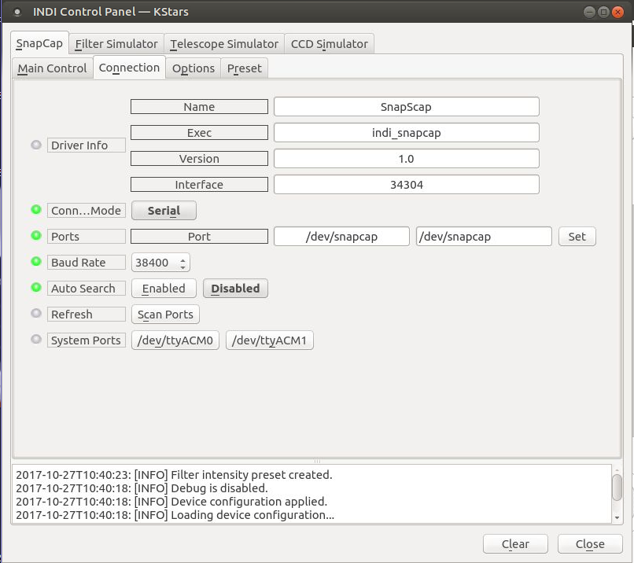

## Features

Gemini SnapCap is used for dust protection and also to provide a source for evenly illuminated flat light source. INDI SnapCap driver controls parking and unparking of the cap, in addition to controlling the flat light source which are primarily used for automation of Flat Field captures.

## Operation

### Connection options

[Gemini SnapCap](http://www.geminitelescope.com/snapcap-motorized-tube-ota-cap/) communicates via serial port at 38400 bauds. Unfortunately the device is Arduino based and uses the same USB device ids as any other Arduino Uno so specific udev-rules are not possible, but if you don't have any other Arduinos connected you use this udev-rule to create the symlink:

SUBSYSTEM=="tty", ATTRS{idVendor}=="2a03", ATTRS{idProduct}=="0043", SYMLINK+="snapcap", ENV{ID_MM_DEVICE_IGNORE}="1"

The above udev rules file is useful but not strictly necessary for the operation of SnapCap. You can still connect to /dev/ttyACM0..etc. Furtermore, the controller also has built-in bluetooth serial controller that can be used instead of USB cable after binding the rfcomm serial port. Once the pairing between your computer and the controller is complete, you should see /dev/rfcomm0 in the list of available ports and this can be used to communicate with the controller over Bluetooth.

## Main controls

Main controls show information about current device status and allow control of the dust cover and flat light. Light can only be enabled when the cap is parked (closed), its brightness can be selected from 25-255. Abort button aborts any movement in progress and force movement option can be used to initiate movement when the device thinks it already is in the required position. This shouldn't be necessary though.

### Options

The controller can be configured to read Filter names from other drivers such as a Filter Wheel or a CCD driver with a built-in Filter Wheel (e.g. QSI 583). The Filter device name is set in t