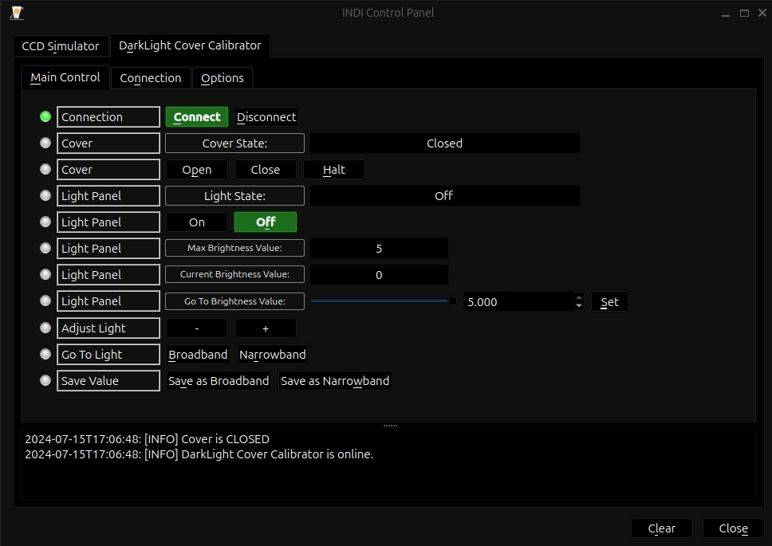
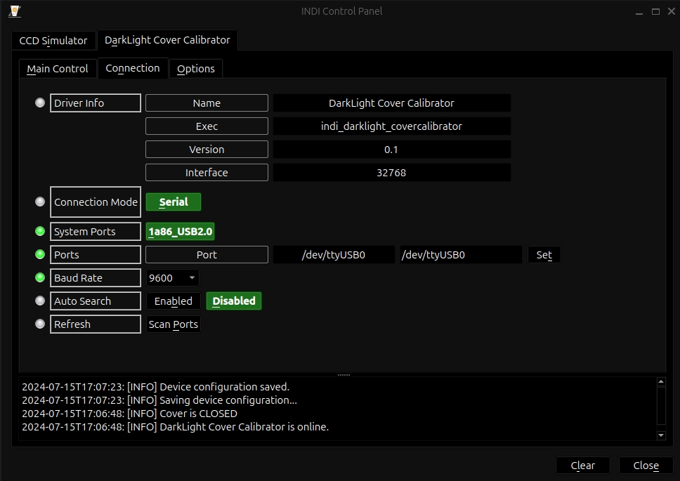

## Features

The DarkLight Cover/Calibrator (DLC) is a versatile DIY solution using an Arduino Nano or compatible microcontroller. The latest iteration of the DLC features a modular design that offers options to exclusively drive a 12V light panel, no servo required, ideal for a wall-mounted setup, or a servo with no light panel, ideal for taking sky flats. This means you can build a device to operate a servo motor, a light panel, or both, serving as both a dust cover for remote telescope users and/or a calibration panel. The DLC offers both an ASCOM and INDI driver, ensuring seamless operation via the DLC Windows application, any automation software compatible with the ICoverCalibrator driver in ASCOM v6.5 or newer, or the INDI platform.

While the DLC does not make the telescope weatherproof or dustproof, it is a valuable addition for any user desiring hands-off control of the cover and a dark/light calibration feature tailored for astrophotography, whether out in a field or in an observatory.

To build or learn more about the DLC, visit the  [DLC SourceForge page](https://sourceforge.net/p/darklight-cover-calibrator/discussion/).

PCB boards, electronics, kits, or completed boards will be available at  [10thTeeAstronomy.com](https://stellarmate.com/10thTeeAstronomy.com).

The INDI DLC driver is divided into three tabs:

-   **Main Control:** Used for the primary functions
-   **Connection:** Used to select Serial port and baud rate
-   **Options:** Used to set preferences for operation

### Main Control Tab

***Note: Corresponding features will only appear if enabled in the microcontroller firmware.  
See the user manual for more details.**

-   **Cover:**
    -   Monitor the current position of the cover.
    -   Use the buttons to [Open], [Close], or [Halt] the cover.
    -   If halted, resume movement by selecting the appropriate direction.
-   **Light Panel:**
    -   Monitor the current state and brightness level of the light panel.
    -   Control the light panel with the [ON] and [OFF] buttons.
    -   Adjust the light panel brightness using the slider or enter a value and click [Set].
    -   Incrementally adjust brightness with the [-] and [+] buttons.
    -   Save and recall two brightness values for broadband and narrowband calibration.
    -   **Note:**  The light automatically turns off when the cover is opened. If "Disable light when cover is open" is unchecked, the light can be turned on while the cover is open.
    -   If AutoOn is enabled in the options menu, the light will turn on to the last set value automatically after the cover closes. 

## Connection Tab

The default port is set to  `/dev/ttyUSB0`  with a default baud rate of 9600.  
**Note:** If you modify the default port or baud rate, remember to save your changes in the  **Options**  tab by clicking [Save] before attempting to [Connect].

## Options Tab

After establishing a connection to the DLC, you can configure various settings within the Options tab:

-   **Stabilize Time:** Set the duration before the light reports readiness after activation or value changes.
-   **Auto On:** Enable automatic light activation upon closing.
-   **Disable Light:** Prevent the light from turning on while the cover is open.

Changes to these features will automatically be saved for the next session.

