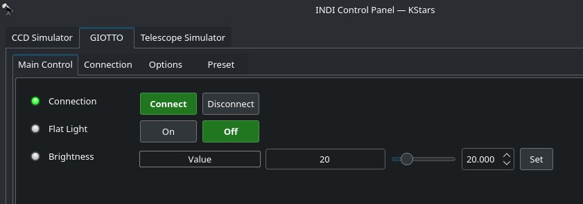

## Features

GIOTTO is the Smart Flat Field Generator we designed to help you capture flat calibration frames for telescopes. GIOTTO uses many LED lights at a color temperature similar to the Sun, a specially designed light diffuser and, thanks to the included thumbscrews, you can easily lock it in front of telescopes. GIOTTO is provided with integrated electronics that allow you adjust GIOTTO’s light intensity by 100 steps (0 to 100%), USB-C port to let you connect to your EAGLE or StellarMate for remote control.

WiFi connectivity to let you wirelessly control it using your smartphone or tablet via the included Virtual HandPad and 12V power port! And if you want to automate the capture of your calibration files or if you're searching for the best way to remotely open and close your telescope, you can add the optional ALTO telescope cover motor and use GIOTTO as a remotely controlled motorized cap!

## Control

The controls are very simple. You can toggle the light on/off and set the intensity from 0% to 110%. Ekos can control GIOTTO directly.

If you equipment profile includes a filter wheel, you can adjust the preset values for each wheel in the Presets tab. These values are saved and re-used for future sessions.

