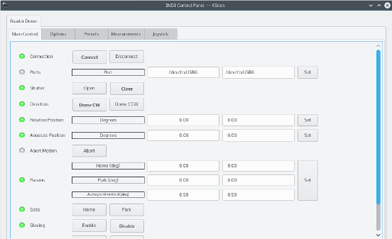

## Features

The driver can control the dome's relative and absolute position and calibrate the dome until it reports a valid azimuth position. The user can setup home and park positions in addition to dome slaving parameters. Furthermore, the user can set up to three custom presets for GOTO operations. Joystick control is supported and the user may move the dome in CW or CCW fashion. The driver can control both the shutter and flaps.

## Operation

Once you connect to the dome, it will check if the dome is already synchronized. If it is not synchronized, click the  _Start_  button in the Cablirate property and it will command the dome to rotate by roughly 180 degreees in order to hit the limit switch and becomes synchronized in absolute azimuth position.

To enable dome slaving, click  _Enable_  in the Slaving property and ensure that all parameters are filled correctly in the  _Measurements_  group. Make sure that the telescope name is set correctly in the  _Options_  group as the mount's RA/DEC coordinates can only be read if the telescope name is correct.

In dome slaving mode, once the telescope complete slewing, the dome new azimuth position will be based on the current telescope position and the dome will be commanded to move to the new calculated azimuth position.

To enable joystick control, simply click the  _Enable_  button in the Joystick property under the  _Options_  group and then you may configure the button on your joystick for CW or CCW motion. You have to run the Joystick driver along with the dome driver, i.e.

indiserver -v indi_baader_dome indi_joystick

If you're using Ekos, you can simply select  _Joystick_  from the auxiliary devices drop down combo