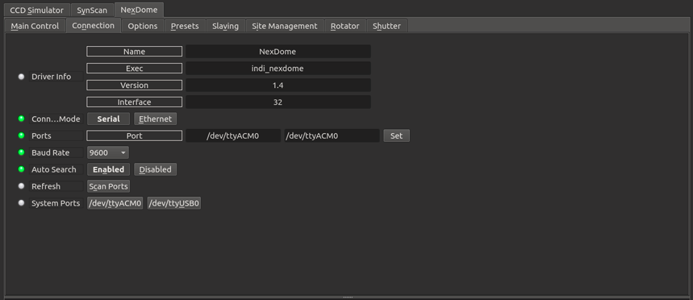
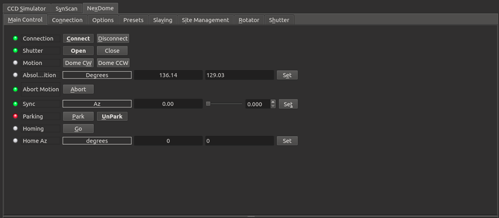
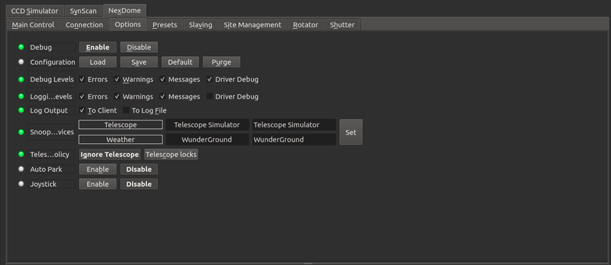
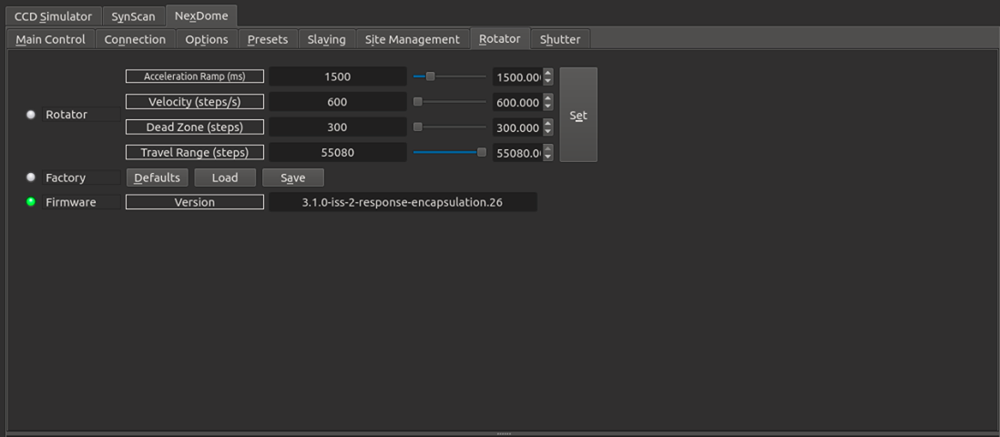
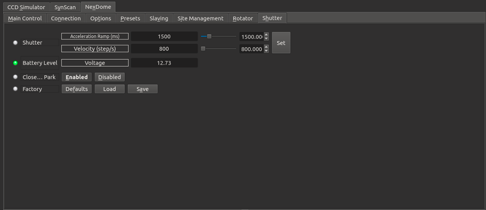
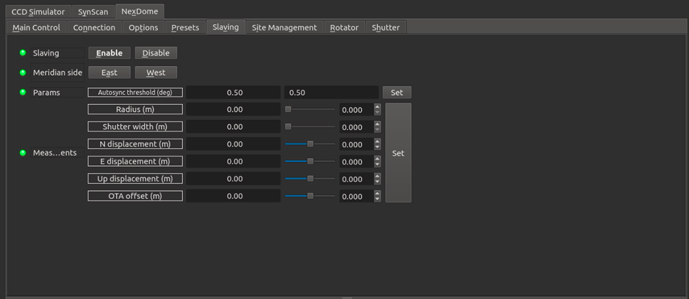

## Features

NexDome is a fully automatic observatory dome control system. Link your dome to a computer for complete automation including telescope slaving and shutter control. It supports the following features:

1.  Slave dome rotation to your telescope
2.  Rotation-only and full shutter-and-rotation systems available
3.  Direct confirmation of shutter open/closed state
4.  Safety interlocks automatically close dome upon loss of data from PC
5.  Park-before-close option to avoid mechanical interferences
6.  Manual override controls for shutter and rotation control
7.  Field-upgradable firmware

## Operation

### Connection

Connecting to the dome is done via the serial port. If you have multiple serial ports on your system, you might need to select which port to connect it. The driver also offer the ability to use a TCP/IP connection however this requires the use of a USB/serial to IP transport such as  _ser2net._

### Main Control panel

Once you are connected to the dome, you can move it to any azimuth position and control the shutter (if connected).

Clicking the dome  **CW**  (Clock-Wise) and  **CCW**  (Counter Clock-Wise) buttons would move the dome in the respective directions by 5 degrees. Use the  **Sync**  property to set the azimuth position to any arbitrary value. The current azimuth position is then set to whatever value is enter in the Sync property.

To find the  **home**  position, click  **Go**  next to the Home property. The dome will rotate until it finds the home index switch and then it will synchronize the azimuth position.

### Options

In the options tab, you can select logging and debugging levels in case you need to troubleshoot an issue in the driver. The snoop devices property is used to listen to properties of interest in other drivers. Since the dome can be slaved to the telescope, it needs to obtain the current telescope position and its target destination. Usually these devices are automatically snooped by your client software. The weather device is used to close to the dome in case of adverse weather conditions (e.g. rain).

Joystick support is available to rotate the dome and park/unpark it. You need a gamepad (e.g. Playstation controller) and need to add the joystick driver in your equipment profile before you can turn on this feature. A new tab named Joystick will appear where you can set what each button or axis can do.

### Policies

-   **Telescope Policy**: Telescope policy can be either set to Ignore Telescope (default) or Telescope Locks. When the policy is set to  **Ignore Telescope**  then the dome can park/unpark regardless of the mount parking state. When it is set **Telescope locks,** this disallows the dome from parking when telescope is unparked, and can lead to damage to hardware if it rains.
-   **Auto Park**: When Auto park is enabled and If weather conditions are in the danger zone, the dome will be automatically parked. Only enable this option is parking the dome at any time will not cause damage to any equipment.
    

## Rotator Settings

In the rotator tab, you can set rotator settings:

-   **Acceleration Ramp**: The acceleration time in milliseconds.
-   **Velocity**: Set the velocity in units of steps per second.
-   **Dead Zone**: Update the dead zone range (default 300 steps). It the smallest allowed move.
-   **Travel Range**: Maximum allowable step size. Probably better no to change this setting at all.

After changing the settings, you can save them to firmware by clicking on Save. If you click Load, setting will be loaded from firmware (but not saved). Clicking Default will reset all settings to default factory settings.

## Shutter

In the rotator tab, you can set rotator settings:

-   **Acceleration Ramp**: The acceleration time in milliseconds.
-   **Velocity**: Set the velocity in units of steps per second.

After changing the settings, you can save them to firmware by clicking on Save. If you click Load, setting will be loaded from firmware (but not saved). Clicking Default will reset all settings to default factory settings.

You can enable or disable automatic shutter opening and closing when dome goes to into or out of the Park position. After changing these settings, go to the Options tabs and click Save configuration to save the driver settings.

Note that in order for the  **Open On Unpark**  feature to work correctly the shutter must be configured to open sufficiently that it triggers the limit switch. This may require the number of shutter steps to be increased beyond the default setting of 46000.

## Site Management

You can set a custom parking position in the  _Site Management_  tab. You can either set the position directly and then clicking Set, or you can go to the desired parking position and then click  **Current**  under  _Park Options_.

This only  **sets**  the parking position. To perform the actual parking, go to the  _Main Control_  tab and click  **Park**.

## Slaving

You can slave the dome to the mount by setting the required slaving parameters (by convention the units are in meters);

1.  **Radius**  is for the radius of the dome (typically 1.05 for a Nexdome)
2.  **Shutter**  width is the aperture of the shutter of the dome in meters (0.6m in current models)
3.  **N displacement**  is for north-south displacement of the intersection of the RA & DEC axis as measured from the center of the dome. Displacement to north is positive, and to south is negative.
4.  **E displacement**  is for east-west displacement. Similar as the above, displacement to east are positive, and to west are negative.
5.  **Up displacement**  is for displacement of the RA/DEC intersection in the vertical axis as measured from the origin of the  **dome**  (not the walls). Up is positive, down is negative.
6.  **OTA offset**  is for the distance of the optical axis to the RA/DEC intersection. In fork mount this is generally 0, but for German like mounts is the distance from mount axis cross to the center line of the telescope. West is positive, east is negative.

After settings the parameters above, go to  _Options_  tab and click  _Save_  in Configurations so that the parameters are used in future sessions. You can also set the  **Autosync threshold**  which is the minimum distance autosync will move the dome. Any motion below this threshold will not be triggered. This is to prevent continuous dome moving during telescope tracking.