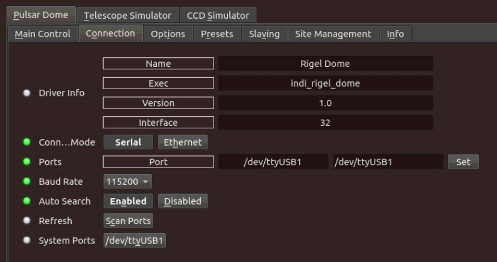
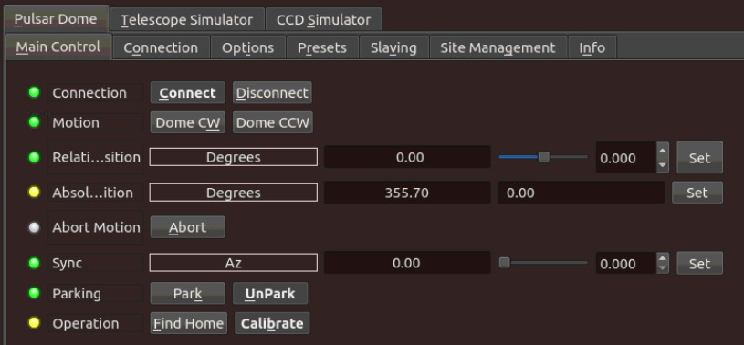
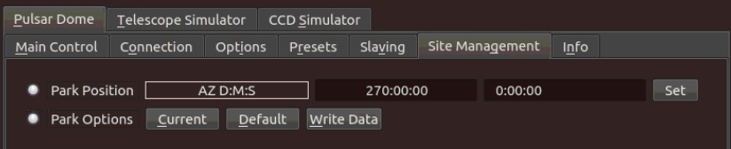
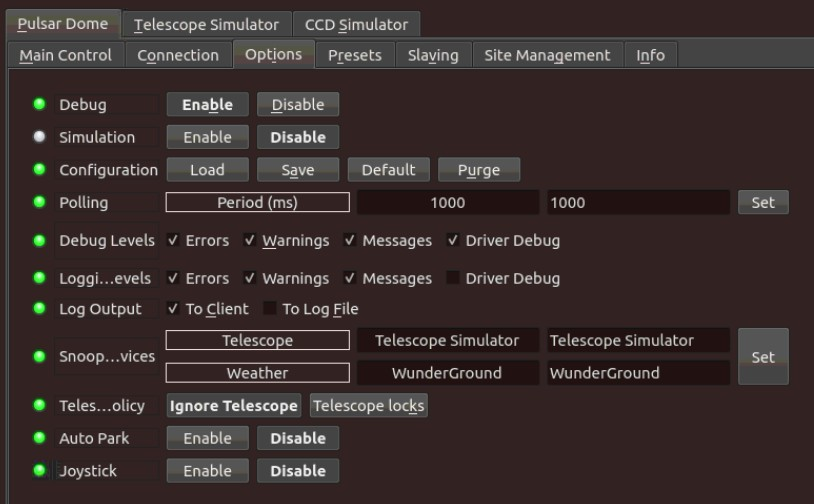

# 

Pulsar Dome

Pulsar Observatories domes utilize rigel controller for rotation and optionally shutter control.

Features

The dome controller is powered via the supplied 240V/12V DC transformer or a 7AH lead-acid battery. Power to the unit is controlled via the main switch and a red LED indicates when power is turned on. Dome slewing at up to 400 x sidereal speed in either direction is manual (at the controller) or via remote operation using a laptop or similar. A microprocessor controls the automatic tracking by moving the dome in a stepwise fashion, each step being approximately 1.8". It is recommended that the unit is switched off when not in use.

Pulsar supports fully automatic observatory dome control system. It also has a variety of sensors and relays to control power to other devices. Link your dome to a computer for complete automation including telescope slaving and shutter control. It supports the following features:

1.  Slave dome rotation to your telescope
2.  Rotation-only and full shutter-and-rotation systems available.
3.  Direct confirmation of shutter open/closed state.

The driver can operate a dome with and without shutter control.

## Operation

### Connection

The driver communicates with the dome controller over USB serial connection. Make sure to select the correct port in the  **Connection**  tab. The driver would automatically scan all ports and attempt to connect to the dome controller if the initial handshake with the controller fails using the designated port.

### Main Control Panel

In the main control panel, you can set the azimuth absolute position of the dome in degrees, or you can the relative position as well. If you click on Dome CW (Dome Clock-Wise) and Dome CCW (Counter clock-wise), it would move the dome in the selected direction for 5 degrees.

To set the dome controller to an arbitrary azimuth position, use the Sync property. Once synced, the current position will be updated to match the new synced position.

Two operations are supported by the driver:

-   **Calibration**: Once you start calibration, the dome would rotate at least twice until it hits the sensors.
-   **Find Home**: Go to home position.

Once started, they can be aborted at any time by click on the  **Abort**  button.

### Custom Parking

You can set a custom parking position in the  _Site Management_  tab. You can either set the position directly and then clicking Set, or you can go to the desired parking position and then click  **Current**  under  _Park Options_.

This only  **sets**  the parking position. To perform the actual parking, go to the  _Main Control_  tab and click  **Park**.

### Slaving

Once you are connected to the dome, you can move it in absolute or relative position. You can slave the dome to the mount by setting the required slaving parameters:

1.  **Radius**  is for the radius of the dome in meters.
2.  **Shutter**  width is the clearance of the shutter of the dome in meters
3.  **N displacement**  is for North displacement. If telescope is not in its ideal central position this parameter allows to configure how much it is displaced from the center. Displacement to north are positive, and to south are negative.
4.  **E displacement**  is for East displacement. Similar as the above, displacement to east are positive, and to west are negative.
5.  **Up displacement**  is for displacement in the vertical axis. Up is positive, down is negative.
6.  **OTA offset**  is for the distance of the optical axis to the crossing point of RA and DEC. In fork mount this is generally 0, but for German like mounts is the distance from mount axis cross to the center line of the telescope. West is positive, east is negative.

After settings the parameters above, go to  **_Options_**  tab and click  **_Save_**  in Configurations so that the parameters are used in future sessions. You can also set the  **Autosync threshold**  which is the minimum distance autosync will move the dome. Any motion below this threshold will not be triggered. This is to prevent continuous dome motion during telescope tracking, unless the dome itself support sidereal tracking internally.