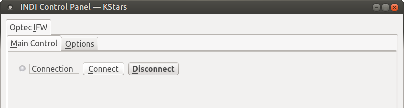
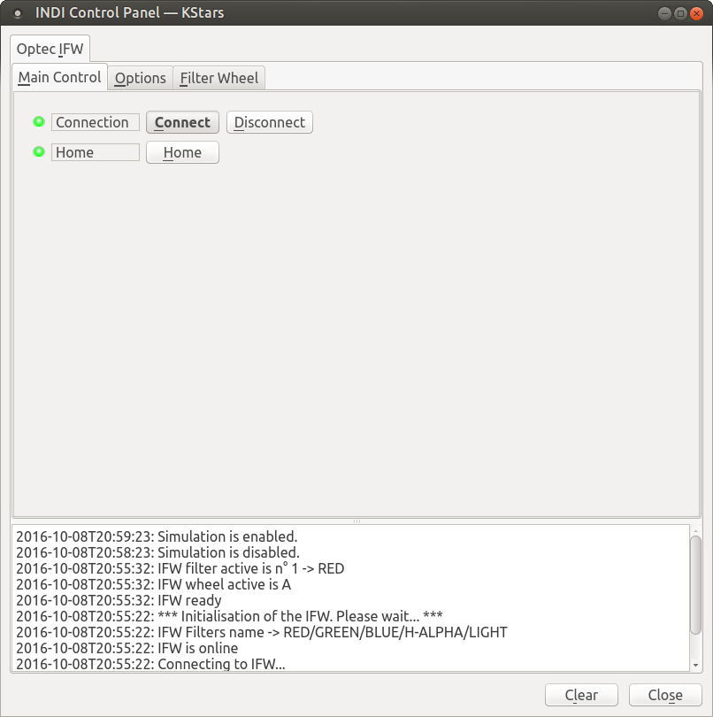
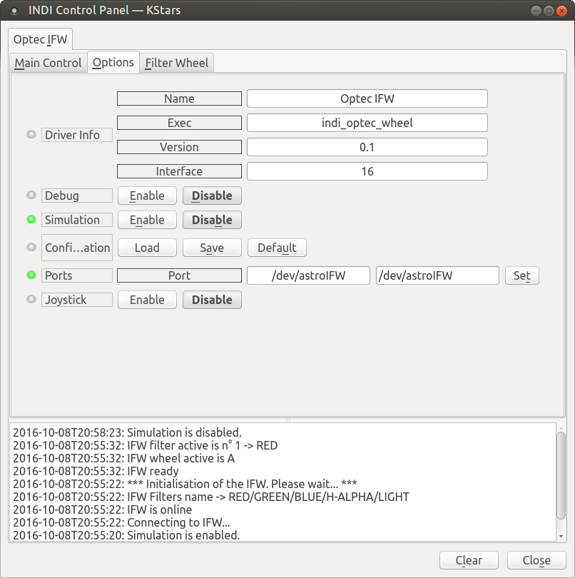
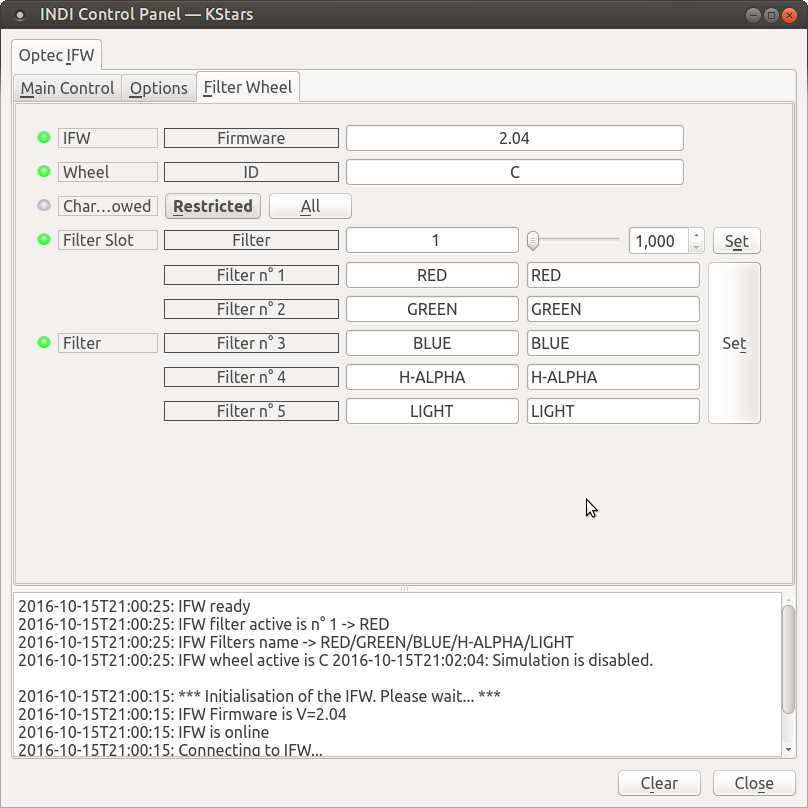
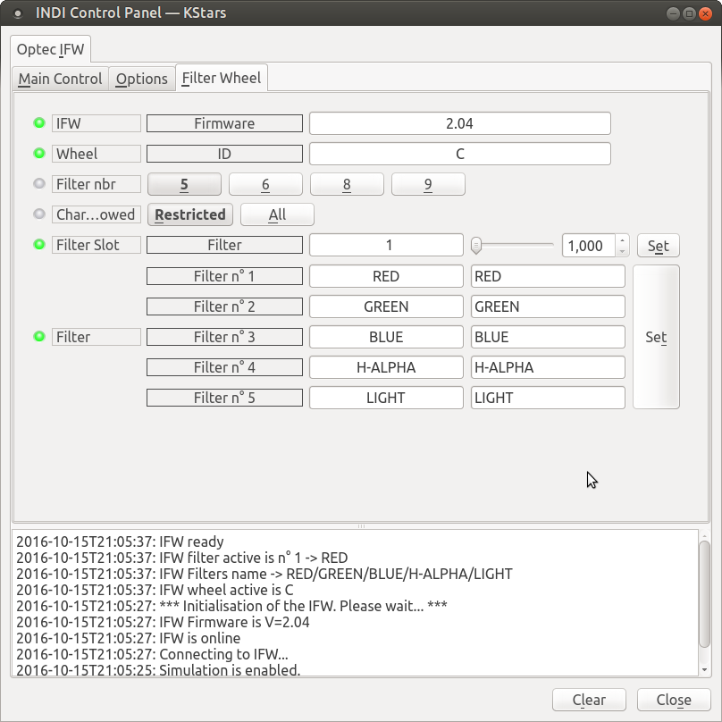
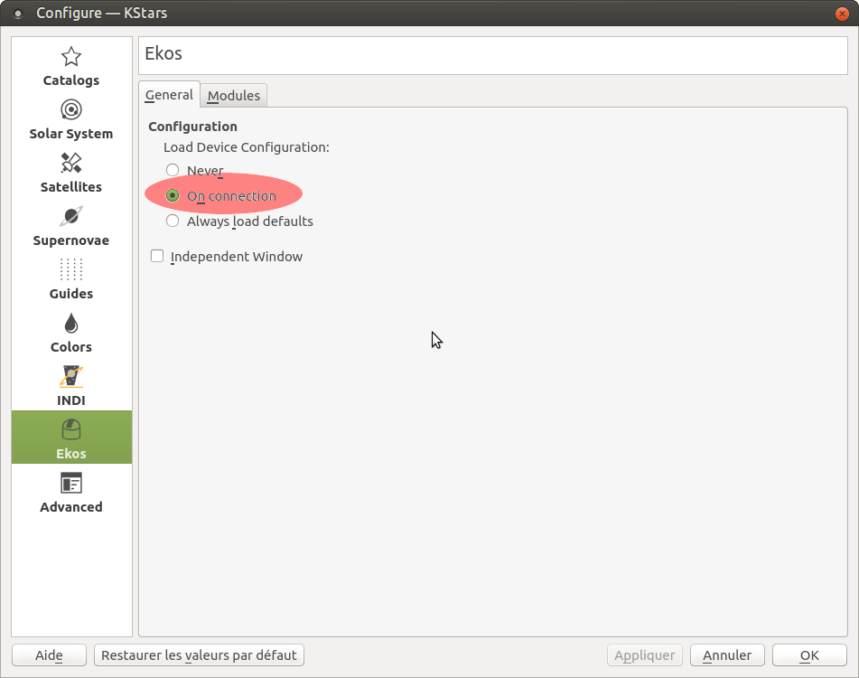

## Features

The OptecInc Intelligent Filter Wheel (IFW) is a system able to manage a lot of filters within different wheels:

-   IFW:
    -   Wheels with 5 filters of 2”
    -   Wheels with 8 filters of 1.25” for industrial application
-   IFW-3
    -   Wheels with 5 square filters of 58mm
    -   Wheels with 6 square filters of 50mm
    -   Wheels with 9 round filters of 50mm

The purpose of usage is to have more than one wheel of the same model but with different filters on these. For example the IFW can recognize 5 different wheels of 2” filters to a total of 25 filters. This driver is able to manage IFW and IFW-3. The different wheels for each model are identified by one letter from A to E.

The identification is done via reed sensors and small magnets placed on the wheels. These magnets provide the wheel’s ID and filters position. The name of the active filter is display on a small 8 digits display on the interface box of the IFW.

By default, the names are a concatenation of the WheelID and the filter number. (A1, A2..A9, B1..E9). These names can be changed by the user throught the serial connection.

More information in this  [document](http://www.optecinc.com/astronomy/catalog/ifw/resources/ifw_technical_manual.pdf)  from Optec.

When connected three tabs are available:

### Main Control

Once connected the driver initialize the IFW. It tooks about 10 second (Even in Simulation !) The IFW move the wheel to find the first filter position and get the identification of the wheel in the unit. You get a new button to send manually the HOME command to the IFW too.

When the IFW is ready you get the Home state green otherwise it turns red (ALERT) and a message ask to check the IFW and press on Home button to try again.

### Options

1.  Driver info : General driver's information
2.  Debug : Activate the debug mode. It has to be used for bugs reporting
3.  Simulation : Activate the driver's simulation mode to test it without IFW connected.
4.  Configuration: Manage the backup of the configuration
5.  Ports : You could configure the correct serial port to connect to the IFW.
6.  Joystick : If the indi_joystick drivers is loaded, activate the selected buttons to move to the previous filter, to the next one or to reset to the first one. If the Joystick is enabled a new tab is visible where the buttons could be configured.

### Filter Wheel

This tab provide information related to the wheel in place in the IFW and the filters names for this wheel.

-   **IFW Firmware**  shows the firmware of the IFW if this information is available.
-   **Wheel ID**  shows the letter of the identified wheel
-   **Filter Slot**  shows the active filter position. We can change the filter in place within the slider or the selector and click on “Set”.
-   **Chars allowed**  is used to restricted (by default) the char accepted to be written in the EEPROM of the IFW. When restriction is active only the following chars are valid: {0123456789ABCDEFGHIJKLMNOPQRSTUVWXYZ=.#/-%} and {space} These are the only ones the IFW box controller is able to display.

If  **All**  is selected, then any char could be written in the EEPROM. That could provide strange results on IFW box controller, but it would be displayed correctly via the PC interface, then by INDI and Ekos.

Filter n°1..n°5(..n°9) show filters names and could be changed and stored in the EEPROM of the IFW box controller when click on “Set” button. When Simulator is active, some other swithes are visible to change the wheel format. We could select the default one with 5 filters or the 6, 8 and 9 ones.

## Operation

The INDI Optec IFW driver provides complete functionality for all majors features supported by the wheel unit.

These instructions cover the use of IFW unit.

1.  Initialization of the unit
2.  Change the wheel to use another filters set
3.  Change filters names for a wheel
4.  Backup configuration

### Initialization of the unit

By sending a Home command when connected, the diver initializes the unit. It tries to get the firmware version of the IFW, identify the wheel ID and load from EEPROM the filters names. If an error occur the driver shows the error code and a short explanation. In this case you have to :

-   Go to Main tab and disconnect the unit
-   Check if the wheel is in the correct position.
-   Check if the wheel is correctly fixed in the unit
-   Make a power cycle of the IFW to reset the error
-   Reconnect to the IFW from the Main tab

### Change the wheel to use another filters set

When the wheel is not moving, Open the cover of the unit, release the axis of the wheel, Take the other wheel in place, tight the axis back and close the cover.

Click on the Home button at the  **Main**  tab to identified the wheel in place and load the filters names from EEPROM.

### Change filters names for a wheel

With the INDI driver we could change the filters names and store them in the IFW’s EEPROM.

-   To do that go on ‘Filter Wheel’ tab
-   Select if the filters names could be readable on the IFW’s box by select ‘Restrict’ (by default) or ‘All’.
-   **Warning**: only the 8 first chars would be register, if a name is longer the extra letters are ignored.
-   Change the name for one or more filters in box. Press ‘Set’ to store the new values. The rules against the name are check only when you click on ‘Set’.
-   The names are stored to the IFW and an initialisation of the unit takes place to load the new names from the EEPROM.

### Backup configuration

To backup your actual configuration goes to the  **Options**  tab and click on  **Save**  button.

The configuration you have saved could be recall by different ways. One is to click on load’ button, other one is to configure on EKOS the ‘Load Device Configuration’ to ‘On connection’. With this selection the configuration is self-loaded when we initiate the connection to the unit from EKOS.

To configure goes to KStars, Settings menu then Configure Kstars...

