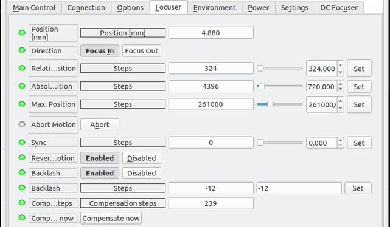
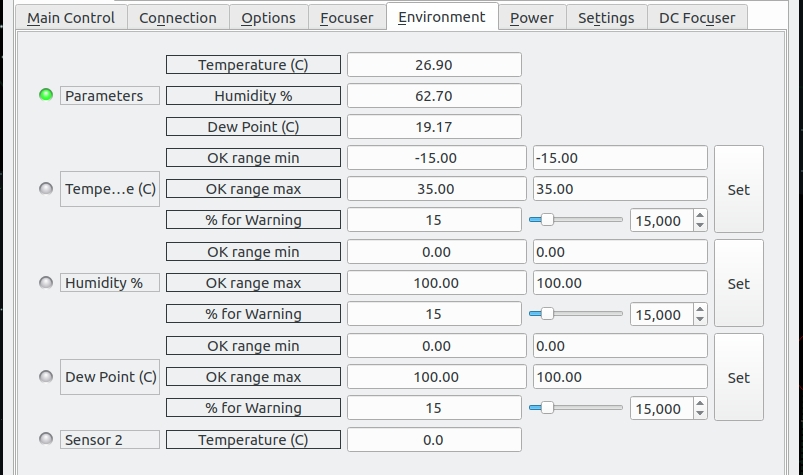
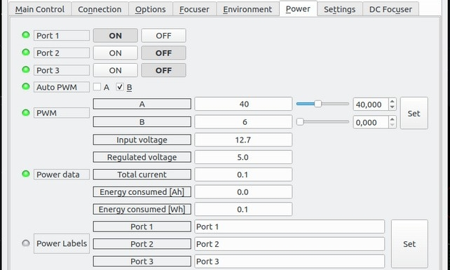
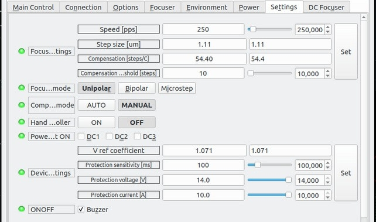

## Features

Astrolink4 INDI driver supports AstroLink 4 mini device. AstroLink 4.0 mini device was designed to make astroimaging easier. Contains two focuser controllers, regulated outputs for heaters, peltiers or fans, switchable power outputs, different sensors inputs, hand controller connector and many other options. Following funcitons are supported in INDI driver:

-   1x stepper focuser motor output
-   1x DC focuser motor output
-   3x switchable 12V power outputs
-   2x regulated PWM outputs
-   temperature / humidity / dew point readings
-   voltage, current, consumed energy monitoring

Before establishing connection, go to  **Connection**  tab and select the port. Once connected, you can:

-   Move the focuser to a position relative to the current one - select "focus in" or "focus out" and specify the number of steps in the "relative position"
-   Move to an absolute position - just specify the step number.
-   Sync, that is, set a specific number as the current position of the motor.
-   Abort the focuser motion at any time.
-   Power
-   Environment (weather readings)
-   DC Focuser

### Focuser

Set the absolute or relative position of the focuser, control backlash and temperature compensation.

### Environment

The environment group provides readings for the temperature, humidity, and dew point. Below them are the limit settings for each parameter that includes the minimum and maximum  **OK**  range for each reading along with the percentage when the reading is marked as warning. If the reading exceed the OK limit, it shall be marked as  **ALERT**. If a  _Critical_  property is marked as ALERT, then it marks the complete observatory as  **unsafe**  and the client software might take precuations to protect the observatory such as automatic parking of mount and/or dome.

### Power

Control the DC output ports and PWM output. Consolidated power data is displayed below the control.

### Settings

Set the controller param