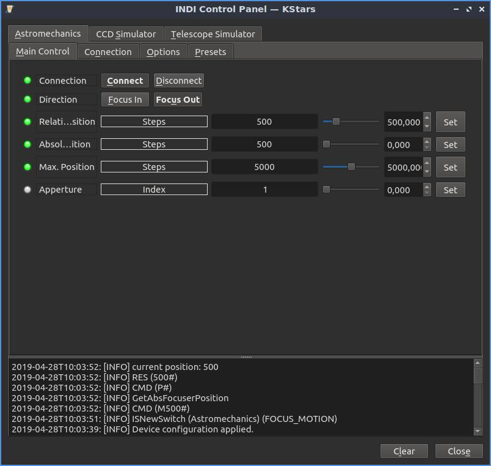
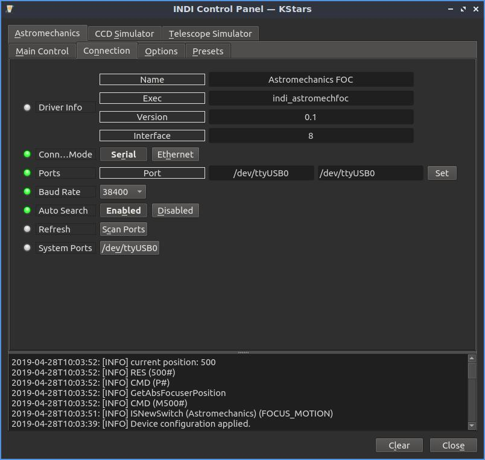
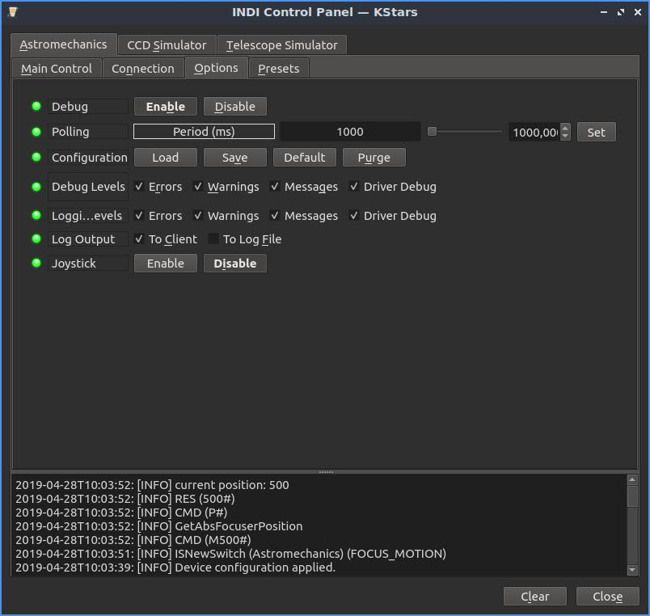
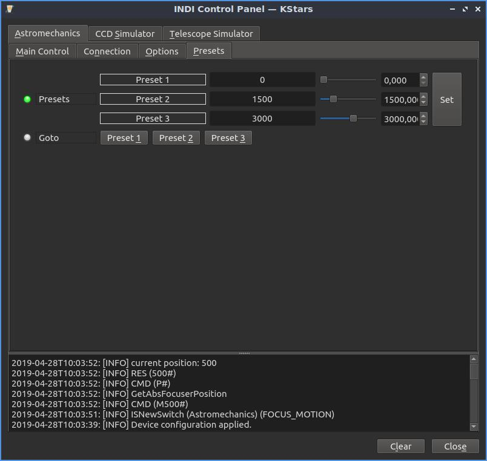

## Features

The Astromechanics Canon Lens Controller is a Canon EF/EF-S compatible solution for external iris & focus drive. Tamron, Samyang, and Sigma lenses are also supported. It features :

-   GOTO function (absolute position) and relative position
-   Lens Apperture setting

## Operation

### Main Control Tab

-   Direction : inward or outward for relative position demand values
-   Relative position : demand offset to the actual position
-   Position absolute : demand absolute position, allowed if lower than maximum position
-   Maximum position : upload the limit to the focuser
-   Apperture : setting index of lens apperture (0: apperture fully opened e.g. f/2.8, 22: apperture closed e.g. f/22)

### Connection

The USB connection is made on the default port, or by autosearch. The device is recognized as a USB Serial converter. Baudrate at 38400 is mandatory.

## Options

The Options tab contains settings for all drivers that include polling (frequency of updates), logging, and debugging. No driver-specific options are available.

## Presets

You may set pre-defined presets for common focuser positions in the  _Presets_  tab.

-   Preset Positions: You may set up to 3 preset positions. When you make a change, the new values will be saved in the driver's configuration file and are loaded automatically in subsequent uses.
-   Preset GOTO: Click any preset to go to that position