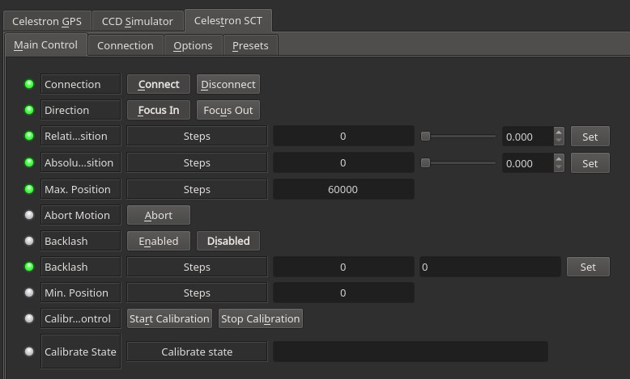
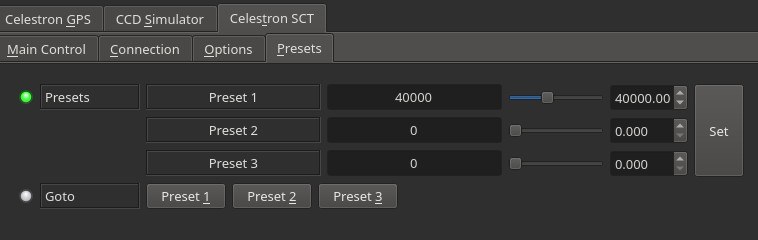

## Features

Celestron SCT Focuser driver is used to control Celestron Motorized Focuser when connected  **directly to a computer via USB**. This driver should not be used if the focuser is connected  **directly to the mount**. When connected directly to the mount, simply use the Celestron mount driver and it would automatically recognize and connect to the focuser.

Do not use Celestron SCT driver if the focuser is connected directly to the Mount direct via AUX cable. Instead, use the Celestron Mount driver to control the focuser.

This driver can be used to :

-   Move the focuser to an absolute position (specific absolute steps)
-   Focus IN and OUT using selected steps (relative position)
-   Abort the focuser motion
-   Set backlash.
-   Calibrate the focuser position.

## Operation

### Connecting

In order to connect to the focuser you just have to plug the USB cable and power up the focuser. Under  **Connection**  tab, you can set the Serial Port especially if you have multiple serial ports connected to the same PC. It is best to use Serial Assistant Manager to designate a permenant port (e.g. /dev/focuser) to this device.

### Calibrating

You need to calibrate the focuser when using it for the first time. The calibration parameters are stored on the focuser itself so it can be re-used later. To begin the calibration process:

1.  Ensure the focuser is installed correctly and that the  [screws are tightend correctly](https://www.cloudynights.com/topic/645522-celestron-electronic-focus-motor-for-sct-and-edgehd/?p=9547983).
2.  Set the starting point of the focuser halfway/center. This is very important, try to get it to halfway as close as possible.
3.  Click  **Start Calibration**  and then monitor the Calibration Status until the calibration process is complete.
4.  If the focuser does not stop on its own, make sure to check and address  [common mechanical issues](https://invent.kde.org/education/kstars/-/issues/147).
5.  After it is complete and successful, you can begin to utilize the focuser.

## Presets

You may set pre-defined presets for common focuser positions in the  _Presets_  tab.

-   Preset Positions: You may set up to 3 preset positions. When you make a change, the new values will be saved in the driver's configuration file and are loaded automatically in subsequent uses.
-   Preset GOTO: Click any preset to go to that position

