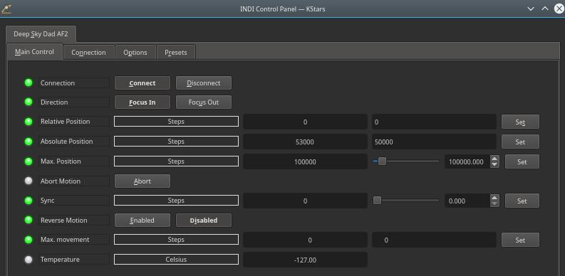

## Features

Listening to your feedback we developed a next generation autofocusing unit with WiFi connectivity and optional accessories - wired hand remote controller and temperature probe. Now even manual focus changes using your mobile phone/tablet are so simple that even a toddler can do it (check our [Youtube channel](https://www.youtube.com/channel/UCdidL3Xsycqp-_0ldGAM_Vg) for a [demonstration on a prototype unit](https://www.youtube.com/watch?v=m-1jXrvqQTQ)). At the same time it is also retaining mounting compatiblity with our older units, so upgrading to AF2 is as simple as swaping the units - no need to change mount adapters or belts.

### Main Control Tab

-   **Direction**: Focus IN or Focus OUT. IN decreases ticks count, OUT increases ticks count. Selecting this controls the direction of the  **Relative Position**  property below.
-   **Relative Position**: Set the number of steps from the current absolute position to move.
-   **Absolute Position**: Set the number of absolute steps.
-   **Sync**: Set the current focus position as the entered position.
-   **Reverse Motion**: reverse direction of the motor, if focus in/focus out are reversed in relation to the focuser physical movement(depends on how the autofocuser is mounted).
-   **Max. movement**: maximum position change in a single movement (in steps).

### Presets

You may set pre-defined presets for common focuser positions in the  _Presets_  tab.

-   Preset Positions: You may set up to 3 preset positions. When you make a change, the new values will be saved in the driver's configuration file and are loaded automatically in subsequent uses.
-   Preset GOTO: Click any preset to go to that position

## Connection

Connect to the focuser using a USB cable. The connection type is serial and by default the port is set to /dev/ttyUSB0. The default baud rate is 9600. If you change the default port, save the changes by going to the  **Options**  tab and click  _Save_  configuration.

## Operation

After establishing connection to the focuser, you can use the focuser control in the INDI control panel directly to move and sync the focuser. Alternatively, the focuser can be used in any INDI compatible autofocusing application.

## Options

The options tab provides several settings to tune the operation and performance of the focuser:

-   **Step mode**:full (200 steps per revolution), half (400 steps per revolution), quarter (800 steps per revolution) and eight (1600 steps per revolution)
-   **Settle buffer**: if set, focuser returns "IsMoving" as TRUE for specified time (in ms) after focuser reaches target position, letting it to settle a bit. Useful if your focuser has any play.
-   **Coils mode**: Always on (recommended) - coils are powered at all times. Idle - off - coils are turned off when focuser is not moving. Idle - coils timeout (ms) - coils are turned off after a specified amount of time from the last move.
-   **Idle - coils timeout**: timeout period for Coils mode "Idle - coils timeout (ms)
-   **Current - move**: current used for moving the motor. More current results in bigger torque. 75% is recommended.
-   **Current - hold**: current used for holding the position when motor is not moving (Coils mode "Always on"). More current results in bigger torque. 75% is recommended.