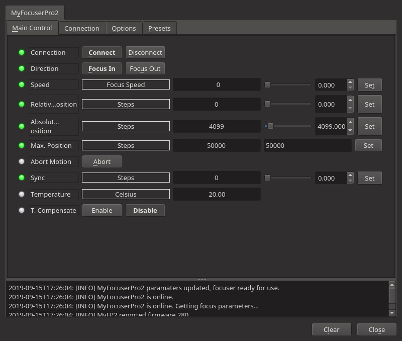
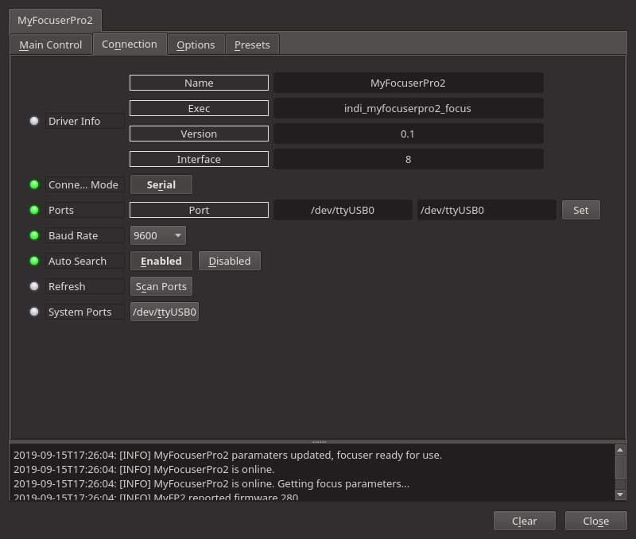
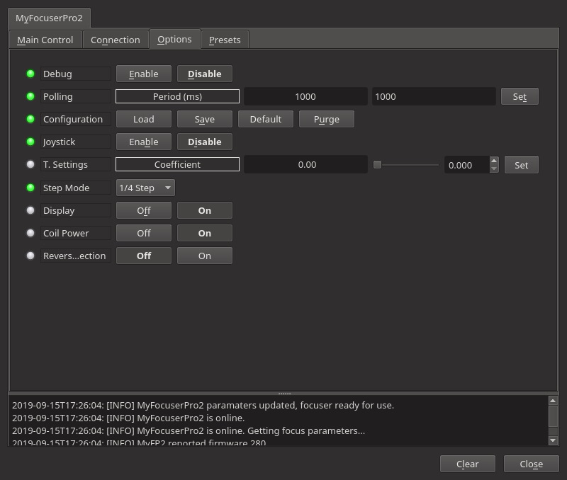
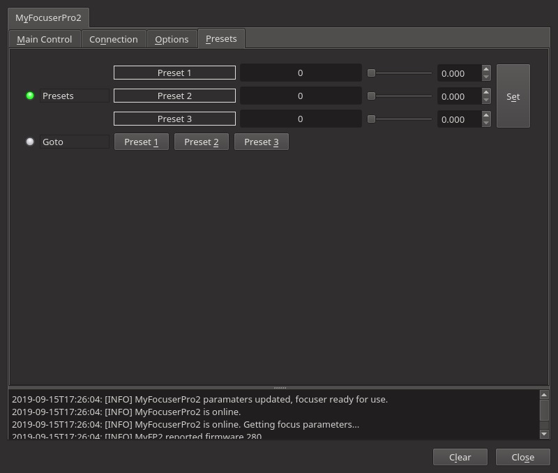

## Features

myFocuserPro2 is a fully featured open source hardware and software focuser designed by Robert Brown, using an Arduino Nano and stepper motor. Multiple options and driver boards are supported, please see website for full feature list, it is  [fully open sourced](https://sourceforge.net/projects/arduinoascomfocuserpro2diy/).

Current features are:

-   Sync
-   Absolute and relative position
-   Preset positions
-   Temperature compensation
-   Coil power control
-   Display on or off
-   Reverse direction
-   Joystick control

### Main Control

-   **Direction**: Focus IN or Focus OUT. IN decreases ticks count, OUT increases ticks count. Selecting this controls the direction of the  **Relative Position**  property below.
-   **Speed**: Set the stepper motor speed 0-Slow, 1-Medium, 2-Fast
-   **Relative Position**: Set the number of steps from the current absolute position to move.
-   **Absolute Position**: Set the number of absolute steps.
-   **Sync**: Set the current focus position as the entered position.
-   **Max. movement**: maximum position change in a single movement (in steps).

### Connection

-   **Driver info**: General driver's informations
-   **Connection Mode**: Serial only supported

### Options

-   **Debug**: Activate the debug mode. It has to be used for bugs reporting
-   **Polling**: NOTE: Regardless of setting, polling is hard coded to 1000ms, as myFocuserPro2 does not like to polled any faster
-   **Configuration**: Manage the backup of the configuration
-   **Joystick**: If the indi_joystick drivers is loaded, activate the selected buttons to move the focuser « IN » or « OUT » from a selected amount of ticks. If Joystick is enable a new tab is visible where the buttons could be configured.
-   **T.Settings**: Number of steps / deg change to adjust focuser
-   **Step Mode**: Choose required step mode from Full , 1/2, 1/4, 1/8, 1/16, 1/32 or 1/64
-   **Display**: Turn Display On or Off
-   **Coil Power**: Set the stepper motor hold coil power On or Off
-   **Reverse Direction**: Reverse direction of the motor, if focus in/focus out are reversed in relation to the focuser physical movement

### Presets

You may set pre-defined presets for common focuser positions in the  _Presets_  tab.

-   Preset Positions: You may set up to 3 preset positions. When you make a change, the new values will be saved in the driver's configuration file and are loaded automatically in subsequent uses.
-   Preset GOTO: Click any preset to go to that position