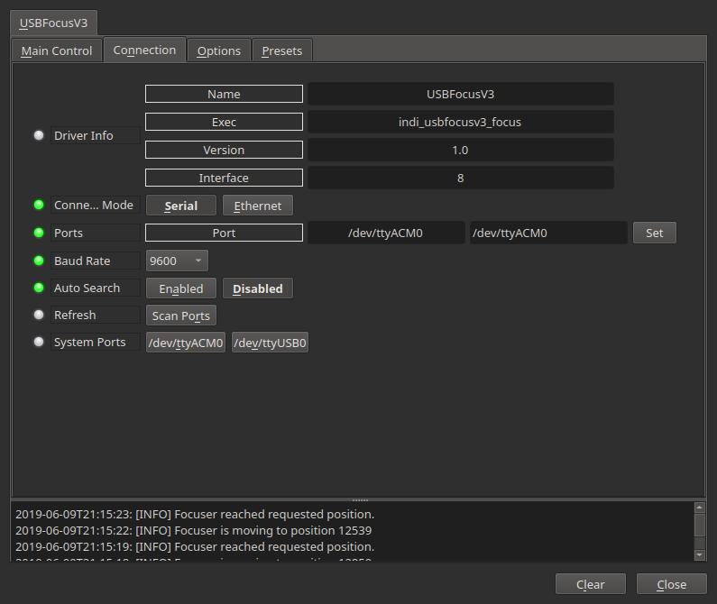
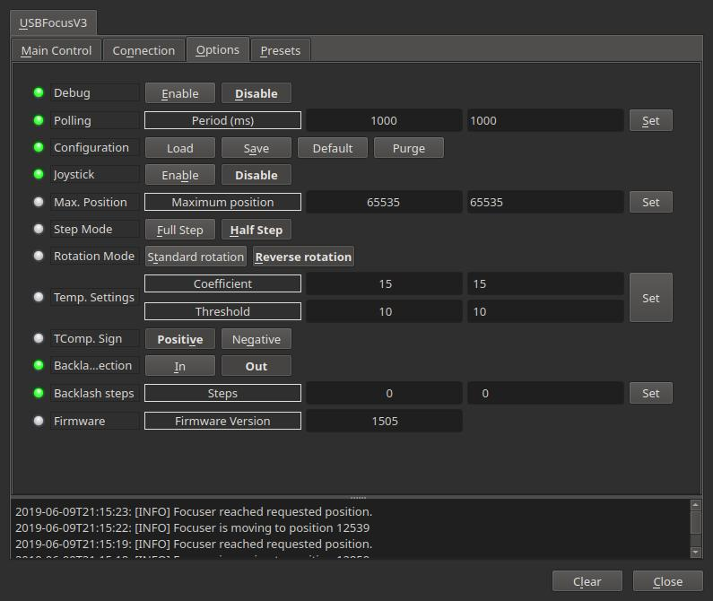

## Features

USB_Focus is a robotic focusing system, It connects to your computer USB port (or USB Hub 2.0), and depending on the motor you can add a 8-12v power supply. It connects to an external digital temperature probe, 0.1°C accuracy and can automatically follow best focus for the all night (temperature compensation). It comes with a handpad for manual electronic focusing. It pilots a custom motor and reducer providing high accuracy (8000 positions per turn) and high torque (more than 85 oz.inch). It is backlash compensated.

You can use other motors but only bipolar.

## Main Control Tab

Control the focuser position. Before use, set the 0 position with the focuser fully in, then move fully out and the set value for Max. Position.

## Connection

Connect to the focuser using a USB cable. The connection type is serial and it use the port /dev/ttyACM0. The default baud rate is 9600. After changing the default port, save the changes by going to the  **Options**  tab and click  _Save_  configuration.

If you have difficulties to connect, it is possible the device is taken by ModemManager that lock the port in exclusive mode. The simplest solution for this problem is to remove ModemManager because you hardly want to use a serial modem this days.

sudo apt-get remove modemmanager

If you need to keep ModemManager the other solution is to add a udev rule to prevent it take the usbfocus.  
Create a file /etc/udev/rules.d/80-usbfocuser.rules with the following content:

ATTRS{idVendor}=="0461", ATTRS{idProduct}=="0033", ENV{ID_MM_DEVICE_IGNORE}="1"

## Operation

After establishing connection to the focuser, you can use the focuser control in the INDI control panel directly to move and sync the focuser. Alternatively, the focuser can be used in any INDI compatible autofocusing application.

## Options

The options tab provides several settings to tune the operation and performance of the focuser:

