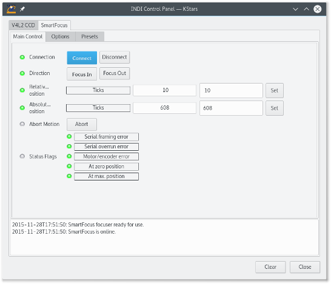
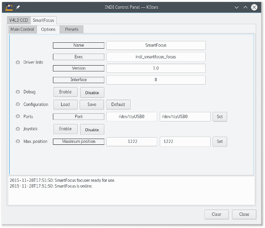

## Features

The JMI SmartFocus focuser control unit allows remote operation of JMI focusers. You can control the focuser absolute and relative positions and motions can be interrupted.

The figure below shows the Main Control panel of the SmartFocus driver.

### Main Control Tab

-   **Connection**: Connect to or disconnect from the SmartFocus unit. The RS232 port to be used is specified in the Options panel.
-   **Direction**: Sets the direction of relative focuser motions, either inward or outward.
-   **Relative Position**: Sets the number of steps from the current absolute position to move and starts the repositioning of the focuser.
-   **Absolute Position**: Sets a new absolute position of the focuser and starts the repositioning.
-   **Abort**: Interrupts the current motion.
-   **Status**: The status flags of the SmartFocus unit. Normally, only the flags indicating that the focuser has reached its zero or maximum position should light up.

### Options

The figure below shows the Options panel of the SmartFocus driver.

The following two properties can be set.

-   **Ports**: Sets the name of the RS 232 port. Both baudrates that are supported by the SmartFocus unit, 2400 and 9600, are tried.
-   **Max. position**: Sets the maximum position that the focuser can reach. This property must be set by the user because the SmartFocus unit does not allow it to be read. The value of this property is specific for each focuser model. It can be found at the top of the configuration tab of the JMI SmartFocus software. It is important to note that, in contrast to the JMI software, the INDI SmartFocus driver does not write this value to the SmartFocus unit. The driver only uses it to check the relative and absolute positions specified in the main control panel.

### Presets

You may set pre-defined presets for common focuser positions in the  _Presets_  tab.

-   Preset Positions: You may set up to 3 preset positions. When you make a change, the new values will be saved in the driver's configuration file and are loaded automatically in subsequent uses.
-   Preset GOTO: Click any preset to go to that position

## Operation

The INDI JMI SmartFocus driver provides functionality for relative and absolute positioning of JMI focusers that are controlled via a JMI SmartFocus unit.