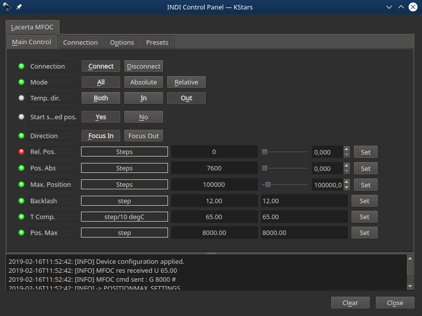
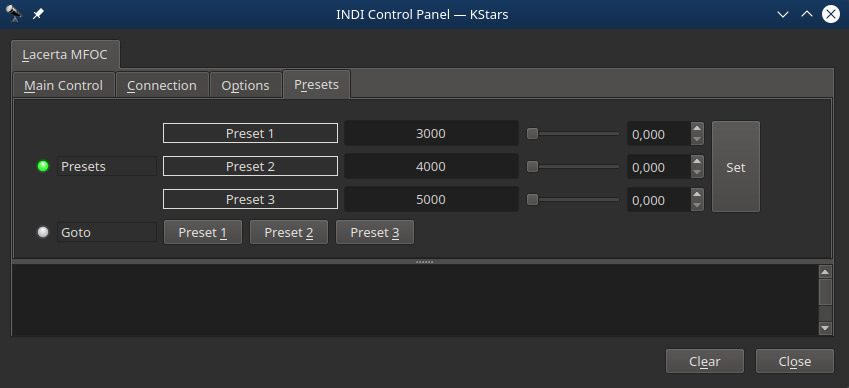
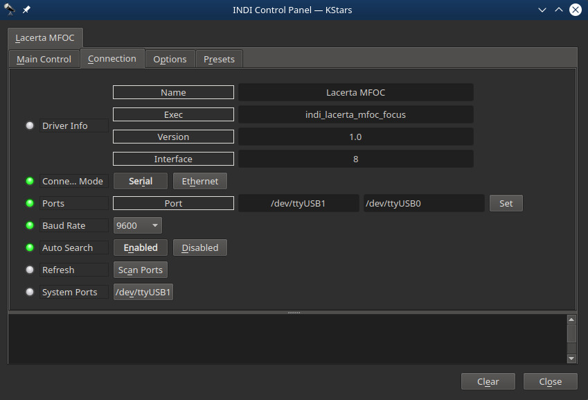
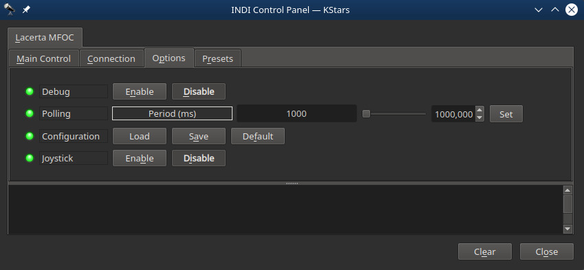

## Features

The LACERTA Motorfocus is a precision stepper motor with handbox and temperature sensor. It can be used in standalone or remotely. It features :

-   GOTO function (absolute position) and relative position
-   Automated temperature compensation
-   Backlash compensation

### Main Control Tab

-   Mode : Absolute position, relative position or both.
-   Temperature compensation direction : by continuous compensation of the temperature, allows inward, outward or both motions
-   Started at saved postion : moves to the last used position at start
-   Direction : inward or outward for relative position demand values
-   Relative position : demand offset to the actual position
-   Position absolute : demand absolute position, allowed if lower than maximum position
-   Maximum position : upload the limit to the focuser
-   Backlash : number of steps for backlash compensation
-   Temperature compensation : factor in number of steps for a change of 10°C

### Presets

You may set pre-defined presets for common focuser positions in the  _Presets_  tab.

-   Preset Positions: You may set up to 3 preset positions. When you make a change, the new values will be saved in the driver's configuration file and are loaded automatically in subsequent uses.
-   Preset GOTO: Click any preset to go to that position

## Connection

Connect to the focuser using a USB cable. The connection type is serial and by default the port is set to /dev/ttyUSB0. The default baud rate is 9600. If you change the default port, save the changes by going to the  **Options**  tab and click  _Save_  configuration.

## Operation

After establishing connection to the focuser, you can use the focuser control in the INDI control panel directly to move and sync the focuser. Alternatively, the focuser can be used in any INDI compatible autofocusing application.

## Options

The options tab includes parameters to enable/disable logging and debugging settings in addition to polling and joystick control.

The debugging and logging options should remain off unless you are to diagnose a problem with the driver.

**Polling**: How often should the driver read the device output signals? By default it is set to 500ms or twice per second.

**Joystick**: If a gamepad or joystick is connected, enable it to focus IN and OUT using the joystick. A new tab called  **Joystick**  is created. The INDI joystick driver must be running and connected to a supported joystick under Linux.