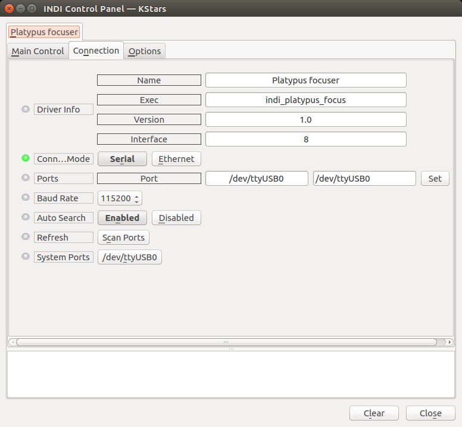
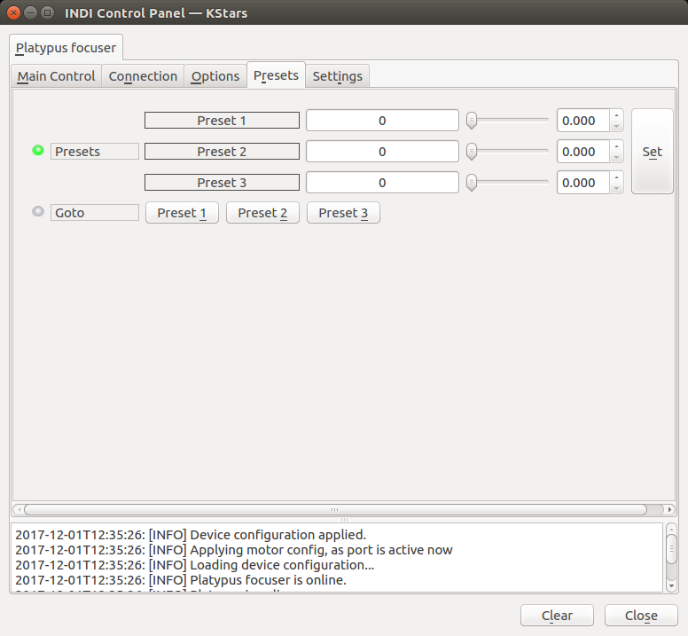

## Features

Both the Armadillo and Platypus are advanced programmable controllers that can drive many different motors, attached to a variety of focusers. With this driver you can automate your focusing in a very accurate and customizable way, being able to drive almost any motor out there, from small and inexpensive dc motors to huge, power hungry motors.  
For accurate focusing recycled stepper motors from old mounts, printers, etc, can be successfully used and driven with these controllers.

### Connection

Apart from information on the driver, you can select the connection mode (for the moment only serial - that is, via USB - is developed). The baud rate is 115200, and the "autosearch" feature usually finds the correct port.

Once connected, you can:

-   Move the focuser to a position relative to the current one - select "focus in" or "focus out" and specify the number of steps in the "relative position"
-   Move to an absolute position - just specify the step number.
-   Sync, that is, set a specific number as the current position of the motor.
-   Abort the motion at any time.

You will also get information on the current temperature reading (using the internal or external sensor, you can configure this in the  Settings  tab), and the firmware version of your controller.

### Presets

You can save up to 3 motor positions in the "presets" tab to quick and easily perform goto to any of them later. Usually the "fully racked in", and "approximate focus" positions are good candidates to store here.

### Settings

Here is the configuration of the motor and controller. Port: select which port the motor is attached to. Just one port for the moment.

-   **Max speed**: speed at which the motor will turn. At the default value of 9800, good for our stock motors, the motor will take 36 seconds to perform a full turn - that is 10 miliseconds per step, and 3600 steps / turn. This value works fine for many motors. If you are tuning a different motor, in general faster speeds work better in smaller steppers.
-   **Temperature senso**