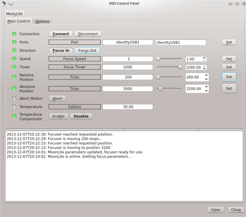

## Features

The MoonLite focuser is a high resolution stepper motor and uses a premium, low backlash Hurst stepper motor. This provides very fine .00008" resolution and accurate position repeatability required for today's high end imaging systems. You can control the focuser absolute & relative positions. It is recommended that the focuser is completely retracted when powered on as the focuser can only be operated in FOCUS OUT mode at this stage. You can set the temperature calibration and coefficient settings and enable/disable temperature compensation accordingly.

### Main Control Tab

-   Port: Set the name of the RS 232 port. The speed is fixed to 9600 baud.
-   Direction: Focus IN or Focus OUT.
-   Focus Speed: Set Focus speed 1 (highest) to 5 (lowest).
-   Focus Timer: Move the focuser at the current speed in the current direction for the specified time in milliseconds.
-   Relative Position: Set the number of steps from the current absolute position to move.
-   Absolute Position: Set the number of absolute steps.
-   Temperature: read out of the built in temperature sensor or the external temperature probe.

### Options

-   Step Mode: Set stepping mode to either Half or Full (default) steps.
-   Temperature Settings: Set the temperature calibration and coefficient values.

### Presets

You may set pre-defined presets for common focuser positions in the  _Presets_  tab.

-   Preset Positions: You may set up to 3 preset positions. When you make a change, the new values will be saved in the driver's configuration file and are loaded automatically in subsequent uses.
-   Preset GOTO: Click any preset to go to that position

## Operation

The INDI MoonLite driver provides complete functionality for all the features supported by MoonLite including relative and absolute positioning, temperature readout, preset and configuration parameters.