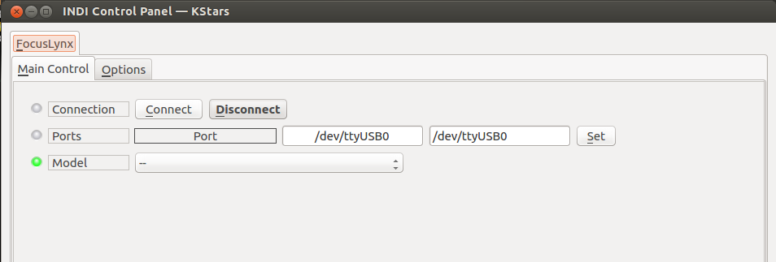
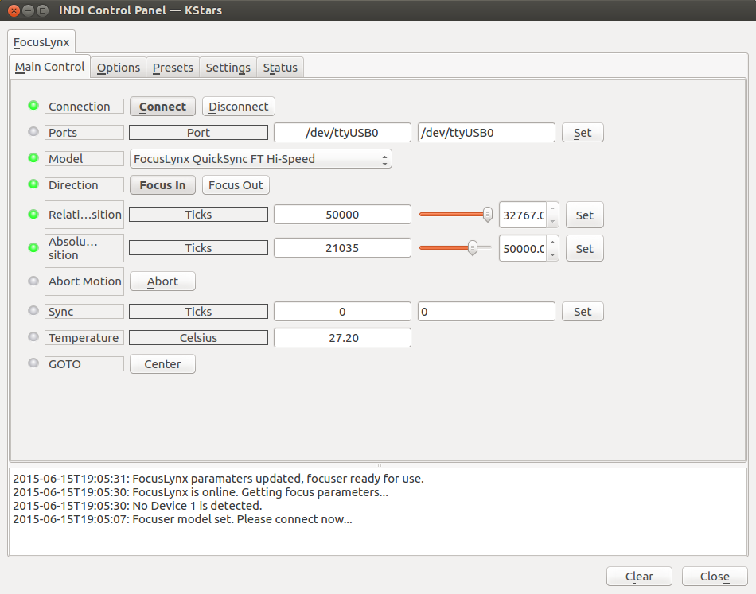
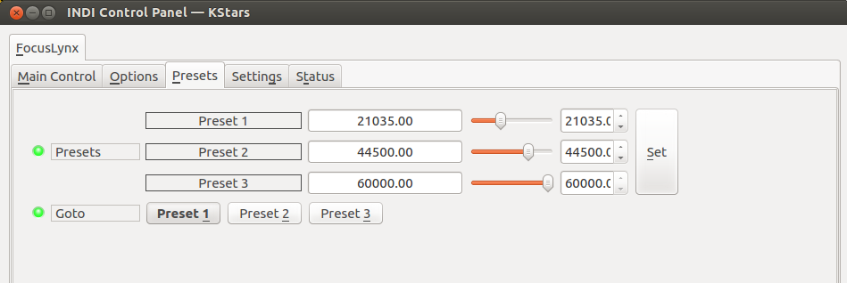
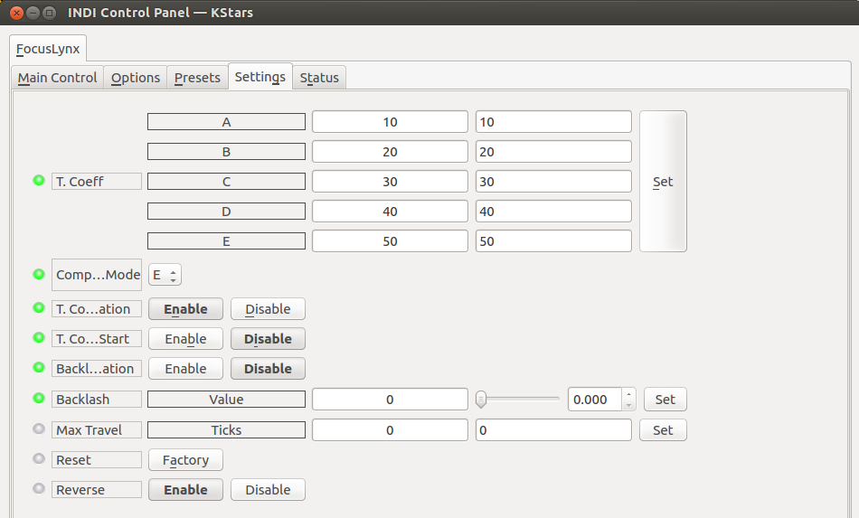
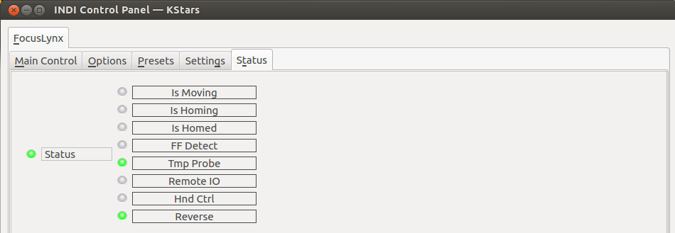
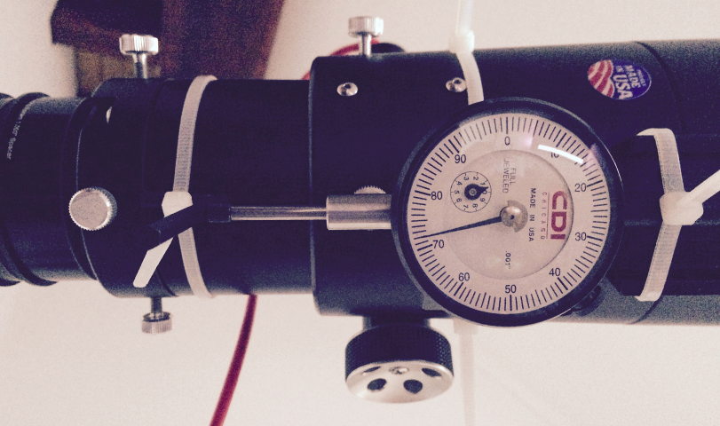
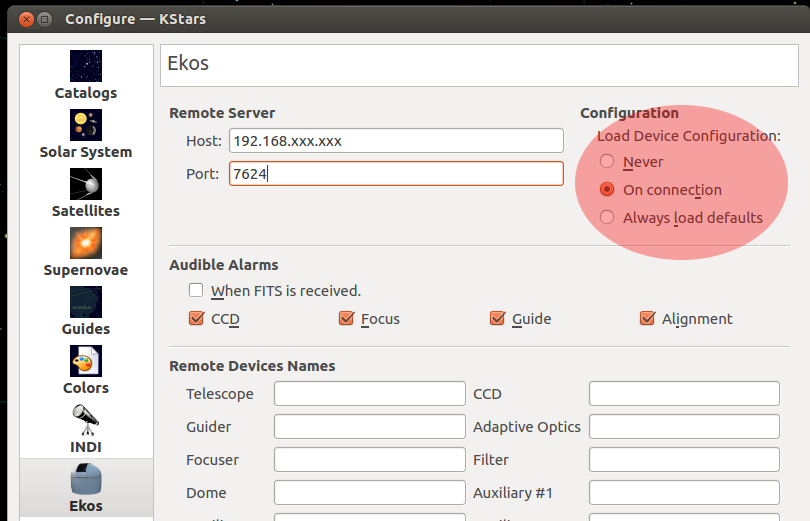

## Features

The FocusLynx/Focus Boss II hub allows precise remote operation of the motorized focuser. Different type of motor could be controlled by this hub.

-   Optec TCF-Lynx focusers are Absolute focusers that will automatically home upon power-up. The TCF-Lynx focusers have a fixed travel and known step resolutions.
-   Optec Fast Focus focusers are Absolute focuses that will home automatically with a limit switch setting the full IN or 00000 position. The Fast Focus have a fixed travel and known step resolutions.
-   QuickSync / HSM Hi-Speed focusers include the Optec QuickSync FT series and Starlight Instruments HSM Handy Motor add-ons for FeatherTouch focusers. The FeatherTouch focusers are non-homing Absolute focusers with varying step resolutions and no fixed travel limits.

**NOTE:**

Select the QuickSync / HSM Hi-Torque if you experience any slipping or motor stall with the FeatherTouch focuser with this option selected.-   QuickSync / HSM Hi-Torque focusers include the Optec QuickSync add-on motor and the Starlight Instruments HSM Handy Stepper Motor add-on for FeatherTouch focusers. The FeatherTouch focusers are non-homing Absolute focusers with varying step resolutions and no fixed travel limits.
-   FeatherTouch / MicroTouch Hi-Speed focusers include the original Micro-Touch motor and the current Starlight Instruments MSM series uni-polar motors for  **Feather Touch**. The FeatherTouch focusers are non-homing Absolute focusers with varying step resolutions and no fixed travel limits.
-   **FocusBoss II**: Select **FeatureTouch HSM Hi-Speed**  from the list when using this focuser.

**NOTE:**

Select the FeatherTouch / MicroTouch Hi-Torque if you experience any slipping or motor stall with the FeatherTouch focuser with this option selected.-   **FeatherTouch**  / MicroTouch Hi-Torque focusers include the original Micro-Touch motor and the current Starlight Instruments MSM series uni-polar motors for FeatherTouch. The FeatherTouch focusers are Relative focusers with varying step resolutions and no fixed travel limits.
-   **DirectSync**  TEC focusers include the DirectSync TEC direct-drive motor for the TEC Large Focusers. This DirectSync TEC focuser is a non-homing Absolute focuser with fixed step resolution of 1.25 micron and no fixed travel limits. The focuser can be synchronized anywhere within the range of travel to any step position between 00000 and 65,535.
-   **Stellarvue**  Focuser option should be selected when using the Optec QuickSync FT High-Speed motor option with a Stellarvue focuser. The Stellarvue Focusers are Relative focusers with varying step resolutions and no fixed travel limits.
-   **TeleVue**  Focuser option should be selected when using the Optec QuickSync TV motor option with a TeleVue focuser. The TeleVue Focusers are Relative focusers with varying step resolutions and no fixed travel limits.
More information in this

[document](http://optecinc.com/astronomy/catalog/focuslynx/pdf/FocusLynx%20Focuser%20Hub%20Help%20File.pdf)

from Optec.

Once connected five tabs are available:

### Main Control

First one, to be able to connect to the driver you have to select the « Model » focuser from the drop-down list. You could select the correct port in this tab too.

WARNING: Take care to choice the correct focuser/motor from the list. In case of wrong choice the motor could be damaged. The driver is not able to detect which kind of focuser/motor is connected and the drivers' developer couldn't be responsible in case of any damages due to a wrong selection.

When connected all mains’ functions are available to send commands to the focuser.

-   _Direction_: These buttons are used with relative travel to determine in which way the focuser will move.
-   _Relative position_: Number of ticks to move when click on « Set » or when we use the joystick's knob, if the joystick is activated one tab “Options”.
-   _Absolute position_: absolute value of the number of ticks where to move the focuser.
-   _Abort Motion_: stop moving the focuser.
-   _Sync_: Set the driver to the actual position of the focuser (For relative focuser)
-   _Temperature_: Information only! Show the actual temperature from the motor unit, the focuser or the optional external probe.
-   _Goto_: Move to the Center position from the full range of the connected motor/focuser. Could be different from the physical center position of the focuser.

### Options

-   _Driver info_: General driver's informations
-   _Debug_: Activate the debug mode. It has to be used for bugs reporting
-   _Simulation_: Activate the driver's simulation mode to test it without focuser connected.
-   _Configuration_: Manage the backup of the configuration
-   _Joystick_: If the indi_joystick drivers is loaded, activate the selected buttons to move the focuser « IN » or « OUT » from a selected amount of ticks. If Joystick is enable a new tab is visible where the buttons could be configured.

### Presets

-   _Preset Positions_: You may set up to 3 preset positions. When you make a change, the new values could be saved in the driver's configuration file.
-   _Preset GOTO_: Click any preset to go to that position

### Settings

-   _Temperature Coefficient_: The hub could be set with five different coefficients.
-   _Compensation mode_: Selection of the active compensation coefficients.
-   _T. Coefficient Compensation_: Active the temperature compensation
-   _T. Coefficient at Start_: Enable or disable the temperature compensation when starting the hub.
-   _Backlash activation_: Active or disable the backlash compensation by the hub.
-   _Backlash_: Set the hub with the number of ticks of the focuser's lash
-   _Max Travel_: Set the number of ticks of the total travel range of the focuser.
-   _Reset_: Reset all hub's parameters to factory state.
-   _Reverse_: Active the reverse mode of the focuser (Depend of the mechanical mounting of the motor). This option would invert « IN » and « OUT » direction in the hub it-self.

### Status

Show the actual status of the focuser. Not all status are operational for all focuser type, relative or absolute one have different functionalities.

## Operation

The INDI FocuserLynx / Focuser BossII driver provides complete functionality for all major features supported by the hub, including relative and absolute positioning, temperature readout, temperature compensation, preset and configuration parameters.

The hub could drive different focusers/motors. The main differences are:

-   Absolute / Relative
-   Fix / Variable travel range
-   Standard / Reverse direction

These instructions cover the use of this hub with an Absolute focuser with Variable travel range. It would be explain to set it in Reverse mode too.

1.  Check if the motor run in standard direction or reverse one
2.  Find the number of ticks of the full travel range of the focuser
3.  Set the actual position (usually the 0 position)
4.  Find the backlash value
5.  Set the pre-set value
6.  Save the configuration for future use
7.  Miscellaneous

This setting to work is one of many and other procedures could be apply too.

### 1. Direction

Disengage the motor from the focuser and move it manually to about the middle of the travel range, then re-engage the motor.

-   On “main” tab set the Sync value to about 32,500.
-   Activate the « Focus IN » button.
-   Change the Relative position value to 5000 as example.
-   Click on « Set » of Relative Position and look in which direction the focuser is moving.

If the focuser is reducing the focus length that means the configuration is NOT reverse, if it's increasing the focus length then the configuration IS Reverse.

-   Select the correct mode on the “Settings” tab, to the Reverse selection parameter.

**NOTE: The Reverse function is set in the hub and it will keep saved in the hub's memory. The direction will be applied at switch on.**

### 2. Travel range

-   Disengage the motor from the focuser. For normal direction move the focuser to the shortest length of focus. For Reverse one, move to the longest focus length.
-   Re-engage the motor to the focuser.
-   Set the Sync position to 0 and click to “Set”
-   For normal focuser set direction to “Focus OUT”, and for Reverse one set it to “Focus IN”
-   Set relative value to about 20,000 ticks and click to “Set” to start moving the focuser.
-   When it stop, estimate the ratio between the travel who has been done and the rest of it. Set a new relative value from this estimation, for example 8000 and click to “Set”
-   Make a new estimation and continue till you reach the end of the movement.
-   If the motor slip on the focuser when it reach the mechanical stop, repeat the complete procedure from 0 till you find a value will stop the motor as close as possible of the travel's end
When you are satisfied with the value you've found, set it on the tab “Settings” on the Max Travel parameter. This value is not stored in the hub, but could be saved with the backup function of the driver. The accuracy of this method is enough to have a correct setting of the driver and no issue when use it with Ekos. If you want to be more accurate you could use a dial indicator to find exactly when the focuser stop to move due to mechanical end.

**NOTE: Keep this value in mind, you're going to use it for synchronization if you have selected the reverse mode.**

### 3. Synchronize the driver to the hardware position.

Under the “main” tab of the driver you find the Sync value to set. This is valid for relative or absolute focuser which are not auto calibrated at switching on. (The biggest part of the focuser supported by the hub).

For relative focuser we have to set the Sync position after switching on, or if you've got some important slipping from the focuser.

For Reverse direction:

To Sync it easily, first one you have to know the value of number of ticks on the shortest focuser's position. This value is the one you have found as Max Travel setting step. As example a value of 44,500 ticks.

Then replace in the instruction below for the normal direction the value 0 by the one you've found! In our example use 44,500 instead of 0.

For Normal direction:

-   If your focuser is already in park position in shortest focus length (Focus IN), set the Sync value to 0. (ex. 44,500 in case of Reverse focuser).
-   If your focuser is anywhere on the range, first move it manually to the shortest position and then set the Sync value to 0 (ex. 44,500 in case of Reverse focuser).

If you prefer use any other position you could do it too. For that you need to have a known position and it ticks value to set it for synchronization.

**NOTE: When the driver is synchronized with a relative focuser then it works as an absolute one.**

### 4. Backlash value

For this value we recommend to use a dial indicator to be accurate as much as possible.

When your indicator is installed, move the focuser till the indicator move to any value then stop

-   Move the dial ring to 0 or take any other method to get a reference.
-   change the direction on the “main” tab
-   change the relative value to a short one, 5 or less ticks.
-   Start to move step by step with the relative movement, and count the number of steps till the needle begin to move back. Multiply the number of step you've done by the number of ticks you've set will give you the backlash value to configure in the driver on the “Settings” tab.
-   Enable or disable the Backlash compensation by the hub on “Backlash activation” parameter. This value is keep in the hub's memory and will be applied by default at switch on.

### 5. Preset value

On the “Presets” tab, set till three value as you want, as close as possible of the back focus position of your camera for future use.

### 6. Backup configuration

To backup your actual configuration goes to the “Options” tab and click on “Save” button.

The configuration you have saved could be recall by different ways. One is to click on “load” button, other one is to configure on EKOS the “Load Device Configuration” to “On connection”. With this selection the configuration will self-loaded on the device connection.

**NOTE:**

-   As indicated before, some setting are store in the hub itself. The driver reads those values on the device connection.
-   The configuration is saved in ~/.indi/FocusLynx_config.xml on the PC running indiserver. Typical on raspberry PI unit.

### 5. Miscellaneous

Temperature compensation:

-   Please read the user manual provided with the hub to calibrate and set this function.
-   You could configured till 5 coefficients
-   These are stored in the hub's memory

Debugging:

On the tab “Options” the debug mode could be activated in case of trouble. Please read  [these instructions](http://www.indilib.org/forum/general/571-read-before-you-post-any-support-request.html)  before send any support requests to the developers.