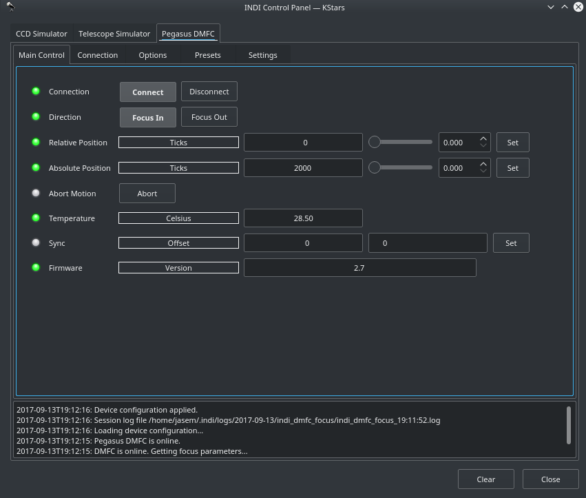
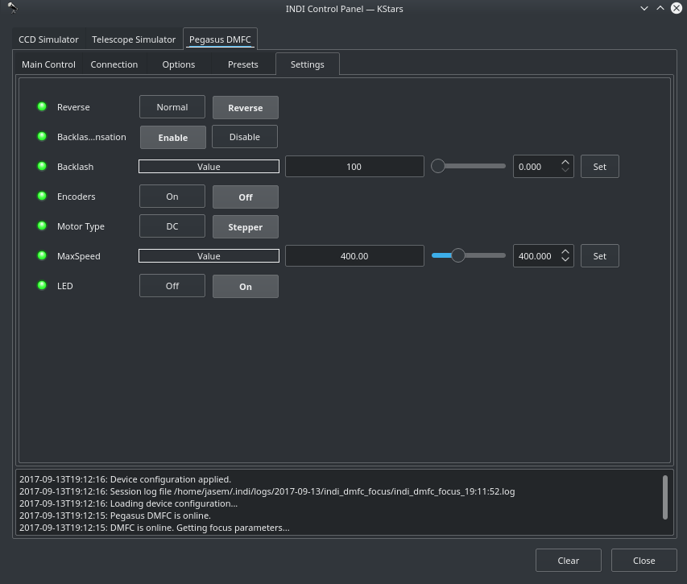
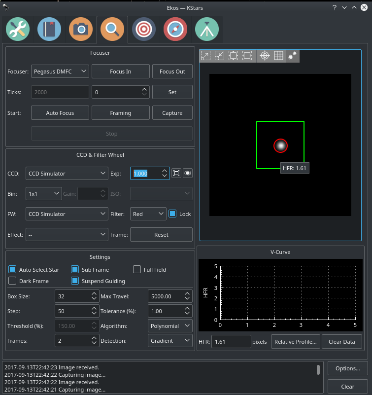

## Features

Pegasus Dual Motor Focus Controller (DMFC) is a Dual-Motor Focus Controller that supports two kind of motor types.

-   High Resolution Stepper motors for absolute position focusing.
-   DC motors by its Pulse Width Modulation duty cycle control.

Controller can switch motor mode from its software, Mode can be instantly changed from  _Stepper_  to  _DC_  motor and saved in controller’s EEPROM memory.

The driver supports all the capabilities of the controller including temperature readout, backlash settings, led and reversibility controls.

### Main Control Tab

From the main control panel, the focuser can be moved in absolute steps using the controls shown above. Set the desired position in the  _Absolute Position_  control and then press  _Set_  to start the motion.

Alternatively, focuser can be moved in  _Relative_  steps  _Inward_  or  _Outward_.

When the focuser is closest to the back of the OTA, it is considered fully  _retracted_. Focus  _IN_  motion is always from larger steps to smaller steps (e.g. 4000 to 3000), while focus  _OUT_  is the opposite (e.g. 3000 to 4000). Therefore, when fully retracted, the focus position should generally indicate  **zero**. Fortunately, even if the current position does not match what you expect, you can  **sync**  the focuser position to any arbitrary ticks position by setting the sync control in the main control panel.

### Settings

All primary settings can be set in the  _Settings_  tab. All the settings can be saved by going to the  _Options_  tab and clicking  _Save_  under configuration.

1.  **Reverse**: Switch direction of motion.
2.  **Backlash**: Set whether backlash compensation is enabled or disabled. Set the desired backlash value in ticks.
3.  **Encoders**: Encoders are enabled by default. Disable them to manually change the position of the focuser without affecting the current position ticks count.
4.  **Motor Type**: Set appropriate motor type for the focuser.
5.  **Max Speed**: Set Maximum stepper speed. It is recommended to use the default value of 400 for stable and smooth motion.
6.  **LED**: Turn On/Off LED

### Presets

You may set pre-defined presets for common focuser positions in the  _Presets_  tab.

-   Preset Positions: You may set up to 3 preset positions. When you make a change, the new values will be saved in the driver's configuration file and are loaded automatically in subsequent uses.
-   Preset GOTO: Click any preset to go to that position

## Operation

The INDI Pegasus DMFC driver provides complete functionality for all the features supported by Pegasus including relative and absolute positioning, temperature readout, preset and configuration parameters.

It can be controlled from any INDI-compatible client. Illustrated below is the focus control with Ekos:

