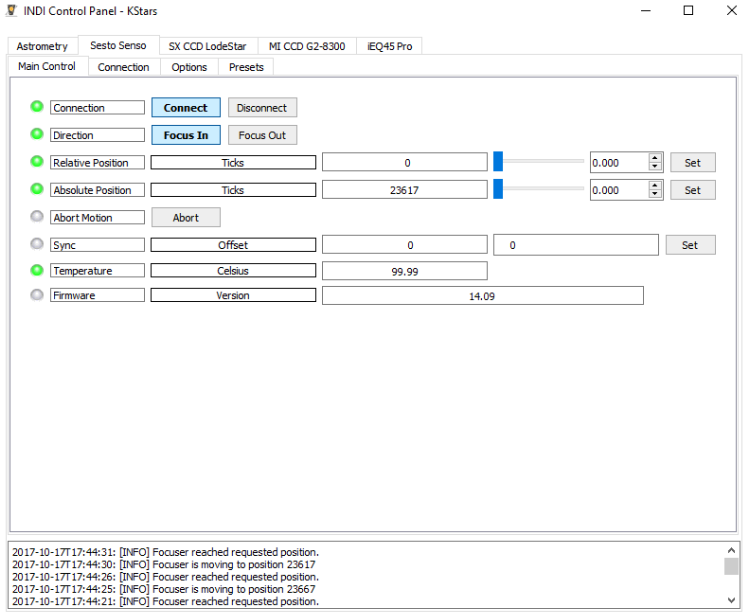

## Features

SESTO SENSO is a robotic focusing motor for telescopes and compatible with most focusers. Install it in place of the micrometer knob and connect it to USB port to remotely control without vibration and with high precision your telescope's focuser! Thanks to the precise control motor with integrated electronics, SESTO SENSO achieves incredible precision of just 0.7 microns.

### Main Control Tab

-   **Direction**: Select focus direction.
-   **Relative Position**: Move the focus by a relative amount in the direction specified above.
-   **Absolute Position**: Move focuser to an absolute position in ticks.
-   **Sync**: Set current position as the supplied offset without moving the focuser.
-   **Temperature**: read out of the built in temperature sensor or the external temperature probe.

### Connection

-   Select connection port, by default, it's set to /dev/ttyUSB0.
-   Select Auto-search parameters.

### Presets

You may set pre-defined presets for common focuser positions in the _Presets_ tab.

-   **Preset Positions**: You may set up to 3 preset positions. When you make a change, the new values will be saved in the driver's configuration file and are loaded automatically in subsequent uses.
-   **Preset GOTO**: Click any preset to go to that position

## Operation

Set the focuser connection port under the  _Connections_  tab. Click connect in the  _Main Control_  Tab to establish connection. The INDI SestoSenso driver provides basic functionality that includes settings of absolute and relative position. Use  _Sync_  to set the current position to any desired value. It can be used by autofocus software such as Ekos.