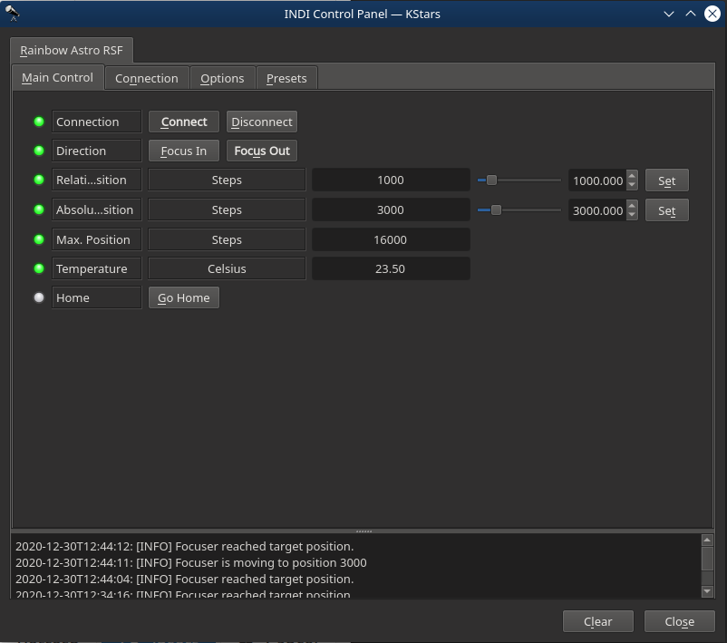
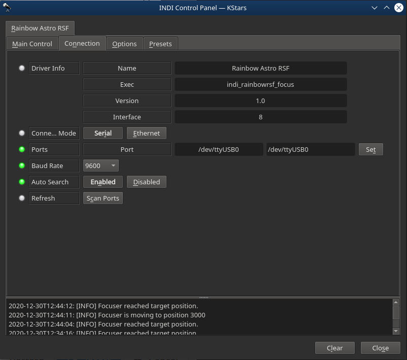
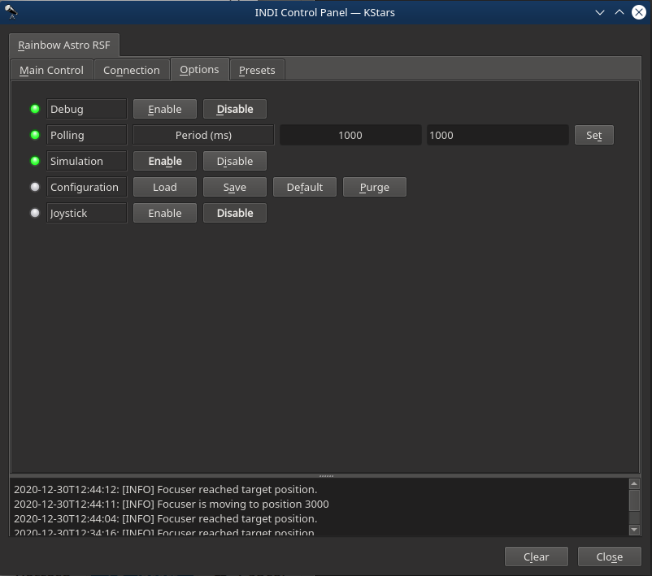
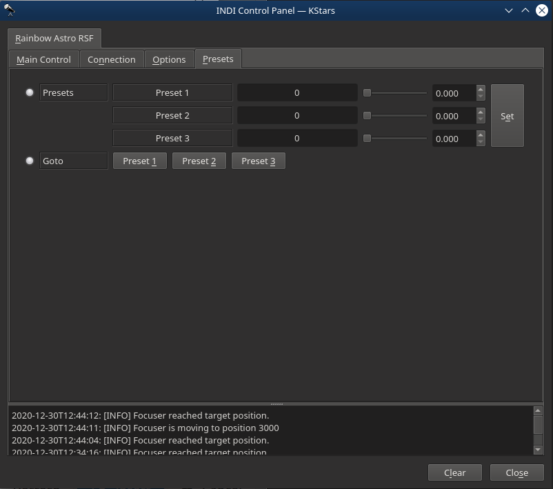

## Features

Rainbow Astro RSF is a secondary mirror focuser with a stepper motor. It includes a physical remote controller that can be used without a computer.

## Main Control

**Please note** the range for the RSF focuser is -8000 to +8000 with zero being the home position. However, in INDI the range is 0 (corresponding to -8000) to 16000 (corresponding to +8000) with 8000 being the zero home position. You do not really need to take any action, this is just for your information.

-   **Direction**: Focus IN or Focus OUT to control the relative position direction
-   **Relative Position**: Moving the focuser a number of steps relative to the current position
-   **Absolute Position**: Moving the focuser to the specified position from 0 to 16000
-   **Max Position**: The maximum number of steps
-   **Temperature**: The current temperature reading of the focuser's sensor
-   **Go Home**: Takes the focuser to the home position which uses a sensor to confirm the position

## Connection

-   **Driver Info**: General driver infomation
-   **Connection Type**: Serial or Ethernet
-   ****Baudrate**:** 9600

## Options

The Options tab contains settings for all drivers that include polling (frequency of updates), logging, and debugging. Contains the option for simulation to run the driver without using the physical device.

## Presets

You may set pre-defined presets for common focuser positions in the  _Presets_  tab.

-   Preset Positions: You may set up to 3 preset positions. When you make a change, the new values will be saved in the driver's configuration file and are loaded automatically in subsequent uses.
-   Preset GOTO: Click any preset to go to that position

