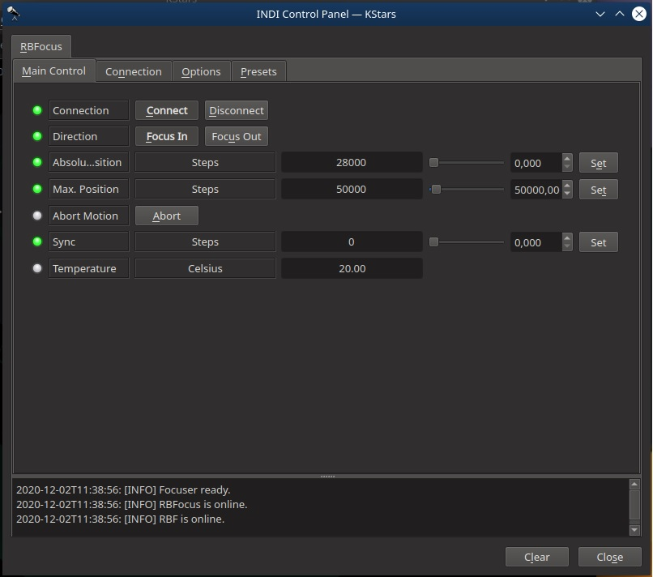
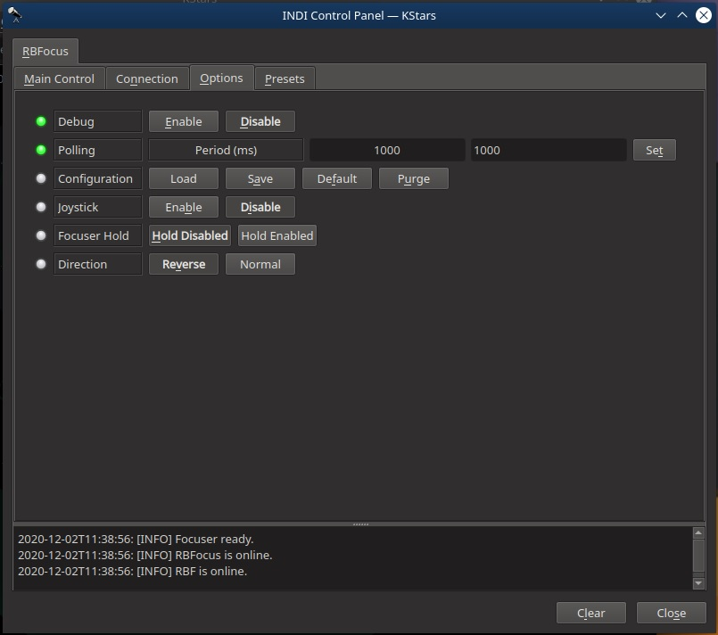

## Features

RB Focuser is a budget-friendly telescope electronic focuser with a resolution of 0.7 microns, made to keep up with today's fast optics standard. Depending on the version, it comes with: temperature sensor, Auto home function, BlueTooth connectivity, and Android APP. The unit is 3D printed what makes it easy to develop new mounting systems for any OTA.

-   Direction: Focus IN or Focus OUT. IN decreases ticks count, OUT increases ticks count. Selecting this controls the direction of the Relative Position property below.
-   Absolute Position: Set the number of absolute steps.
-   Sync: Set the current focus position as the entered position.
-   Max. movement: Maximum position change in a single movement (in steps).
-   Abort Motion: Force focuser to stop when is moving.
-   Temperature: Ambient temperature(in Celcius).

## Operation

### Connecting to RBFocuser

Connect to the focuser using a USB cable. The connection type is serial and by default the port is set to /dev/ttyUSB0. The default baud rate is 9600.

After establishing connection to the focuser, you can use the focuser control in the INDI control panel directly to move and sync the focuser. Alternatively, the focuser can be used in any INDI compatible autofocusing application.

## Options

The Options tab contains settings for all drivers that include polling (frequency of updates), logging, and debugging.

-   Focuser Hold: Keeps the telescope focuser held by the stepper motor when a movement is finished.
-   Direction change: allows the user to reverse de stepper movement direction in case of being necessary.

## Presets

You may set pre-defined presets for common focuser positions in the  _Presets_  tab.

-   Preset Positions: You may set up to 3 preset positions. When you make a change, the new values will be saved in the driver's configuration file and are loaded automatically in subsequent uses.
-   Preset GOTO: Click any preset to go to that posi