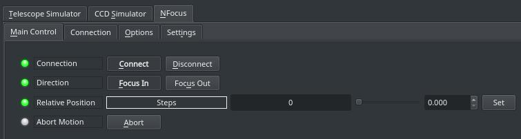
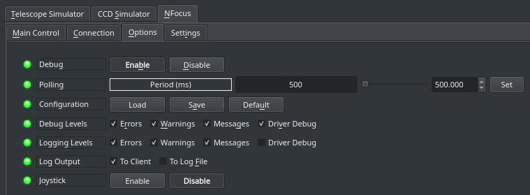

## Features

The nFOCUS controller is a small DC focus controller that provides two directions at two speeds with only two buttons using a12V regulated output. Low speed is adjustable pulse width modulated (PWM) drive, providing full voltage torque for low speed operation. It is compatible with Van Slyke Engineering, JMI, Celestron, MEADE LX200GPS microfocuser, Moonlite and others.

The driver works in  _Relative Focuser_  mode where you can command the focuser specific number of steps INWARD or OUTWARD. Speed controls can be configured in the settings tab of the driver.

### Main Control Tab

-   **Direction**: Focus IN or Focus OUT. IN decreases ticks count, OUT increases ticks count.
-   **Relative Position**: Set the number of steps from the current absolute position to move.
-   **Temperature**: read out of the built in temperature sensor or the external temperature probe if any.

## Operation

### Connection

The focuser is connected to the PC via serial connection. Use Serial to USB adapter and connect it to a USB port. By default, the driver would try to connect to all available systems ports until a successful connection is made. It is genereally recommend to employ the  [Serial Port Assistant](https://stellarmate.com/support.html?view=kb&kbartid=2#5_stellarmate_serial_assistant)  tool to assign a permenant designation for the port. This would make connecting to the serial port reliable from the first time if there are multiple serial to usb devices being used at the same time by the system.

Ethernet/Networked connection option is available when using a Serial-To-Ethernet adapter. The IP address and port of the adapter is required to make the connection.

After making changes to the connection parameters, go to the  **Options**  tab and save the configuration.

### Options

The options tab includes parameters to enable/disable logging and debugging settings in addition to polling and joystick control.

The debugging and logging options should remain off unless you are to diagnose a problem with the driver.

**Polling**: How often should the driver read the device output signals? By default it is set to 500ms or twice per second.

**Joystick**: If a gamepad or joystick is connected, enable it to focus IN and OUT using the jo