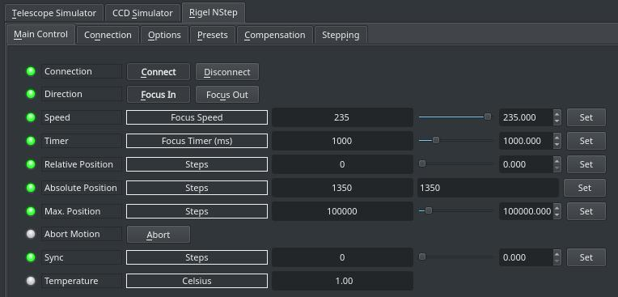
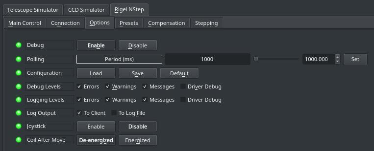
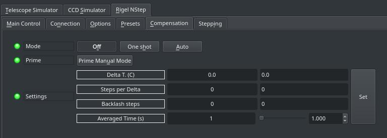

## Features

The nStep controller is a small absolute-position stepper motor controller that can work on a variety of motor configurations. It connects to your PC/StellarMate either via Serial-to-USB cable or WiFi. It supports the following features:

-   **Speed adjustments**: 254 levels of speed adjustment controls.
-   **Temperature Compnesation**: Advanced temperature compensation algorithm to adjust the position of the focuser as the temperature changes. An external temperature probe can be used to record the temperature.
-   **Stepping Controls**: Control the motor stepping mode and wiring phase.
-   **Sync**: Set the focuser position to any arbitary values to reset the position to the desired value.

### Main Control Tab

-   **Direction**: Focus IN or Focus OUT. IN decreases ticks count, OUT increases ticks count.
-   **Speed**: Set stepper motor speed. Lower is slower.
-   **Timer**: Moves the focuser in the set focus direction for this many milliseconds. Do not use directly.
-   **Relative Position**: Set the number of steps from the current absolute position to move.
-   **Absolute Position**: Set the absolute position.
-   **Max Position**: Define an arbitrary maximum travel position. Any GOTOs beyond this position are rejected.
-   **Sync**: Set the current absolute position to this value. It is recommended when using the focuser for the  **first**  time to fully retract the focuser (focuser is closest to the OTA) and then  _Sync_  to  **zero**  as zero is defined as the fully retracted position.
-   **Temperature**: read out of the built in temperature sensor or the external temperature probe if any.
-   **Temperature**: If temperature probe is connected, the current temperature in Celcius shall be reported.

## Operation

### Connection

The focuser can connected to the PC/StellarMate via either a serial-USB connection or WiFi. Use Serial to USB adapter and connect it to a USB port. By default, the driver would try to connect to all available systems ports until a successful connection is made. It is genereally recommend to employ the  [Serial Port Assistant](https://stellarmate.com/support.html?view=kb&kbartid=2#5_stellarmate_serial_assistant)  tool to assign a permenant designation for the port. This would make connecting to the serial port reliable from the first time if there are multiple serial to usb devices being used at the same time by the system.

For WiFi nStep controllers, click on  **Ethernet**  button to switch to  _Networked_  connection. Refer to nStep documentation for configure the WiFi option. The IP address and port of the WiFi adapter is required to make the connection.

After making changes to the connection parameters, go to the  **Options**  tab and save the configuration.

### Options

The options tab includes parameters to enable/disable logging and debugging settings in addition to polling and joystick control.

The debugging and logging options should remain off unless you are to diagnose a problem with the driver.

**Polling**: How often should the driver read the device output signals? By default it is set to 500ms or twice per second.

**Joystick**: If a gamepad or joystick is connected, enable it to focus IN and OUT using the joystick. A new tab called  **Joystick**  is created. The INDI joystick driver must be running and connected to a supported joystick under Linux.

**Coil After Move**: Set whether the stepper coils should be energized or de-energized after motion is complete.

Caution: When set to energized, watch the stepper motor temperature as it might get warm.

### Temperature Compensation

Change the nStep temperature compensation settings. By default, the controller boots up with the temperature compensation disabled. If you switch configuration to  **Auto**  and then save INDI driver configuration, this setting will be applied the next time you use the driver.

-   **Mode**: Click  _One Shot_  to execute temperature compensation once. However, before activating  _One Shot_  mode, press  **Prime For Manual<**  first. When set to  _Auto_, the controller algorithm shall decide when to make the temperature compensation adjustments as per the settings.
-   **Delta T.**: This is the temperature change x10 to trigger a compensation. The nSTEP uses a fixed point value here which is 10X the real temperature change desired. Examples: -005 = move in "-" direction when temp changes by 0.5C, +015 = +1.5C change must be detected before triggering a compensation. The values can range from -100 (-10.0C) to +100(+10.0C) in increments of 5(0.5C).
-   **Steps Per Delta**: Move this many steps for each Delta Temp change. Direction of movement controlled by sign of DeltaTemp
-   **Backlash**: Apply this number of steps in last move direction before reversing direction. Range 0 through 100 with 0 = no backlash takeup
-   **Averaged Time**: Temperature will be averaged over this number of seconds. Range 1 to 75 seconds. Set to a lower value for more immediate changes. A lower value may cause 'hunting' if the sensor is detecting a value that is just toggling slightly (e.g. from 17.5C to 18.0C to 17.5C).

### Stepping Settings

Controls the stepping mode and phase.

-   -   **Wave**: Wave Stepping Mode.
    -   **Half**: Energizes 1 or two coils at a time, doubling step resolution.
    -   **Full**: Highest power mode, two coils always energized.
-   **Phase Select**:  **set to 0 for usb-nSTEP**. Can be used for any possible the phase wirings. Allow a person to wire the phases in any order then chose one of 3 settings in software to drive them.