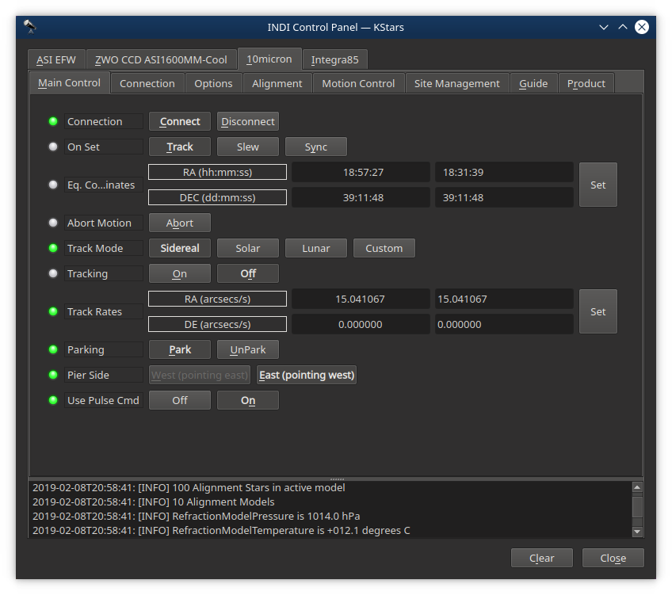
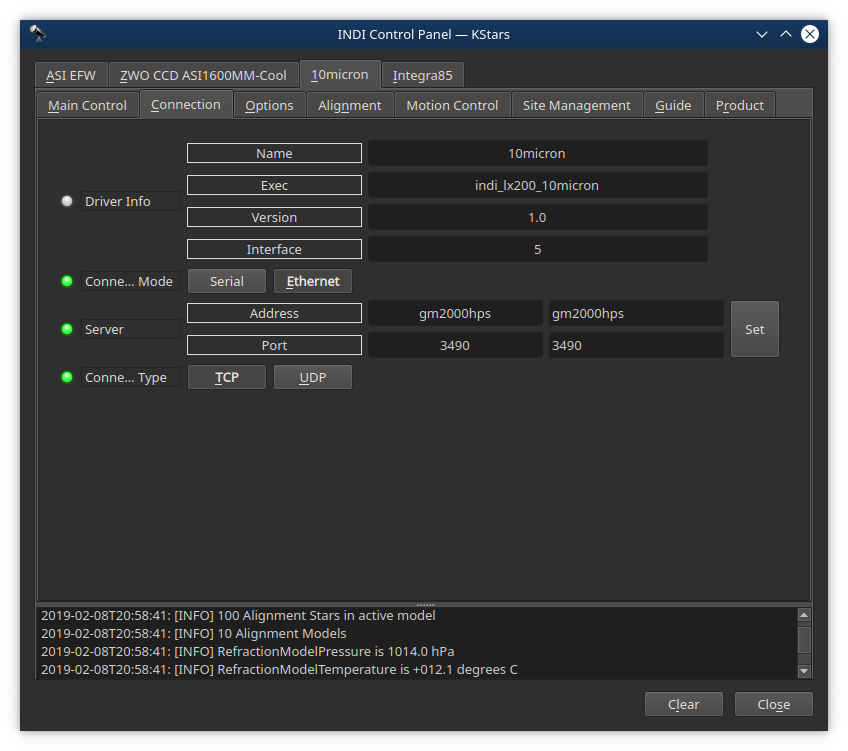
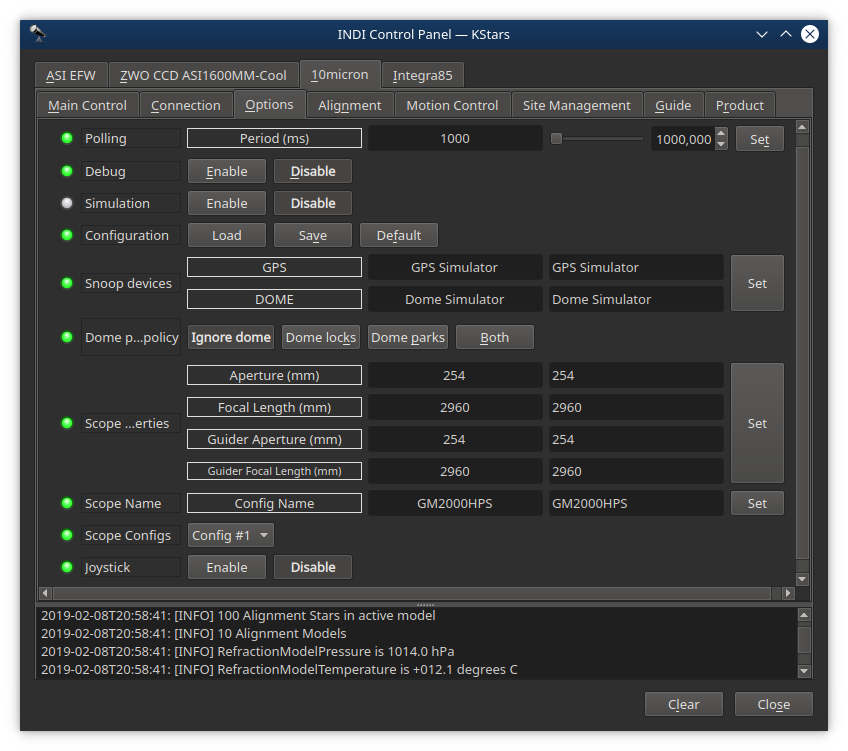
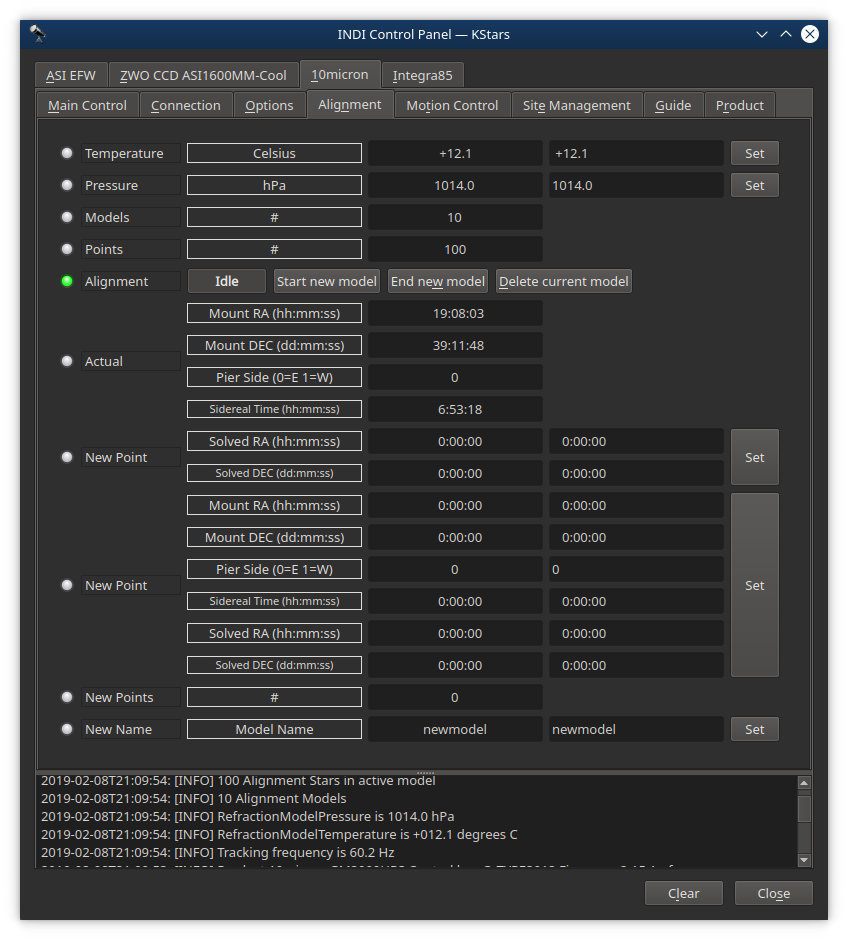
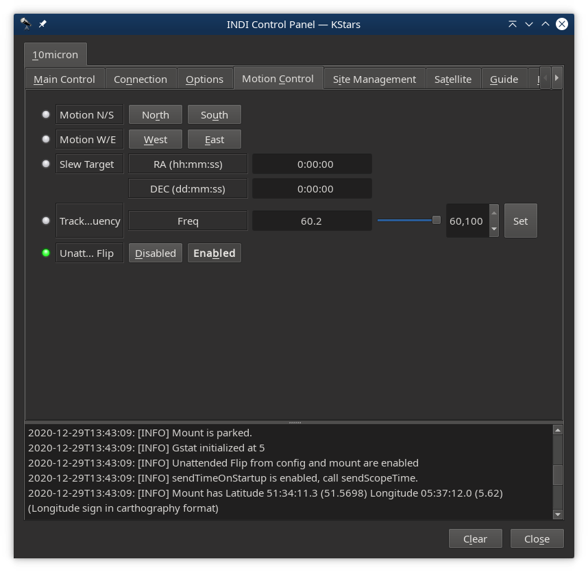
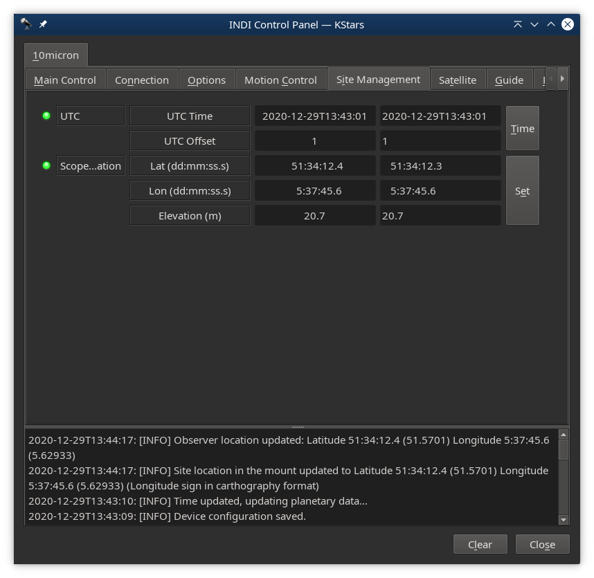
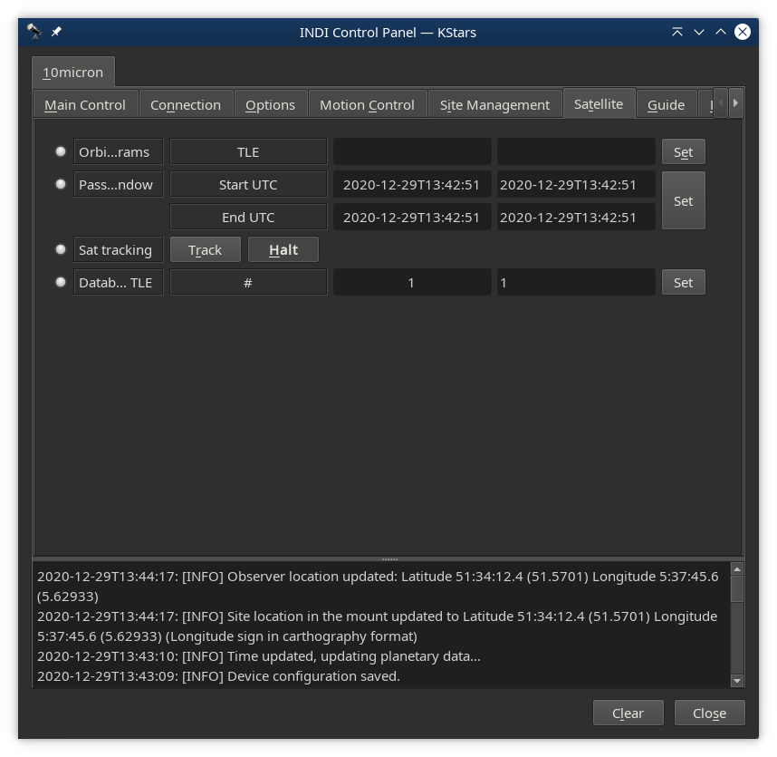
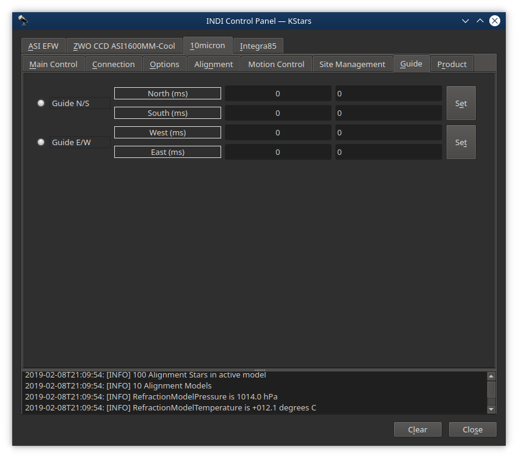
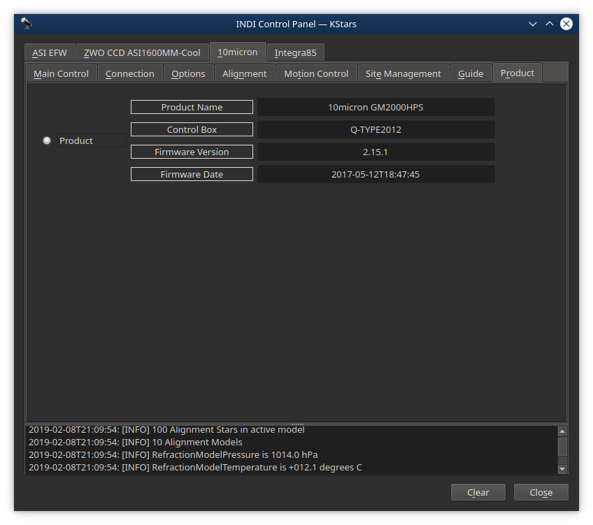

## Features

This driver supports the 10 Micron HPS and QCI models. All basic LX200 functions as well as some 10 Micron extensions are supported like goto, park, pier side, ultra precision and pressure and temperature for the refraction model and satellite tracking.

The driver ideally connects to the mount via ethernet but wifi or serial port support is available as well.

New features will still be added to the driver over time as not everything that the 10Micron API offers has been exposed.

Current features are:

-   Goto/Slew at 10 Micron Ultra Precision Mode
-   Sidereal, lunar, solar and custom trackrates
-   Parking
-   Pier side
-   Pulse guiding

## Connectivity

For connecting to the mount  _Serial_  and  _Network_  (Ethernet and WIFI) connections are supported. Ethernet is recommended for reliability and it frees up the serial port for an optional GPS receiver. For a Network connection the Address can be an IP address or a DNS name. The mount listens to ports 3490 and 3492, either works. For Network the connection type needs to be TCP.

## First Time Connection and Options

When running the driver for the first time, go to the Connection tab and select the desired connection mode and depending on that choice the serial port or the network address (IP address or DNS name) and network port to connect to. After making changes in the Connections tab, go to Options tab and save the Configuration settings.

Next set the telescope's aperture and focal length in the  **Options**  tab and save these settings too.

## Alignment

The Alignment tab can be used to manually create pointing models. While this works it is also very tedious and a much faster and better approach is to use  [MountWizzard v4](https://github.com/mworion/MountWizzard4)  together with Plate Solving. This can be either StellarSolver or the online  [Nova Astrometry.net](http://nova.astrometry.net/)  for plate solving, or a  [local installation of Astrometry.net](http://astrometry.net/use.html)  together with  [Astrometry.net API Lite](https://github.com/Jusas/astrometry-api-lite).

## Motion Control

The Motion Control tab shows North/South and East/West motion as well as the slew target coordinates. This part is just informative.

The tracking frequency can be changed. This value is computed by the 10Micron mount in order to emulate the corresponding LX200 command. It is typically not used or altered.

The Unattended Flip setting can be enabled or disabled. When this option is enabled, the mount will not stop when reaching the tracking limit, but it will begin an UNATTENDED slew to the other side of the meridian in order to continue to track the object. WARNING: use this option with extreme care, because it renders the mount able to start a slew operation without a specific instruction by the operator or by the controlling software.

## Site Management

The Site Management tab allows you to manually set the time and location of the mount. Time is better set automatically by either a GPS unit that is connected to the mount, or by the computer running the INDI server if it has some sort of network time synchronization. Location is also best set automatically by a GPS unit that is connected to the mount, or a GPS unit that is connected to the INDI. If you have a GPS unit connected directly to the mount then disable client programs such as KStars/EKOS to set the mounts time and location because these settings will fight those coming from the GPS unit.

Scope location Latitude and Longitude can be entered in the 10Micron ultra precision format of dd:mm:ss.s . The longitude polarity follows carthographic format where positive longitudes are east of the prime meridian (which passes near the Royal Observatory, Greenwich, England), and negative ones are west. (The driver internally reverses this polarity as per LX200 API standard.)

## Satellite

The Satellite tab allows you to track a satellite given its satellite orbital elements in Two-Line Element format (TLE). The TLE format is described at  [www.celestrak.com/NORAD/documentation/tle-fmt.php](https://www.celestrak.com/NORAD/documentation/tle-fmt.php)  and can be entered in the Orbit Params TLE field. The Pass Window field then displays the beginning and the end timestamp of the next satellite pass. The Sat Tracking switch can be set from Halt to Track to make it all work. The TLE are stored in a database on the mount and previous entries can be selected by the Database TLE field so that they do not have to be typed again.

## Guide

The Guide tab allows for very simple manual guide commands.

## Product

The Product tab lists mount specifics like the Product Name, Control Box type and Firmware version and release date.

