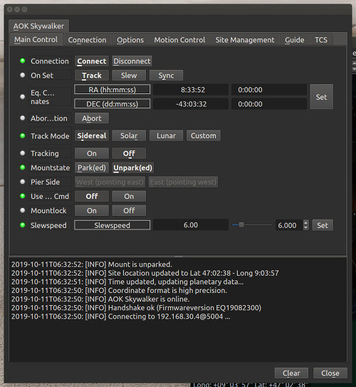
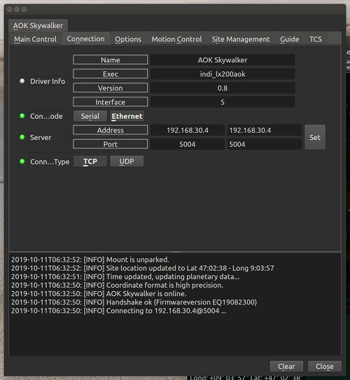
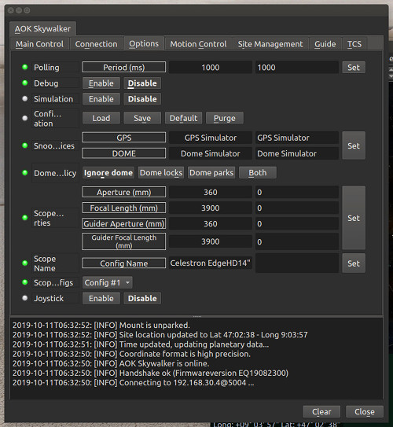
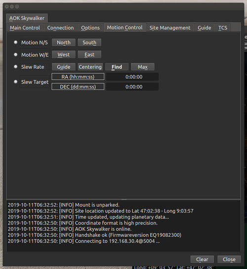
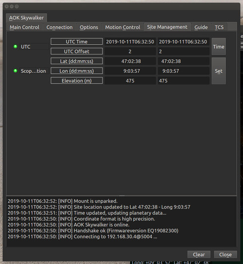
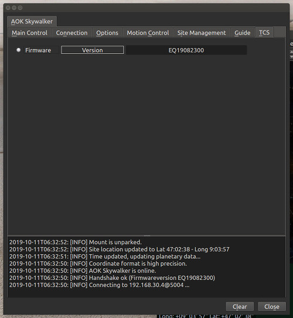

## Features

The INDI AOK Skywalker driver interacts with the AOK Skywalker mount controller (DDM Skywalker) using the TCP/IP protocol over WiFi or a wired ethernet link.

The Herkules line of the AOK Skywalker mounts are produced by AOKSwiss & Magnetdrives AG. The equatorial models DDM Herkules V12, V24 and V48 are supported. The alt-azimuth mount Atlas should be handled as well.

Current features are:

-   Sync & Goto
-   LX200 compatible slew rates (Guide, Centering, Find, Max)
-   Configureable slew speed
-   Sidereal and solar trackrates
-   Tracking On/Off switch
-   Mount Park/Unpark switch
-   Pulse-guiding (projected)
-   ST4 Guiding
-   Mount Locked/Unlocked switch
-   Indication of pierside

-   The driver does not implement an internal alignment model, as it uses the builtin pointing model of the controller (DDM Skywalker).
-   It also employes the builtin automatic meridian flip of the DDM Skywalker, which heavily relies on setting the correct location data! (see Connectivity, 3. First Time Connection)
-   The parking position can be set individually through the webserver. (see Connectivity, 2. Web Server)

## Connectivity

The mount is operated via the DDM Skywalker by means of a WLAN or a wired connection over TCP/IP.

### 1. Control Server

The default IP address:port is [192.168.1.9:5004]. (Follow the information in the operation manual of the DDM Skywalker, if you want to change adress or port.)

### 2. Web Server

In addition to the control port, the DDM Skywalker features a website at the address [192.168.1.9:80], that gives supplemental controls and informations about the status of the controller. (Be sure to have a working internet connection, as the DDM Skywalker is loading the sitemask from the web!)

### 3. First Time Connection

Before starting the driver, power the mount. The drives of the mount will make a couple of minor movements about both axis for calibration. Wait until the mount is steady again.

When running the driver for the first time, go to the  **Connection**  tab, select [Ethernet] and enter the IP address and port for the controller . After having set the changes in the Connections tab, go to  **Options**  tab and save the settings. Now you should be able to establish a connection with the DDM Skywalker in the  **Main Control**  tab.

## Operation

### Main Control

The  **Main Control**  tab is where the primary control of the AOK Skywalker takes place. After a successful connection the mount will be automatically unparked. Align the telescope with a known stellar object and do a "sync". This way Mountlock and Tracking will be automatically engaged. To track another object, enter the equatorial of date (JNow) coordinates and press [Set]. The mount shall then slew to an object and once it arrives at the target location, it should engage tracking at the selected tracking rate which default to [Sidereal tracking]. [Slew mode] is different from [track mode] in that it does not engage tracking when slew is complete.  
Users will seldom use this interface directly however, since many clients (e.g. KStars) can slew and "sync" the mount directly from the sky map without having to enter any coordinates manually.

At present two tracking modes are supported: Sidereal and Solar. Tracking can be engaged and disengaged by toggling the  **Tracking**  switch.

### Options

Under the options tab, you can configure many parameters before and after you connect to the mount.

-   **Snoop Devices**: Indicate which devices the DDM Skywalker driver should communicate with:
    -   **GPS**: If using a GPS driver (e.g. INDI GPSD) then enter its name here. The DDM Skywalker shall sync its time and location settings from the GPS driver.
    -   **Dome**: If using a Dome driver, put its name here so that Dome Parking Policy can be applied.
-   **Configuration**: Load or Save the driver settings to a file. Click default to restore default settings that were shipped with the driver.
-   **Simulation**: You can connect to the DDM Skywalker without having connected the mount and test all commands. So there is no need to toggle this switch!
-   **Debug**: Enable debug logging where verbose messaged can be logged either directly in the client or a file. If Debug is enabled, advanced properties are created to select how to direct debug output.  [Watch a video on how to submit logs](https://stellarmate.com/support/logs-submission.html).
-   **Dome Parking Policy**: If a dome is used in conjunction with the mount, a policy can be set if parking the mount or dome can interfere with the safety of either. For example, you might want to always park the mount _before_ parking the dome, or vice versa. The default policy is to ignore the dome.
    -   **Ignore dome**: Take no action when dome parks or unparks.
    -   **Dome locks**: **Prevent** the mount from unparking when dome is parked.
    -   **Dome parks**: Park the mount if dome starts parking. This will disable the locking for dome parking, EVEN IF MOUNT PARKING FAILS.
    -   **Both**: Dome locks & Dome parks policies are applied.
-   **Scope Properties**: Enter the Primary and Seconday scope information. Up to six different configurations for _Primary_ and Secondary _Guider_ telescopes can be saved separately, each with an optional unique label in [Scope Name] property.
-   **Scope Config**: Select the active scope configuration.
-   **Joystick**: Enable or Disable joystick support. An INDI Joystick driver must be running for this function to work. For more details, check the  [INDI Telescope Joystick](https://stellarmate.com/support/tutorials/135-controlling-your-telescope-with-a-joystick.html)  tutorial.

### Motion Control

Under motion control, manual motion controls along with speed and slew controls are configured.

-   **Motion N/S/W/E**: Directional manual motion control. Press the button to start the movement and release the button to stop.
-   **Slew Rate**: Guide, Centering, Find and Max.
-   **Slew Target**  displays the coordinates of the current land target.

### Site Management

Time and Location settings are configured in the  **Site Management**  tab. Please note that proper data is crucial for the correct working of the mount, especially the automatic flips. The DDM Skywalker itself does not retain time and location: So after having set the changes, go to  **Options**  tab and save the settings. This way the controller is receiving the correct data on startup of the driver. Most applications, like KStars, can update the driver with location and time (see INDI settings in KStars).

-   **UTC Time/UTC Offset**: UTC Time and UTC offset must be set for proper operation of the mount. The UTC offset is in hours. East is positive and west is negative.
-   **Location**: Latitude and Longitude must be set for proper operation of the mount. The longitude range is 0 to 360 degrees increasing eastward from Greenwich.
-   **Elevation**: Elevation is entered only for informational purpose. It will not be included in any calculations.

### Information

On successful connection the DDM Skywalker firmware version is read out.

