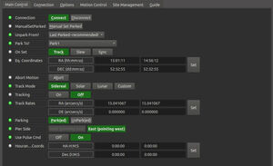
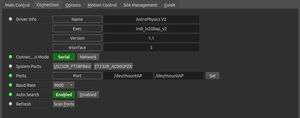
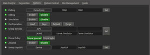
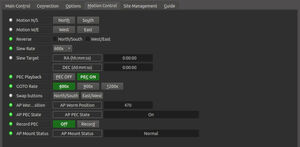
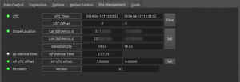

## Features

This driver supports Astro-Physics mounts over a serial or wired LAN connection with a firmware version of 'V' or newer. Only GTOCP3, GTOCP4, and GTOCP5 Control Boxes are supported. For GTOCP1 and GTOCP2, please use the legacy driver.

While the driver was designed to be used in a fully remote observatory without any operator presense, it is highly recommended to test the driver with your mount to ensure safe and proper operation. The driver is not a replacement to AP's Command Center (APCC). No advanced mount modeling is support except for simple SYNCs.

## Operation

### First Time

-   Use one of the predefined "ParkTo" positions of PARK1/PARK2/PARK3/PARk4. They are the only park positions supported. These are defined in this document from Astro-Physics: [PARK POSITIONS](http://www.astro-physics.com/images/Park_Positions_Defined.pdf)
-   Make sure the  _**Unpark From**_ option on the  **Main** is set to  **Last Parked**. This is the safest option since it will let the mount determine its position based on where it was last parked. The only reason to use a different setting is if the mount seems to have lost sense of where it is and you want to start from a predefined position.
-   Do not try parking the mount until this position is defined.
-   Save these options using the _**"Save"**_ button on the **Options**  tab or else the changes will be loss when the driver is closed.

### Main Control

-   **Connect:**  You can manually connect/disconnect to the mount.
-   **UnparkFrom?:** This should usually be set to LastParked. That means when you unpark, the mount remembers where it was last pointing, and as long as the geography and time are properly set in the mount, and the user has not move the mount's pointing position manually, it should be able to recover its position. You can force it to assume it is in the Park1, Park2, Park3, or Park4 position, but, of course, please make sure it really is. These are positions defined in this document from Astro-Physics: [PARK POSITIONS](http://www.astro-physics.com/images/Park_Positions_Defined.pdf)
-   **ParkTo?:** Tell the mount which of the above 4 park positions should be used.
-   **Manual Set Parked:** This is a button to help fix a problematic mount. You can force the mount to consider itself parked whereever it is pointing by pressing this button. After doing that, you would manually place it in a known park position, set UnparkFrom? to that position, and click unpark. Carefully test to make sure the mount is acting reasonably. Please supervise very carefully and be prepared to stop motion (possibly with a power switch). After that it is highly recommended to change UnparkFrom back to LastParked.

Leave this option at "Last Parked" unless you know what you are doing. If you start the driver up and it is set to something besides "Last Parked" and the mount is not actually in the configured PARK position it will be very confused about where it is really pointing and lead to improper slews that may cause a pier strike!

### Connection

The main control here is the port to connect to. The driver being used, and its version are also displayed.

### Options

The  **Options** tab is used to set debugging and other configuration options, as well as being able to load and save configurations.

-   **Debug**: Enable debug logging where verbose messaged can be logged either directly in the client or a file. If Debug is enabled, advanced properties are created to select how to direct debug output.  [Watch a video on how to submit logs](https://stellarmate.com/support/logs-submission.html).
-   **Simulation**: Enable to disable simulation mode for testing purposes.
-   **Configuration**: Load or Save the driver settings to a file. Click default to restore default settings that were shipped with the driver.
-   **Snoop Devices**: Indicate which devices the driver should communicate with:
    -   **GPS**: If using a GPS driver (e.g. INDI GPSD) then enter its name here. EQMod shall sync its time and location settings from the GPS driver.
    -   **Dome**: If using a Dome driver, put its name here so that Dome Parking Policy can be applied.
-   #### Dome Parking Policy
    
    If a dome is used in conjunction with the mount, a policy can be set if parking the mount or dome can interfere with the safety of either. For example, you might want to always park the mount _before_ parking the dome, or vice versa. The default policy is to ignore the dome.
    
    -   **Ignore dome**: Take no action when dome parks or unparks.
    -   **Dome locks**: **Prevent** the mount from unparking when dome is parked.
    -   **Dome parks**: Park the mount if dome starts parking. This will disable the locking for dome parking, EVEN IF MOUNT PARKING FAILS.
    -   **Both**: Dome locks & Dome parks policies are applied.
-   **Scope Properties**: Enter the Primary and Seconday scope information. Up to six different configurations for _Primary_ and Secondary _Guider_ telescopes can be saved separately, each with an optional unique label in  **Scope Name**  property.
-   **Scope Config**: Select the active scope configuration.
-   **Joystick**: Enable or Disable joystick support. An INDI Joystick driver must be running for this function to work. For more details, check the  [INDI Telescope Joystick](https://stellarmate.com/support/tutorials/135-controlling-your-telescope-with-a-joystick.html)  tutorial.

### Motion Control

Under motion control, manual motion controls along with speed and guide controls are configured.

-   **Motion N/S/W/E**: Directional manual motion control. Press the button to start the movement and release the button to stop.
-   **Slew Rate**: Rate of manual motion control above when 1x equals sidereal rate.
-   **PEC Playback**: Controls whether PEC correction are enabled.
-   **GOTO Rate**: Rate of motion for GOTO operations.
-   **Swap Buttons**: Reverse direction mount moves.
-   **Sync**: Controls whether SYNC or RECAL is used for syncs. The recommended setting is  **:CMR#**  to use RECAL!

### Site Management

 

Time and Location are configured in the Site Management tab.

-   **UTC**: UTC time and offsets must be set for proper operation of the driver upon connection. The UTC offset is in hours. East is positive and west is negative.
-   **Location**: Latitude and Longitude must be set for proper operation of the driver upon connection. The longitude range is 0 to 360 degrees increasing eastward from Greenwich.
-   Firmware: (read only) display of the internal firmware of the mount.
-   AP sidereal time: (read only) display of the sidereal time, as computed by the AP mount.
-   AP UTC Offset: (read only) display of the internal UTC offset value. Note this will not be negative.

### Guide

Guide related option:

-   **Guide N/S/W/E**: Guiding pulses durations in milliseconds. This property is meant for guider application (e.g. PHD2) and not intended to be used directly.
-   **Guide Rate**: Guiding Rate for RA & DE. Example: 0.25 means the mount shall move at 25% of the sidereal rate when the pulse is active. The sideral rate is ~15.04 arcseconds per second. So at 0.25x, the mount shall move 0.25*15.04 = 3.76 arcsecond per second. When receving a pulse for 1000ms, the total theoritical motion 3.76 arcseconds. The recommended value is 1.0x.