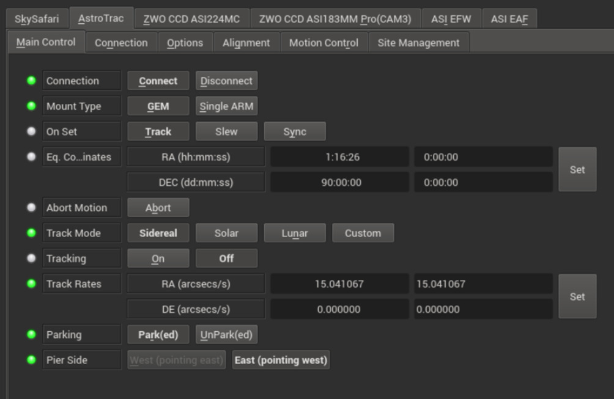
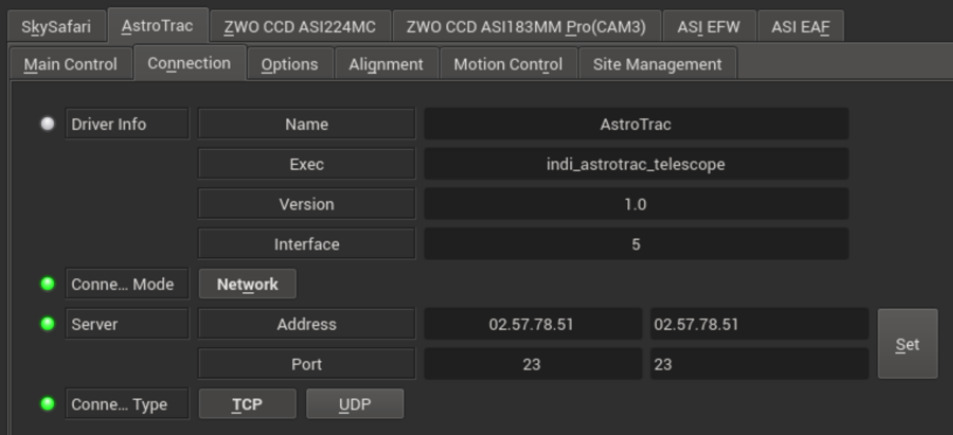
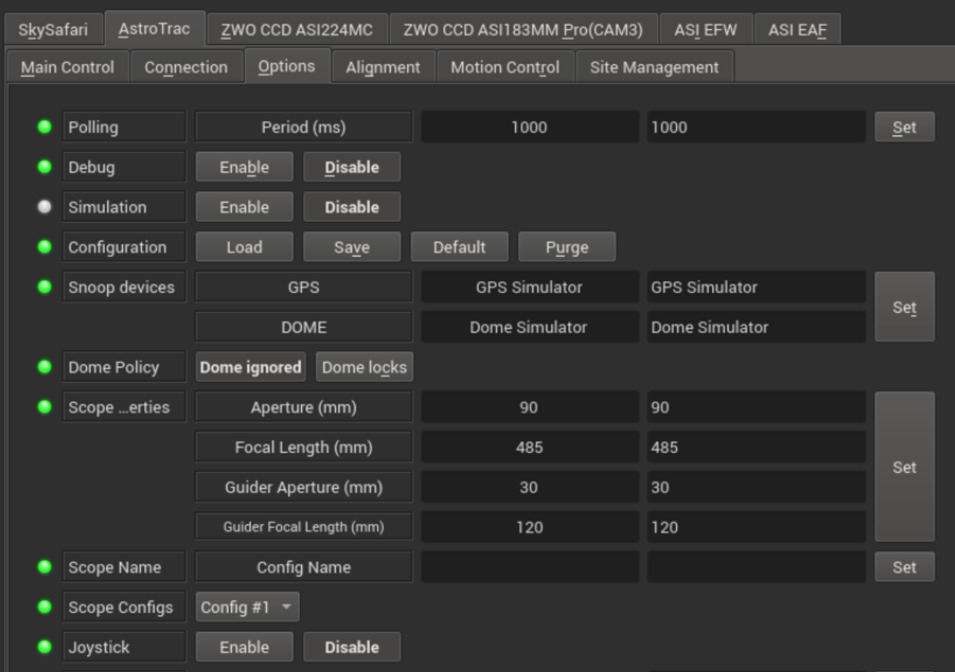
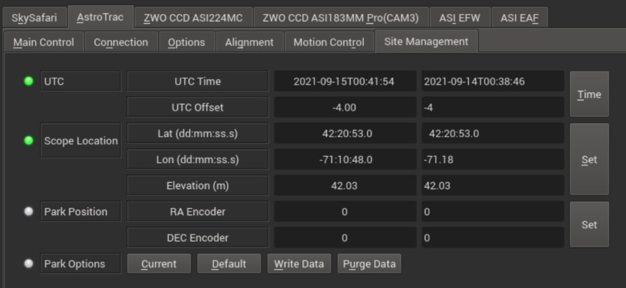
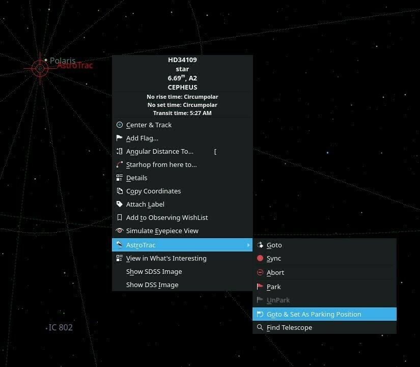
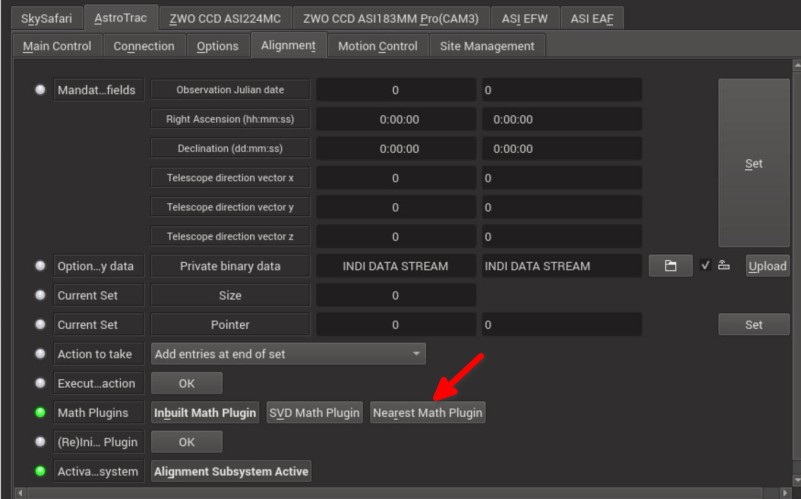

## Features

This INDI Astrotrac driver interacts with Astrotrac mounts via WiFi. It fully supports all the mount features and provides support for a mount model powered by  [INDI Alignment Subsystem](https://www.indilib.org/api/md_libs_indibase_alignment_alignment_white_paper.html). This results in highly accurate GOTOs when used with a plate solving software (e.g. Ekos) as the driver compensates for differences between the sky and mount coordinates on the fly.

Current features are:

-   Goto/Slew/Sync.
-   Park/Unpark with configurable custom parking positions.
-   Custom tracking rates
-   Custom acceleration rates
-   Guiding
-   Sidereal, lunar, solar and custom trackrates
-   Full joystick support
-   Mount modelling

## Connectivity

The driver communicates with the mount over the netwrok. Therefore, before establishing connection to the mount, you must set the mount's IP address and port in the  _Connection_  tab. Please ensure the machine running the driver is on the same network as the mount so they can talk to each other.

Please note 2 ways to connect RA/DEC drives

1.  RA power first then once on then after 15 or so seconds connect cable from RA to DEC , that should trigger the RA to configure the DEC as a DEC automatically
2.  However with some peoples mounts that doesn’t happen due to some issue that Richard from Astrotrac does not know how to fix in which case you have to manually configure the DEC drive as a DEC drive:
    1.  In this case you can connect the RA and DEC connecting cable before powering on everything or after it does not matter
    2.  You then connect to the drive you will configure as a DEC drive and connect to its wifi (AstroTrac360:RA:XX.XX.XX.XX) from any device can be same or for example your phone. Navigate to the IP address via the browser and go to the console (in the UI)
    3.  You type 1i50 and hit enter
    4.  The drive will now disconnect itself and in a few moments will appear as AstroTrac360:DEC:XX.XX.XX.XX ( WHERE XX IS THE IP address OF YOUR DRIVE)
    5.  Now the RA drive will be able to send commands via the cable to control the DEC drive

For more information on communication with the mount, you can check a  [detailed INDI thread](https://www.indilib.org/forum/mounts/10366-astrotrac-360-indi-driver-documentation-development.html)  on the subject.

## Operation

By default, the mount type is set to  **German-Equatorial (GEM)**  and can be switched to  **Single-ARM**  mode if desired. This must be done  _before_  connecting to the mount.

### Main Control

The main control tab is where the primary control of Astrotrac takes place. To track an object, enter the equatorial of date (JNow) coordinates and press Set. The mount shall then slew to an object and once it arrives at the target location, it should engage tracking at the selected tracking rate which default to Sidereal tracking. Slew mode is different from track mode in that it does not engage tracking when slew is complete. To sync, the mount must be already tracking. First change mode to Sync, then enter the desired coordinates then press Set. Users will  _rarely_  use this driver controls directly since many clients (e.g. KStars) can slew and sync the mount directly from the sky map without having to enter any coordinates manually.

Four tracking modes are supported: Sidereal, Lunar, Solar, and Custom. When using _Custom_ mode, the rates defined in **Track Rates** shall be used. Tracking can be enganged and disenganged by toggling the **Tracking** property. The units are arcseconds per second.

### Options

Under the options tab, you can configure many parameters before and after you connect to the mount.

-   **Snoop Devices**: Indicate which devices Paramount should communicate with:
    -   **GPS**: If using a GPS driver (e.g. INDI GPSD) then enter its name here. EQMod shall sync its time and location settings from the GPS driver.
    -   **Dome**: If using a Dome driver, put its name here so that Dome Parking Policy can be applied.
-   **Configuration**: Load or Save the driver settings to a file. Click default to restore default settings that were shipped with the driver.
-   **Simulation**: Enable to disable simulation mode for testing purposes.
-   **Debug**: Enable debug logging where verbose messaged can be logged either directly in the client or a file. If Debug is enabled, advanced properties are created to select how to direct debug output. [Watch a video on how to submit logs](https://stellarmate.com/support/logs-submission.html).
-   #### Dome Parking Policy
    
    If a dome is used in conjunction with the mount, a policy can be set if parking the mount or dome can interfere with the safety of either. For example, you might want to always park the mount _before_ parking the dome, or vice versa. The default policy is to ignore the dome.
    
    -   **Ignore dome**: Take no action when dome parks or unparks.
    -   **Dome locks**: **Prevent** the mount from unparking when dome is parked.
    -   **Dome parks**: Park the mount if dome starts parking. This will disable the locking for dome parking, EVEN IF MOUNT PARKING FAILS.
    -   **Both**: Dome locks & Dome parks policies are applied.
-   **Scope Properties**: Enter the Primary and Seconday scope information. Up to six different configurations for _Primary_ and Secondary _Guider_ telescopes can be saved separately, each with an optional unique label in **Scope Name** property.
-   **Scope Config**: Select the active scope configuration.
-   **Joystick**: Enable or Disable joystick support. An INDI Joystick driver must be running for this function to work. For more details, check the [INDI Telescope Joystick](https://stellarmate.com/support/tutorials/135-controlling-your-telescope-with-a-joystick.html) tutorial.

### Motion Control

Under motion control, manual motion controls along with speed and guide controls are configured.

-   **Motion N/S/W/E**: Directional manual motion control. Press the button to start the movement and release the button to stop.
-   **Slew Rate**: Rate of manual motion control above when 1x equals sidereal rate. This feature is currently not supported in the firmware since the slew speed is fixed to 10800 arcsec per sec.
-   **Acceleration**: Acceleration rates per axis in arcseconds per seconds squared. The mount uses this value to accelerate from rest to the full slew speed (currently fixed at 10800 arcsecs per sec by the mount firmware).
-   **Encoders**: Displays the current Hour-Angle (HA) and Declination (DE) axis encoder values in degrees. You can manually command the mount to move to a specific encoder position by changing this property.
-   **Guide N/S/W/E**: Guiding pulses durations in milliseconds. This property is meant for guider application (e.g. PHD2) and not intended to be used directly.

### Site Management

Time, Locaiton, and Park settings are configured in the Site Management tab.

-   **UTC**: UTC time and offsets must be set for proper operation of the driver upon connection. The UTC offset is in hours. East is positive and west is negative.
-   **Location**: Latitude and Longitude must be set for proper operation of the driver upon connection. The longitude range is 0 to 360 degrees increasing eastward from Greenwich.
-   **Parking**: By default, the parking position is when the OTA to be looking directly at the celestial pole. To restore parking position to the default value, please Default under Park option. You can set a custom parking position using two methods. The mount must be unparked before you can set a new position:
    -   Enter the desired HA & DE encoder values for the custom parking position, then press Set and then press Write Data to save the new parking position.
    -   Slew the mount to the desired parking position, then press Current to sync the encoders position to this value, and then Write Data to save.

You can park the telescope by clicking on Park. If the telescope is already parked, click the park button to unpark it. You cannot perform any motion unless the telescope is first unparked!

If you are using KStars as your INDI client, you can click on any object or location on the Sky Map and then set it as the desired parking position as illustrated below:

### Alignment

The mount model utilized by the driver is managed by the properties in the alignment tab. Each time a sync point is added (by Plate solving software for example), the  _Current Set_  size is incremented by one. To save the list to disk so that it can be utilized in a future session, click on the  **Action to take**  dropdown and select  _Save the alignment database to local storage_  then press  **OK**  next to  _Execute Action_  property. For best results, change the  **Math Plugins**  to use the  _Nearest Math Plugin_  since it is very simple and reliable when used with plate-sovling software. For more complicated modelling, select  _SVG Math Plugin_

