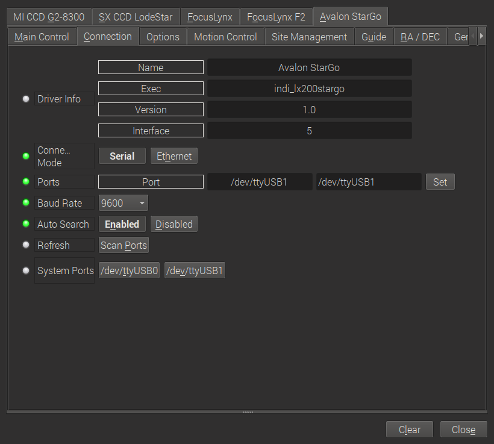

## Installation

The INDI Avalon StarGO driver is released as a 3rd party driver and requires INDI Library >= v1.7.5. To install the driver under Ubuntu:

sudo apt-add-repository ppa:mutlaqja/ppa
sudo apt-get update && sudo apt-get install indi-avalon

## Features

This INDI driver interacts with the StarGO GoTo Control System from  [Avalon Instruments](http://www.avalon-instruments.com/)  through a USB connection. It can directly drive Avalon mounts and other mounts that are controlled by StarGO.

Current features are:

-   Goto/Slew
-   Slewing speeds ...
-   Sidereal, lunar and solar trackrates
-   Configurable custom parking positions
-   Pulse-guiding
-   ST4 Guiding
-   Focussing

The StarGO device also contains support for up to two stepper motors like focusers. The implementation herefore is at a very early stage.

## Connectivity

Currently, the INDI driver only supports connections to the StarGO Control System through a USB cable. Please connect the computer running the INDI driver via USB to the StarGO device of your mount.

## Operation

### Connecting the StarGO Device

In order to establish the connection to the StarGO device, switch to the  **Connection**  tab and select the appropriate USB connection:

Select the appropriate USB device where StarGO is connected to. In case the device is not visible, press **Scan Ports**. The  **Baud rate**  can be left untouched as long as  **Auto select**  is set to **Enabled**, which leads to a automatic detection of the right baud rate. Please leave the **Connection mode**  to **Serial**, changing to **Ethernet**  has no effect.

Then switch to the  **Main Control**  tab and press  **Connect:**

### Main Control

The main control tab is where the primary control takes place. As soon as  **Connect**  has been pressed, the entire set of option unfolds.

As you may know from the Windows/ASCOM client, you need to press  **Sync home**  before the mount reacts to slewing etc. The other controls on this tab are more or less straight forward:

-   **Abort motion**: stops the motion of the scope
-   **Track mode**: set to  **sideral**  (star tracking),  **solar**  (sun tracking),  **lunar**  (moon tracking) or  **none**  (no tracking at all)
-   **Tracking**: turn tracking on and off
-   **Parking**: slew to the (predefined) parking position and  **park**  the scope. Remember, that you need to  **unpark** the scope before you can slew it somewhere
-   **Pier side**: read only information on which pier side the scope is currently placed
-   **Use pulse guiding**: in case that you want to guide through pulse guiding instead of ST4, turn this option on
-   **Aux1 Focuser**: Enable or disable a focuser connected on the AUX1 port of the StarGO device.  **Please set to disabled as long as no focuser is present.**
-   **Home position**: sync the current position as the home position. At the same time, the pointing model is initialized
-   **Goto home**: slew to the home position defined above and turn off tracking
-   **Set park**: set the current scope position as park position

### Alignment

Position the mount in its home position and press  **Sync Home**  on the **Main Control**  tab. Now the tracking mode is enabled and the mount can be slewed to arbitrary positions. StarGO manages its own pointing model. Each time a **Sync**  is called, StarGO adds a new entry in its pointing model.

The best results can be achieved, when plate solving is used for building up an appropriate pointing model.

### Options

On the options tab, you can setup various debugging options and scope properties.

Most of them are straight forward and general INDI functions. Maybe some need explanation:

-   **Polling**: here you define the frequency, how often the INDI client asks the INDI server for updates. 1sec is a typical value
-   **Scope Properties**: set here the right parameters of your main scope and the guiding scope.  _Hint_: if you have  **problems with plate solving**, check here, if the values are correct.

### Motion Control

With this tab you can manually slew the mount in all directions at different slewing speeds.

### Site Management

On the Site Management tab you can configure the location of your scope. If you are using KStars, it is recommended to set it through the Geographic Location of KStars and configure KStars such that it updates time and site for INDI.

### Guiding

Don't change anything here unless you know what you are doing.

### RA/DEC

This tab is dedicated to guiding options.

-   **Autoguiding**: set the guiding speeds. For Avalon mounts, please follow the [recommendations of Avalon Instruments](http://www.avalon-instruments.com/support/13-troubleshooting/117-phd2-guide-suggested-parameters)
-   **ST4**: enable or disable guiding through the ST4 port of your guiding camera. In case you set it to **enabled**, do not forget to connect your guiding camera with the ST4 port of the StarGO device
-   **Meridian flip**: set the behaviour of the next slew command. If set to **auto**, the mount executes a meridian flip automatically. In case of **disabled**, no meridan flip takes place. And inversly, for **forced**  a meridian flip is executed although it was not necessary from the scope position. **If you do not know what you are doing, please leave it on auto!**

### General Info

This tab displays the current firmware version.

**AUX1 Focuser**

Here you can control a focuser connected to the **AUX 1**  port of the StarGO device.

With this tab you can control a focuser connected to the AUX1 port of the StarGO device:

-   **Direction**: The direction in which the focuser moves when a relative position is set.
-   **Speed**: Speed of the focuser moves (not appropriately tested yet).
-   **Timer**: Update interval of the tab.
-   **Absolute Postion**: Move the focuser to an absolute position.
-   **Relative Position**: Move the focuser in or out by a given number of steps according to the direction selected above.
-   **Abort**: Stop the movement of the focuser.
-   **Sync**: Set the current focuser position to a defined value (e.g. set it to 0 if the focuser is entirely drawn in).
-   **Direction**: Here you can switch the directions if your focuser operates the other way round.

<!--

Firmware

Firmware tab displays information on the detected mount type and firmware version. Furthermore, the RA/DE steps, frequencies, and gear ratios are displayed.

### Motor Status

The stepper motors positions and work periods are displayed in addition to the status of each motor. If the mount is equipment with auxiliary encoders, then their position shall be displayed

### Alignment

By default the alignment mode is set to N-Star, every time you perform a sync, a new sync point is added to the model. You need to save the alignment points file if you want the driver to utilize them on the next startup. You can perform all these operations in the  _Align_  tab. The EQMod driver is currently transition to the INDI Alignment Subsystem and this section shall be updated when the transition is over to avoid duplicate information.

Under Options, you can select to utilize INDI's Alignment Subsystem instead of EQMod's own alignment system. However, the Alignment Subsystem is currently not stable so it is recommended to use EQMod alignment system which is on by default.

### PEC

PEC training works the same way as with the handcontroller. Guide on a star, engage PEC training and the firmware will wait for the mount pass the worm indexer and then records the resulting speeds in the EEPROM of the motor microcontroller. When it has finished (worm indexer) it toggles a status bit and you can see in the INDI Control panel the status of PEC training becoming green (whereas it remains busy/yellow while training).

PEC/PEC training is enabled in INDI EQMod for mounts which supports it, EQ8, AZEQ5/6, EQ6R too apparently. It is a motor controller firmware feature, the INDI driver just sends the corresponding commands to start/stop PEC/PEC training and do not then bother about it. Please note that the firmware PEC+guiding may not be a good idea as the firmware changes the motor speed unconditionnally, so some guide commands may be lost.

### Horizon Limits

For horizon limit just slew to the points along the horizon you want to set and hit the Add current button. The order of points is significant as Horizon uses a linear approximation between them. When you have finished hit the Write File button (saved in ~/.indi/HorizonData.txt which you can manually edit also).