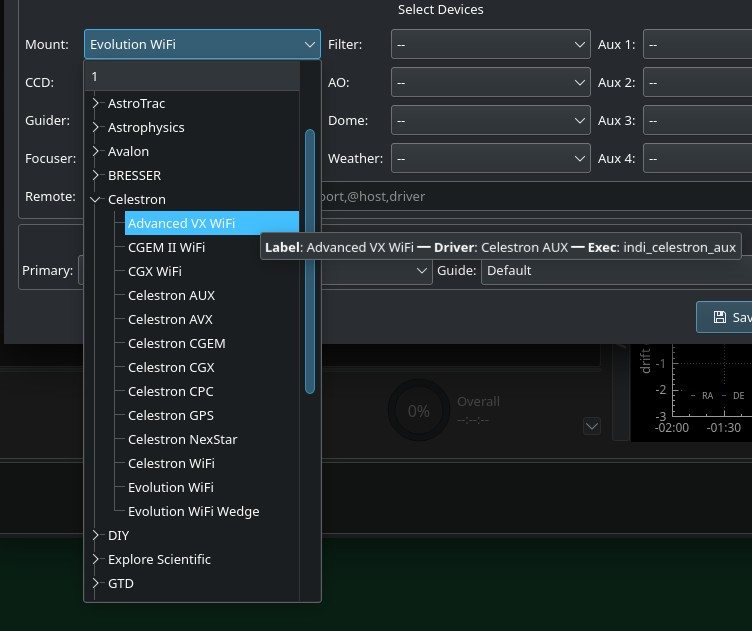
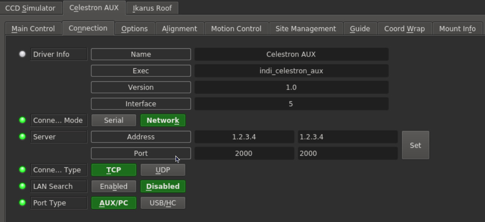
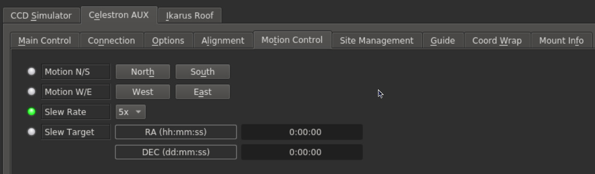
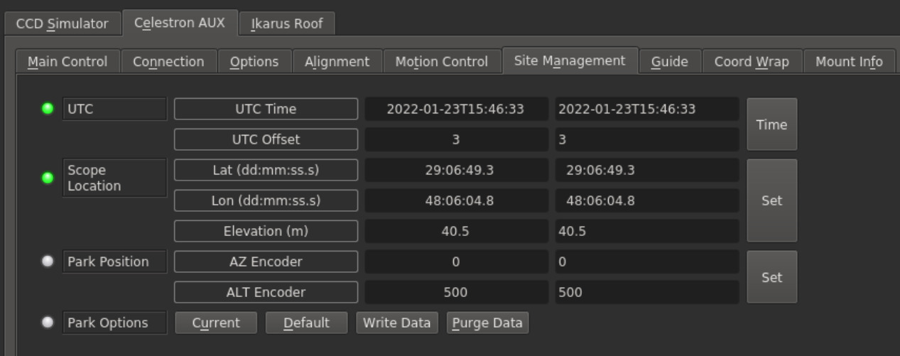
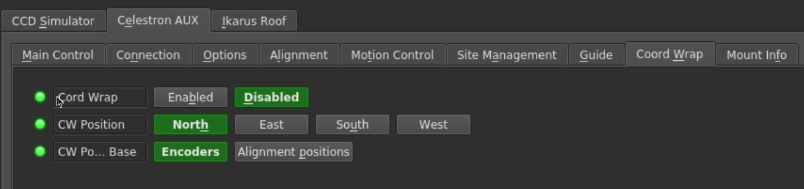
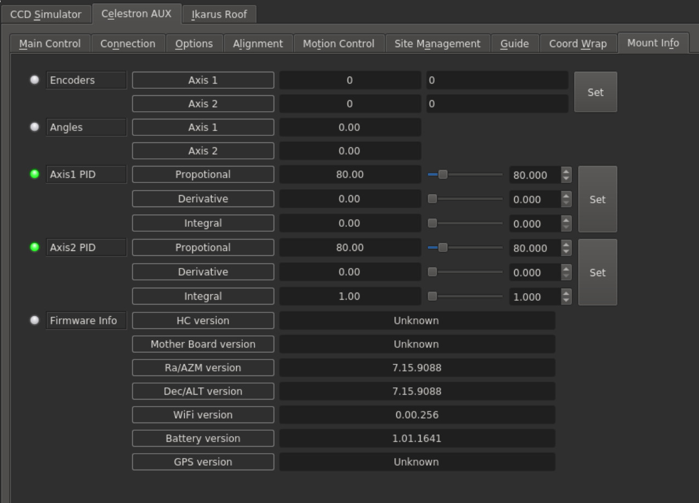

# 

Celestron AUX

INDI Celestron AUX Driver is released with INDI Library >= v1.9.4

BETA driver. Do not use unattended. For Alt-Az mode, you must adjust the  [PID parameters](https://stellarmate.com/devices/mounts/celestron/248-celestron-aux.html#mountinfo)  to achieve good tracking. This driver was not fully tested with an Equatorial mount. Use caution.

### Supported Mounts

The driver supports control of all Celestron Alt-Az and Equatorial mounts that are controlled via the following methods:

1.  WiFi
2.  [AUX Port](https://www.celestron.com/blogs/knowledgebase/what-are-the-aux-ports-on-my-computerized-telescope-for)
3.  PC Port (found on  [CPC](https://www.celestron.com/blogs/knowledgebase/what-is-the-pc-port-on-my-cpc-scope-for)  and  [CGX mounts](https://www.celestron.com/blogs/knowledgebase/what-is-the-pc-port-on-my-cge-mount-for)).

## Aliases

While the primary driver name is Celestron AUX, several aliases or labels were created to faciliate the driver selection for user.

For example, selecting  _Evolution WiFi_  would start the driver in Alt-Az mode with the Network Type set to Network, while selecting  _Evolution WiFi Wedge_  would start the driver in Equatorial mode.

## Features

The Celestron AUX driver provides GOTO and sky alignment functions of Celestron mounts which support AUX protocol and is designed to work over all available communication channels. It works directly with mount and axis controllers, without any help from the Hand Controller.

In fact the HC may interfere with the driver operation and is  _better left disconnected_  from the mount or not used. The only potential function left to the HC is working as a serial interface to the mount. In principle, it should support any Celestron mount using AUX command set (most of them) with SkyFi wireless module, additional or build-in or over any type of serial connection (PC/AUX port with proper level converter or Hand Controller serial port). The driver was tested with NexStar Evolution (Alt/Az) and CPC (EQ) mounts.

The driver supports the following features:

-   GOTO
-   Sync
-   Custom Parking
-   Track Modes (Sideral, Solar, Lunar) for Equatorial Mounts only
-   Track Rates
-   Slew Speeds
-   Slew Directional Control
-   Coord Wrap Management.
-   Active PID Tracking for Alt-Az mounts.
-   Guiding

## Connectivity

### USB/Serial

Celestron AUX driver can use any of the serial connections offered by Celestron scopes. The serial connections are listed below with their main characteristics.

1.  **HC:** serial cable connected to hand controller serial port (less recent models).
    -   4 pins connector (RJ11).
    -   3 wires used: GND, TX, RX.
    -   RS-232 serial voltage levels (+5V,-5V).
    -   9600 baud transmission speed.
    -   No transmission flow handshake, no echo.
    -   Command protocol: pass through (mostly  [AUX](https://paquettefamily.ca/nexstar/NexStar_AUX_Commands_10.pdf)  protocol encapsulated inside HC messages).
2.  **HC**: USB cable connected to hand controller USB port (most recent models) (alpha testing).  
    -   mini USB connector.
    -   Command protocol: pass through (mostly  [AUX](https://paquettefamily.ca/nexstar/NexStar_AUX_Commands_10.pdf)  protocol encapsulated inside HC messages).
3.  **AUX:** serial cable connected to Celestron AUX port.
    -   6 pins connector (RJ12)
    -   5 wires used: GND, TX, RX, CTS, RTS
    -   TTL serial voltage levels (+5V, 0V)
    -   19200 baud transmission speed
    -   Half duplex CTS/RTS handshake with echo
    -   Command protocol: [AUX](https://paquettefamily.ca/nexstar/NexStar_AUX_Commands_10.pdf)
4.  **PC:**  serial cable connected to Celestron PC port  
    -   8 pins connector (RJ45)
    -   5 wires used: GND, TX, RX, CTS, RTS
    -   RS-232 serial voltage levels (+5V,-5V)
    -   19200 baud transmission speed
    -   Half duplex CTS/RTS handshake with echo
    -   Command protocol:  [AUX](https://paquettefamily.ca/nexstar/NexStar_AUX_Commands_10.pdf)
5.  **USB**: USB cable connected to an USB port of telescope mount (alpha testing).  
    -   USB connector type A.
    -   Command protocol:  [AUX](https://paquettefamily.ca/nexstar/NexStar_AUX_Commands_10.pdf).

As modern computers generally no longer have serial interfaces, a convenient way to make a serial connection to a Celestron scope is to use an USB to serial converter with the proper cable as mentioned in the previous list.

Beware of cheapest USB/serial converters, they have serial lines with TTL levels (+5V,0V). So, they work with AUX port only. Connections to HC and PC ports require a true USB/RS-232 serial converter with symmetric voltage levels (+5V,-5V).

On the other hand old standard RS-232 is symmetric +/-12V signalling should  **NEVER**  be connected to the AUX port.  **Nothing**  should be connected there  **without proper level converter**. The AUX port is non-standard and connected directly to the bus between all motor controllers and main board. There is an oportunity to burn all scope electronics by connecting wrong signals there.

### Network connection

This type of connection can be used with scopes with WiFi interface like NexStar Evolution or any other Celestron scope equipped with SkyFi Wi-Fi adapter. It is the driver's default connection mode, and by default set the Celestron WiFi Hotspot settings (out of the box it is IP:1.2.3.4, Port:2000). If the mount WiFi is configured to join to your own WiFi network (Station mode) then you need to set the IP address there or enable  **LAN Search**  so that it automatically searching the subnet.

### First time connection

Before establishing connection to the mount, you must set the following properties in the driver:

-   **Mount Type**: Equatorial Or Alt-Az
-   **Connection Mode**: Network or Serial
-   **Port Type**: If the connection is Serial, then which port to use? AUX/PC or USB/HC?
-   **Network Information**: If connection mode is Network, then you can set the mount IP address and port. By default, it's set 1.2.3.4 which is the Celestron WiFi Hotspot IP address.

### Main Control Panel

From the main control panel, you can issue GOTOs, syncs, and park/unpark the mount. Depending on the mount model, it's possible to  _home_  the mount in Azimuth/Right Acension and possibly Altitude/Declination axis. Horizontal GOTOs are also supported. Parking position can be set in the Site Management tab.

## Alignment

The Celestron AUX driver embeds the Alignment Subsystem module that comes with the INDI library. This module allows to align the pointing coordinates of the telescope with respect to the celestial frame. After module alignment, the telescope pointing coordinates read from the driver will coincide with the direction actually pointed in the sky, less than a small error. This operation is generally performed at each power up or when the telescope mount is moved or changed for some reason.

This alignment operation is not a substitute for a correct mount leveling and orientation to north meridian for altazimuth mounts or to north/south celestial pole for equatorial mounts. Indeed, they are a prerequisite. By default, the driver uses Nearest Alignment Plugin.

There is no need to directly interaction with the Alignment tab in the driver as it is managed by the client (e.g. Ekos).

### Motion Control

Move the mount using the selected slew rate in the N/S and W/E directions.

### Site Management

The mount time and location are set in this tab. It is usually automatically handled by your client, so no need to set it directly. You can move your mount to your desired park position and then click  _Current_  followed by  _Write Data_. Then go back to the Main Control Panel and click Park. Once parked, the tracking is turned off and you can safely turn off power. If no custom parking is set, the mount would park to its home position.

### Coord Wrap

To protect against cables snapping, enable the  [Cord Wrap protection](https://www.celestron.com/blogs/knowledgebase/what-is-cordwrap-how-can-i-prevent-it). Select where you want the NCL (No Cross Line) to be.

### Mount Info

Displays the Mount firmware and ecnoder positions and angles. You can set the absolute position of the encoder if desired. When using an Alt-Az mount, then the Axis1 & 2 PID ([Propptional-Integral-Dervivate](https://en.wikipedia.org/wiki/PID_controller)) controller is used to keep the mount tracking the target. After each second, the target horizontal coordinates (which are time dependent) are calculated from the target equatorial coordinates. This result is compared to the mount's current horizontal position, and the difference is then sent to the mount to compensate.

If you find that your mount is not tracking your target accurately, it's recommended to start by adjusting the Propotional gain for each axis first. This usually have the biggest impact on the result with no further adjustments required. By default, the integral and derivative terms are set to zero. It's not recommended to set derivative gain unless you know what you're doing. Integral gain can be adjusted to elliminate steady-state error but can result in any over-shoot as well.

PID control is NOT used for Equatorial mounts, it is exclusive to Alt-Az mount tracking.

