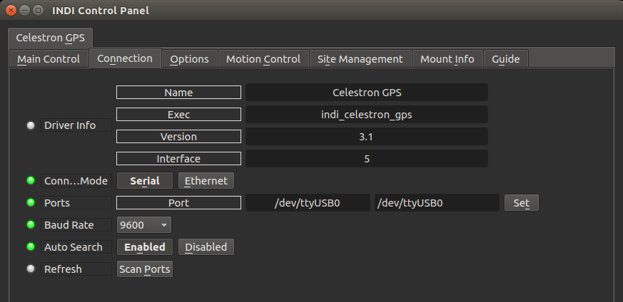
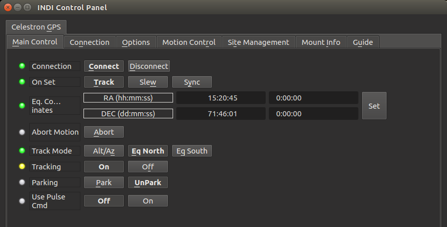
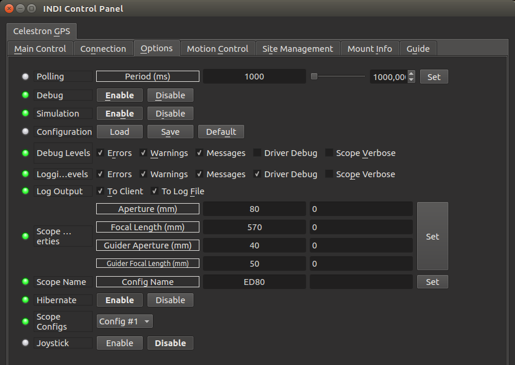
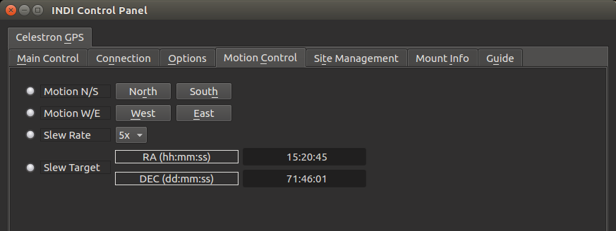
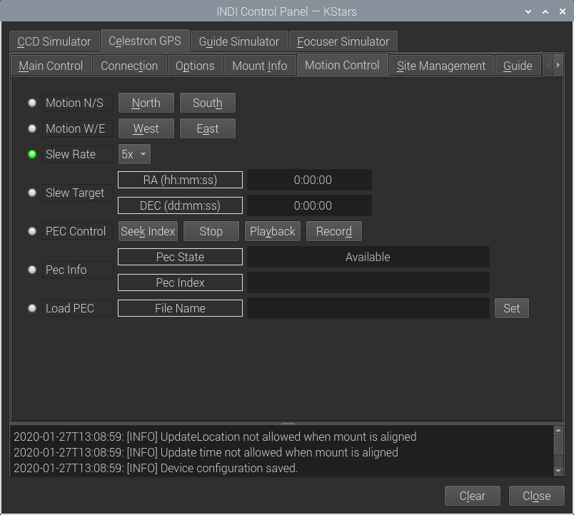
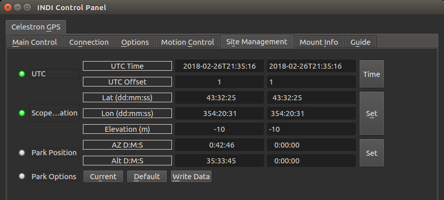
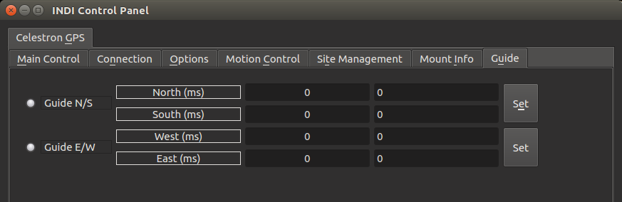
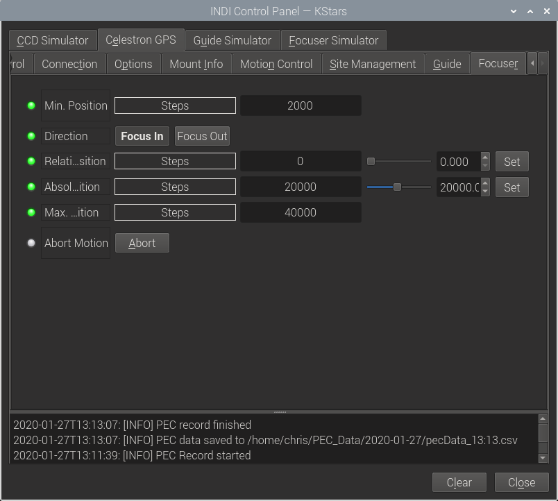

## Features

This driver supports Celestron telescopes using the NexStar protocol. The following models use this protocol:

-   NexStar GPS
-   NexStar GPS-SA
-   NexStar iSeries
-   NexStar SE Series
-   NexStar GT
-   Advanced GT
-   CGE mounts
-   CPC
-   SLT
-   CGEM mounts
-   Evolution mounts
-   CGX and CGXL mounts

Really any mount that uses the Celestron Hand Control and connected using the USB or RS232 port on the base of the HC. The driver will operate with NexStar HCs version 4.20 or better, NexStar Plus HCs and StarSense HCs. In all cases it is recommended that the HC is updated to the current version available from Celestron.

Current features of the Celestron NexStar driver:

-   Goto/Slew/Sync
-   Slew rates adjustment
-   Parking
-   Tracking modes: Alt/Az, Eq North, Eq South
-   Time/location setting
-   Pulse guiding
-   Joystick support
-   Hibernate/wakeup (Current NexStar + HC will allow the munt to be power cyceld between hibernate and wake up).
-   Side of Pier (GEM mounts only)
-   Seek home and align (CGX and CGXL mounts only)
-   PEC playback, Record, save and load from file (if the mount supports it).
-   Control Celestron SCT Motorized Focuser (if connected directly to the mount via cable).

The driver is based on the  [NexStar protocol](http://www.nexstarsite.com/download/manuals/NexStarCommunicationProtocolV1.2.zip).

For current hand controls the driver will interogate the mount through the HC and set it's capabilities according to the mount type and version read from the mount.

## Celestron Focuser Control

The Celestron SCT Focuser can also be controlled using this driver. The focuser must be connected using the AUX cable and a current NexStar Plus HC used. The focuser window will only be shown if the focuser is present. If the focuser is connected via USB, then  **Celestron SCT**  driver must be selected as its own standalone focuser driver.

## Operation

### 1. First Time

When using the driver for the first time, ensure to set the telescope's aperture and focal length in the  **Options**  tab. Also, set the geographical location and park position in the  **Site Management**  tab.

Click the  **Save**  button on the  **Options** tab to store these settings.

Go to the  **Connection**  tab and select the the serial port the telescope is connected to. Baud rate should be 9600.

Click the  **Auto search** option if you want INDI to search the telescope in all the available serial ports.

The mount must be turned on and aligned. The connection must be made to the connector on the base of the hand control, either a RS232 connection with a USB to RS232 adaptor or a USB connector depending on the HC. The HC to RS232 cable must use the the Celestron cable.

Note: in Debian-based GNU/Linux distributions (like Ubuntu or Mint) the user must belong to the  **dialout** group to be able to use the serial port.

### 2. Main Control

The  **Connection**  field allows you to connect and disconnect the mount according to the options indicated in the  **Connection**  tab.

**On Set**  button allows you to select the action that must be executed when the  **Set**  button in the  **Eq. Coordinates** fields is pressed. Three options  
are available:

-   **Track**: the telescope will slew to the target location and then engage tracking using the tracking mode selected in the  **Track Mode**  field.
-   **Slew**: the telescope will not start tracking after reaching the target.
-   **Sync**: Update the telescope coordinates without moving the motors.

The  **Abort Motion**  button can be used to stop the mount at any time.

Tracking can be engaged and disengaged by pressing the On/Off buttons in the **Tracking**  property.

Mount parking and unparking is controlled by the  **Parking**  property.

The  **Use Pulse Cmd**  property can be enabled to guide the mount through the communications interface and eliminates the requirement of using an ST-4 cable to guide the mount.

Most of the functions of this panel are available through the contextual menu shown by clicking the left mouse button in the KStars sky map, so the user don't need to enter the target coordinates manually.

### 3. Options

The Options tab is used to set debugging and other configuration options, as well as being able to load and save configurations.

-   **Polling period**: The INDI driver reads values from the mount periodically. The reading period in milliseconds can be changed using this field.
-   **Debug**: Enable debug logging where verbose messages can be logged either directly in the client or a file. If Debug is enabled, advanced properties  
    are created to select how to direct debug output. [Watch a video on how to submit logs](https://stellarmate.com/support/logs-submission.html).
-   **Simulation**: Enable to disable simulation mode for testing purposes.
-   **Configuration**: Load or save the driver settings to a file. Click default  
    to restore default settings that were shipped with the driver.
-   **Scope Properties**: Enter the Primary and Seconday scope information. Up to six different configurations for Primary and Secondary Guider telescopes can be saved separately, each with an optional unique label in Scope Name property.
-   **Hibernate**: Enable or disable mount hibernation.
-   **Scope Config**: Select the active scope configuration.
-   **Joystick**: Enable or Disable joystick support. An INDI Joystick driver must be running for this function to work. For more details, check the  
    [INDI Telescope Joystick tutorial](https://stellarmate.com/support/tutorials/135-controlling-your-telescope-with-a-joystick.html).

### 4. Motion Control

This panel allows you to manually control the movement of the telescope. Button labels here are self-explanatory.

### 4a. PEC

If your mount supports PEC then the PEC management options are shown in the Motion Control Tab. PEC is available on most GEM mounts and the higher end fork mounts  _but only when operated on a wedge_. **These PEC options will only be shown if your mount supports PEC.**

-   **PEC Control**:
    -   **Seek Index**  - This will move the mount by up to tywo degrees in Ra to find the PEC index. This is essential to allow PEC Playback or record. The PEC State changes to Index Found and the PEc Index will show the current value when this is done.
    -   **Stop**  - this will stop either a PEC playback or record. The PEC State changes to Index Found. If stop is pressed before a PEC Record has completed no data is saved.
    -   **Playback**  - PEC playback is started. The PEC State will change to PEC Playback. This will continue until Stop is pressed. If a slew is done when PEC Playback is active then it will remain active.
    -   **Record**  - The PEC Record process is started. This will continue until a full PEC record cycle is completed, recording will then stop and the current PEC data is saved to a file. The file name is shown in the Load PEC - File Name text box.  
        The record process is:
        -   Seek PEC Index
        -   Start guiding
        -   Start PEC recording
        -   Wait until it has completed.
        -   Further PEC records can be done, collecting multiple PEC record cycles and averaging than can produce a better PEC record.
-   **PEC Info**  - two text information boxes are shown:
    -   **PEC State**  - This shows the current PEC state. These are:
        -   Available - the mount supports PEC but the index has not been found. The only option is to press Seek Index to seek the PEC index.
        -   Index Found - The PEC index has been found, Playback or Record can be started.
        -   PEC Playback - the mount is playiing back it's current PEC data, it will continue unti Stop is pressed.
        -   PEC Recording - the mount is recording PEC data using the current guide corrections. This will continue for a full PEC cycle, currently 8 minutes.
        -   There are two other states - Unknown and not available. These should not be visible because none of the PEC properties will be enabled unless PEC is possible.
    -   **PEC Index**  - this shows the current PEC index. It is currently a value from 0 to 88 which is read from the mount. This increments as the PEC index changes, currently about every 8 seconds.
-   **Load PEC**  - this has one text box -  **File Name**. This shows the file name in which the last PEC record was saved. The text box ca be edited and pressing the  **Set**  button will load the PEC data in the current file to the mount.

For simple use just record a single PEC run. This will be saved in the mount and can be used by selecting Playback.

For more advanced use record multiple PEC runs and average the PEC data. The earlier mounts benefit from multiples of three recording runs taken consecutively. This is because some gears will repeat over three PEC cycles and averaging 3 cycles will remove this effect. Once the new file is produced it can be loaded by specifying its file name in the File Name text box and pressing Set to load it to the mount.

There is no way included to average the PEC data but this can be done in a spreadsheet by loading multiple PEC runs, averaging the data and writing the result to a new PEC data file. Or someone could write a PEC management tool...

The PEC data format is the same as the one used in Celestron's PECTool application, the data is saved as one number per line as follows:  
Line 1: Number of PEC bins, currently alway 88  
Lines 2 to 90: 89 PEC values, the first one is always zero and they are the sum of the PEC corrections to date. There is one more than the number of bins.  
Line 91: The number of arc seconds of Ra movement for one PEC cycle, currently 7200.

It's possible that Celestron will increase the number of PEC bins on later mounts, the current implementation should be OK up to 190 bins.

### 5. Site Management

Time, Location, and Park settings are configured in the  **Site Management**  tab.

**UTC**: UTC time and offsets must be set for proper operation of the driver upon connection. The UTC offset is in hours. East is positive and west is negative.

**Location**: Latitude and longitude must be set for proper operation of the driver upon connection. The longitude range is 0 to 360 degrees increasing eastward from Greenwich.

**Parking**: By default, the parking position is at the celestial pole. To restore parking position to its default value, click the  **Default** button under  **Park Options**.  
You can set a custom parking position using two methods:

-   Enter the desired AZ & ALT values for the custom parking position.
-   Slew the mount to the desired parking position, then press  **Current**.

Press  **Write Data**  to save the new parking position.

The mount must be unparked before you can set a new parking position.

You can park the telescope by clicking on  **Park** on the  **Main Control** tab. If the telescope is already parked, click the  **Unpark** button to unpark it. You cannot perform any motion unless the telescope is first unparked.

### 6. Guide

**Guide N/S/W/E**: Guiding pulses durations in milliseconds. This properties are meant for guider application (e.g. PHD2) and not intended to be used  
directly.

### 7.Focus

The min position and max position are read from the focuser. They are set by using the Celestron focuser calibration. If they are both zero this is an indication that the focuser has not been calibrated. The focuser cannot be moved unless it has been calibrated. This is to protect the focuser from running into the hard stops and causing damage.