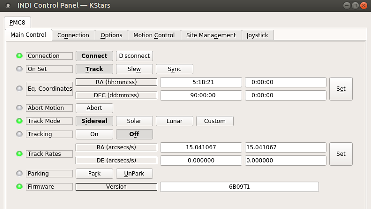
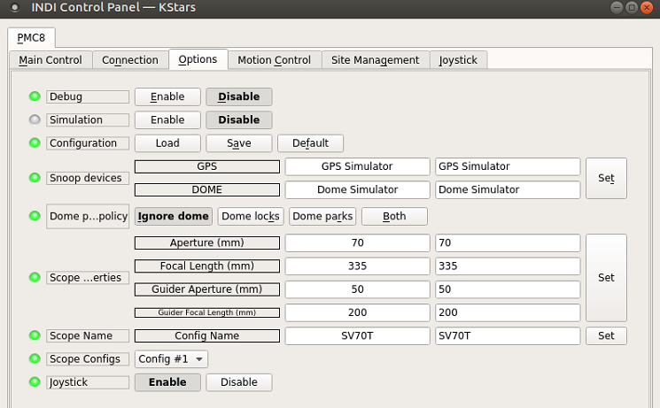
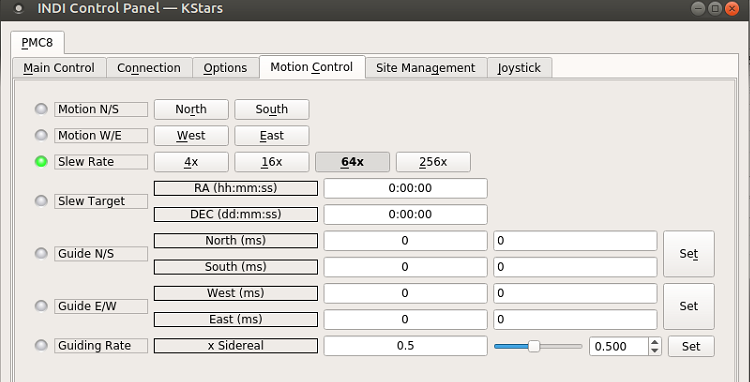
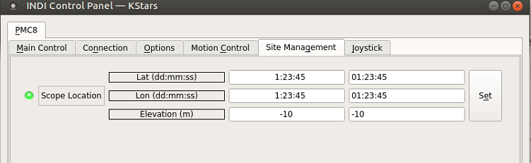

## Features

### Beta Note

This driver operates the following mounts:

-   Losmandy G11
-   Explore Scientific EXOS2
-   Explore Scientific iEXOS100

Be sure the correct mount type is selected when using the driver for the first time. The driver defauls to EXOS2.

### Requirements

This driver supports both Ethernet and Serial connections. However, a serial connection is recommended for stability.

For mounts that require a _Serial to USB_ FTDI adapter (typically used for the EXOS2 and G11), previous versions of this driver required you to reprogram the adapter as outlined in this [post](https://espmc-eight.groups.io/g/MAIN/message/2569). Reprogramming is no longer necessary. However, there is still some benefit to using a reprogrammed cable (faster connection time, no need to reset upon reconnect). Note that you will need to undo the reprogramming if you ever want to use the same cable for updating firmware, connecting to the mount with the ASCOM driver, or other purposes.

For older mount firmware, in order to make the mount controllable through USB/Serial, some commands need to be run in order to switch the internal state of the mount. The process is described in detail in this file [Switching Between the WiFi Interface and the Serial Interfaceon the iEXOS 100™Mount Controller](http://02d3287.netsolhost.com/pmc-eight/ESAN003_rev01.pdf)

### First Time

This driver supports Explore Scientific G11, EXOS2 and iEXOS 100 PMC-Eight mounts over a Serial or Ethernet connection.

Current features of the  **PMC-Eight**  driver:

-   Goto/Slew
-   Sidereal, lunar, solar and custom track rates
-   Pulse-guiding
-   ST4 Guiding
-   Full joystick support

## Operation

### First Time

When using the driver for the first time, ensure to set the telescope's aperture and focal length in the **Options** tab.

It is also necessary to set the geographic location and park position in the **Site Management**  tab.

Do not try parking the mount until this position is defined!

### Initialization

The telescope must start in the park position - this is with the scope pointing towards the pole and the counterweight straight down.

### Main Control

The main control tab is where the primary control takes place.

To track an object, enter the equatorial of date (JNow) coordinates and press Set. The mount shall then slew to an object and once it arrives at the target location, it should engage tracking at the selected tracking rate which default to Sidereal tracking. Slew mode is different from track mode in that it does not engage tracking when slew is complete. To sync, the mount must be already tracking. First change mode to Sync, then enter the desired coordinates then press Set. Users will seldom use this interface directly since many clients (e.g. KStars) can slew and sync the mount directly from the sky map without having to enter any coordinates manually.

The **Abort Motion**  button can be used to stop the mount at any time.

Four tracking modes are supported: Sidereal, Solar, Lunar, and Custom. When using  _Custom_  mode, the rates defined in  **Track Rates**  shall be used.

Tracking can be enganged and disenganged by toggling the  **Tracking**  property.

Mount parking and unparking is controlled by the **Parking**  property.

The **Firmware**  property shows the detected firmware version of the mount controller.

### Options

The  **Options** tab is used to set debugging and other configuration options, as well as being able to load and save configurations.

-   **Debug**: Enable debug logging where verbose messaged can be logged either directly in the client or a file. If Debug is enabled, advanced properties are created to select how to direct debug output.  [Watch a video on how to submit logs](https://stellarmate.com/support/logs-submission.html).
-   **Simulation**: Enable to disable simulation mode for testing purposes.
-   **Configuration**: Load or Save the driver settings to a file. Click default to restore default settings that were shipped with the driver.
-   **Snoop Devices**: Indicate which devices the driver should communicate with:
    -   **GPS**: If using a GPS driver (e.g. INDI GPSD) then enter its name here. EQMod shall sync its time and location settings from the GPS driver.
    -   **Dome**: If using a Dome driver, put its name here so that Dome Parking Policy can be applied.
-   #### Dome Parking Policy
    
    If a dome is used in conjunction with the mount, a policy can be set if parking the mount or dome can interfere with the safety of either. For example, you might want to always park the mount _before_ parking the dome, or vice versa. The default policy is to ignore the dome.
    
    -   **Ignore dome**: Take no action when dome parks or unparks.
    -   **Dome locks**: **Prevent** the mount from unparking when dome is parked.
    -   **Dome parks**: Park the mount if dome starts parking. This will disable the locking for dome parking, EVEN IF MOUNT PARKING FAILS.
    -   **Both**: Dome locks & Dome parks policies are applied.
-   **Scope Properties**: Enter the Primary and Seconday scope information. Up to six different configurations for _Primary_ and Secondary _Guider_ telescopes can be saved separately, each with an optional unique label in  **Scope Name**  property.
-   **Scope Config**: Select the active scope configuration.
-   **Joystick**: Enable or Disable joystick support. An INDI Joystick driver must be running for this function to work. For more details, check the  [INDI Telescope Joystick](https://stellarmate.com/support/tutorials/135-controlling-your-telescope-with-a-joystick.html)  tutorial.

### Motion Control

Under motion control, manual motion controls along with speed and guide controls are configured.

-   **Motion N/S/W/E**: Directional manual motion control. Press the button to start the movement and release the button to stop.
-   **Slew Rate**: Rate of manual motion control above when 1x equals sidereal rate.

### Site Management

Location settings are configured in the Site Management tab.

-   **Location**: Latitude and Longitude must be set for proper operation of the driver upon connection. The longitude range is 0 to 360 degrees increasing eastward from Greenwich.