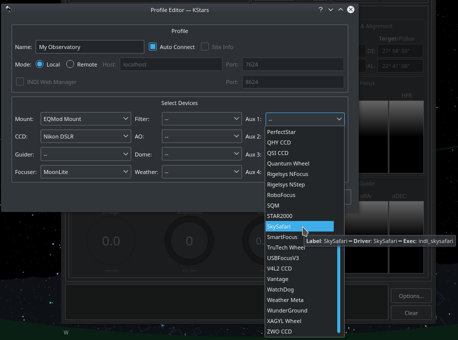
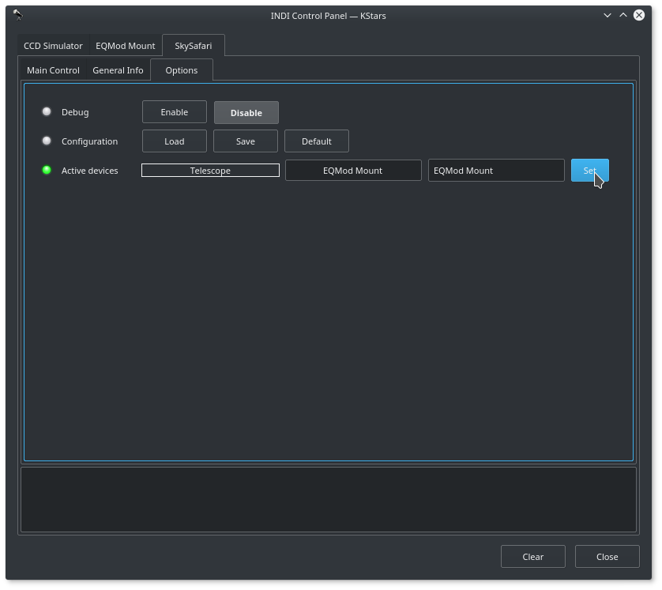
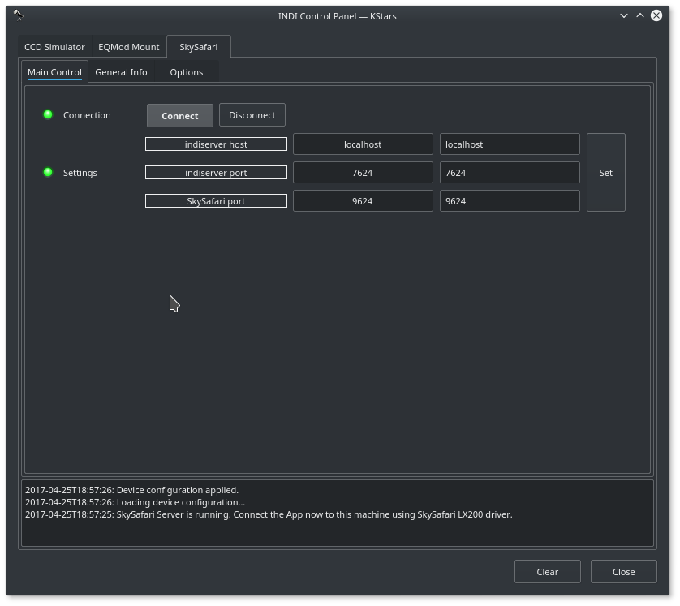
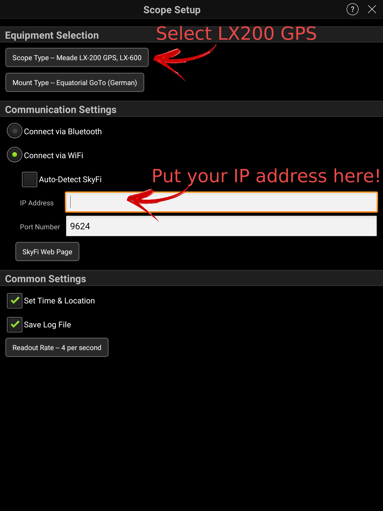
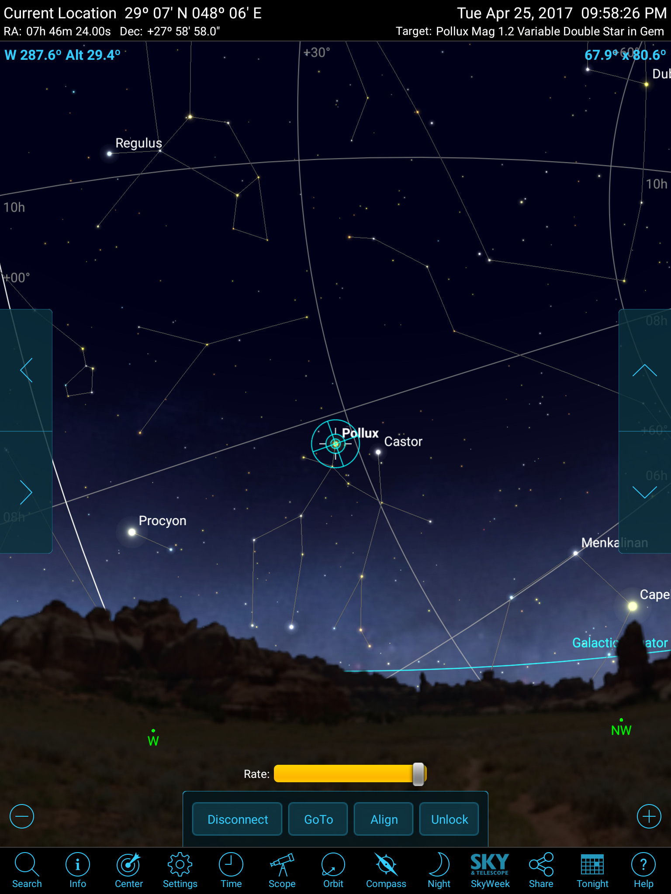

> ## Features

This driver is  **no longer needed**  when using SkySafari 7 or later. Connect to INDI server directly and do not add this driver to your equipment profile. Only use this driver when using SkySafari 6 or earilar

[SkySafari](https://skysafariastronomy.com/products/index.html)  is an astronomy application for Mac, iOS, and Android. Using either SkySafari Pro or Plus versions, you can control yours mounts. Since SkySafari currently does not support INDI mounts directly, a middleware drivers was develop to sit between SkySafari and INDI mount. It would allow you to use SkySafari to control and monitor your mount while at the same time use other INDI clients like Ekos to control it.

Current features are:

-   Goto
-   Align
-   Slew Speeds
-   Abort
-   Setting of Latitude/Longitude

## Operation

Add the auxiliary  **SkySafari**  driver to your equipment profile. The driver is available under the auxiliary dropdown in Ekos.

When you start the profile, you only need to update what mount the SkySafari drivers listens to. By default, it is set to  _Telescope Simulator_. In the example below, since the mount we selected in our example Equipment Profile is EQMod, we change the mount to  _EQMod Mount_.

EQMod Mount is just an example, select the mount driver suitable for your mount in the Equipment Profile.

You must do this  **before you click connect**  and establish the server. If you are already connected, click  _Disconnect_, update the mount name, then click  _Connect_  again.

After you change the mount name to your active mount, please save the configuration by clicking  **Save**  so that your mount name is used the next time you connect to the driver.

In the unlikely event your INDI mount is  **NOT**  running on the same machine as the SkySafari INDI driver, you can change the INDI server hostname and port. Otherwise,  _leave_  this settings without any changes. By default, the SkySafari INDI server is started on port  **9624**. You can change this value if necessary but it is recommended to leave it as it

Now are you ready to connect, simply connect all your drivers and the SkySafari driver shall establish a server that your iOS/Android SkySafari app can connect to. When everything is OK, you shall see a message indicating that server is established:

Now open your SkySafari app and setup your mount. By default, the INDI SkySafari servers starts on port  **9624**. You need to know the IP address of the machine running INDI server, whether it's a desktop machine or embedded like Raspberry PI.

If you are connecting to StellarMate directly over HotSpot mode, enter  **10.250.250.1**  as the IP address in SkySafari. If StellarMate is joined to home WiFi network, enter  **stellarmate.local**  or StellarMate IP address directly.

Go the mount setup page in your App and set the IP address and port of the INDI SkySafari server:

You're set! Now simply connect to the telescope by clicking the telescope icon in SkySafari and it should connect in a few seconds if there are no issues in communication. Then you can control your mount as your would normally would under SkySafari while at the same being able to use it at the same time in any INDI compatible client.

