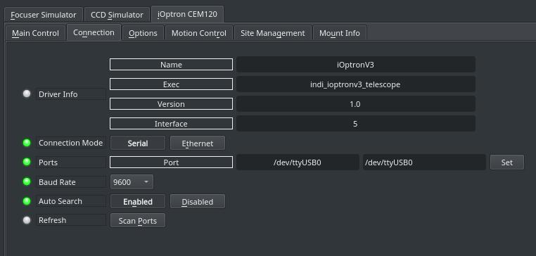
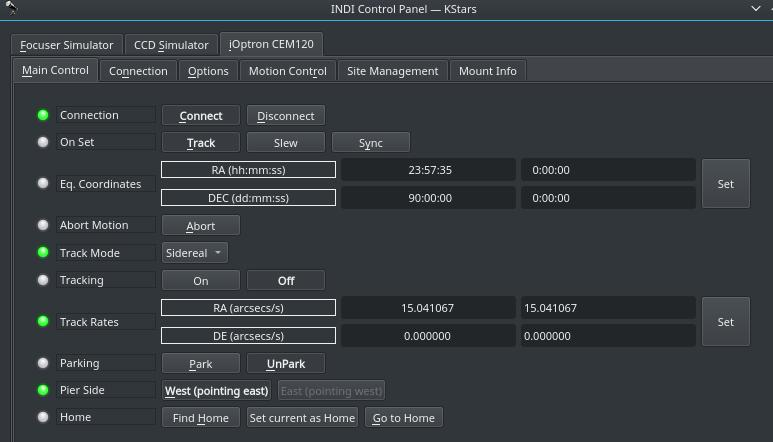
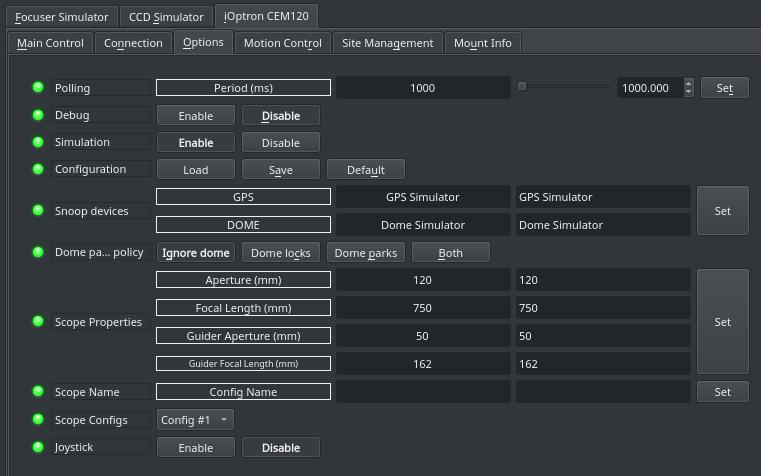
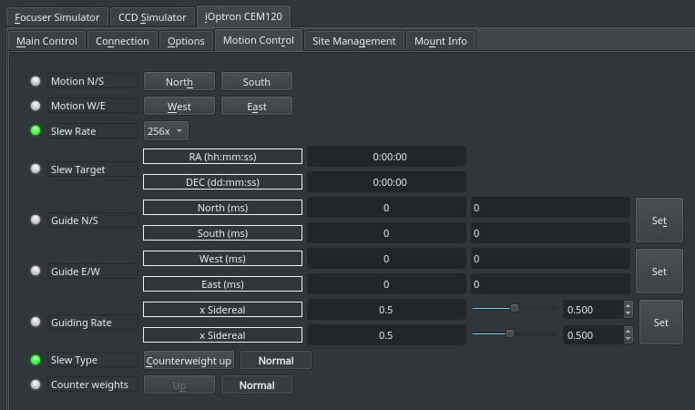
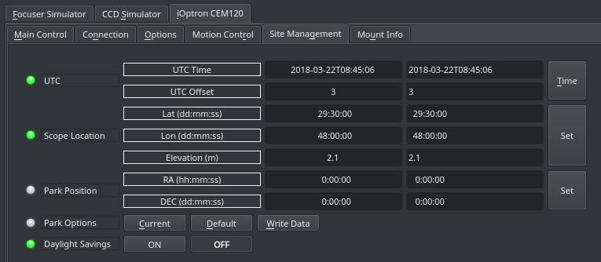
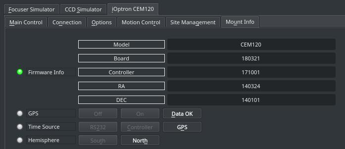

## Features

**This INDI driver is not limited**  to CEM120 as it supports the following iOptron mounts:

-   CEM120-EC2 with firmware 20171001 and later
-   CEM120-EC with firmware 20171001 and later
-   CEM120 with firmware 20171001 and later
-   CEM60-EC with firmware 20171001 and later
-   CEM60 with firmware 20171001 and later
-   iEQ45 Pro (EQ and AA mode) with firmware 20171001 and later
-   iEQ30 Pro with firmware 20171001 and later
-   CEM25-EC with firmware 20171001 and later
-   CEM25(/P) with firmware 20171001 and later
-   SmartEQ Pro+ with firmware 20171001 and later
-   AZ Mount Pro with firmware 20171001 and later
-   Cube Pro with 8408 (EQ and AA mode) with firmware 20171001 and later
-   Cube II (EQ and AA mode) with firmware 20171001 and later

Current features are:

-   Goto/Slew at user-selectable rates.
-   Sidereal, lunar, solar, king, and custom track rates.
-   Configurable custom parking positions.
-   Normal Slews and Counterweight up slews.
-   Home search & gogo.
-   Pulse-guiding.
-   Full joystick support.

The mount must be aligned first before establishing connection with INDI. Further enhancement to the GOTO operation can be done by using an astrometry solver.

## Connectivity

### 1. USB

To connect to iOptronV3 mount from a PC or a device like Raspberry PI, you need a USB to RS232 RJ9/DB9 adapters. You connect the USB to your computer or embedded device running INDI and then use the driver to control the mount.

The default baud rate is set to 9600. If the connection fails to communicate with your mount, make sure the baud rate is set to the value indicated in the hand-controller. Some users reported using baud rate of 230400 to successfully communication with CEM120.

### 2. Network

If iOptron is available over the network via RS232-to-Ethernet adapter or WiFi for example, you can  _Ethernet_  connection mode and enter the corresponding IP address and port where the remote server is located.

### 4. First Time Connection

When running the driver for the first time, go to the  **Connection**  tab and select the port to connect to. You can also try connecting directly and the driver shall automatically scan the system for candidate ports. If CEM120 is connected the network via a Serial-TCP (Ethernet or WiFi) adapter, then you can select  _Ethernet_  mode and enter the IP address and port for the adapter connected to the mount. After making changes in the Connections tab, go to  **Options**  tab and save the settings.

## Operation

Once CEM120/iOptronV3 is online, it loads mount settings if they exist. Its location defaults to the celestial pole unless a custom parking position is set previously.

### Main Control

The main control tab is where the primary control of CEM120 takes place. To track an object, enter the equatorial of date (JNow) coordinates and press Set. The mount shall then slew to an object and once it arrives at the target location, it should engage tracking at the selected tracking rate which default to Sidereal tracking. Slew mode is different from track mode in that it does not engage tracking when slew is complete. To sync, the mount must be already tracking. First change mode to Sync, then enter the desired coordinates then press Set. Users will seldom use this interface directly since many clients (e.g. KStars) can slew and sync the mount directly from the sky map without having to enter any coordinates manually.

Five tracking modes are supported: Sidereal, Lunar, Solar, King, and Custom. When using  _Custom_  mode, the rates defined in  **Track Rates**  shall be used. Tracking can be enganged and disenganged by toggling the  **Tracking**  property.

You can search for home position, or set current position as the home position, or simply go to the home position. Please note that the home position is  **NOT**  the same as parking position. Only a subset of mount support parking & unparking operation as the mount internal alignment data is not lost when the mount is parked and the power is cycled.

### Options

Under the options tab, you can configure many parameters before and after you connect to the mount.

-   **Snoop Devices**: Indicate which devices CEM120 should communicate with:
    -   **GPS**: If using a GPS driver (e.g. INDI GPSD) then enter its name here. CEM120 shall sync its time and location settings from the GPS driver.
    -   **Dome**: If using a Dome driver, put its name here so that Dome Parking Policy can be applied.
-   **Configuration**: Load or Save the driver settings to a file. Click default to restore default settings that were shipped with the driver.
-   **Simulation**: Enable to disable simulation mode for testing purposes.
-   **Debug**: Enable debug logging where verbose messaged can be logged either directly in the client or a file. If Debug is enabled, advanced properties are created to select how to direct debug output.  [Watch a video on how to submit logs](https://stellarmate.com/support/logs-submission.html).
-   #### Dome Parking Policy
    
    If a dome is used in conjunction with the mount, a policy can be set if parking the mount or dome can interfere with the safety of either. For example, you might want to always park the mount _before_ parking the dome, or vice versa. The default policy is to ignore the dome.
    
    -   **Ignore dome**: Take no action when dome parks or unparks.
    -   **Dome locks**: **Prevent** the mount from unparking when dome is parked.
    -   **Dome parks**: Park the mount if dome starts parking. This will disable the locking for dome parking, EVEN IF MOUNT PARKING FAILS.
    -   **Both**: Dome locks & Dome parks policies are applied.
    
      
    
-   **Scope Properties**: Enter the Primary and Seconday scope information. Up to six different configurations for _Primary_ and Secondary _Guider_ telescopes can be saved separately, each with an optional unique label in  **Scope Name**  property.
-   **Scope Config**: Select the active scope configuration.
-   **Joystick**: Enable or Disable joystick support. An INDI Joystick driver must be running for this function to work. For more details, check the  [INDI Telescope Joystick](https://stellarmate.com/support/tutorials/135-controlling-your-telescope-with-a-joystick.html)  tutorial.
-   **Backlash**: Set RA & DEC backlash in microsteps.

### Motion Control

Under motion control, manual motion controls along with speed and guide controls are configured.

-   **Motion N/S/W/E**: Directional manual motion control. Press the button to start the movement and release the button to stop.
-   **Slew Rate**: Rate of manual motion control above when 1x equals sidereal rate.
-   **Guide N/S/W/E**: Guiding pulses durations in milliseconds. This property is meant for guider application (e.g. PHD2) and not intended to be used directly.
-   **Guiding Rate**: Guiding Rate for RA & DE. 0.3 means the mount shall move at 30% of the sidereal rate when the pulse is active. The sideral rate is ~15.04 arcseconds per second. So at 0.3x, the mount shall move 0.3*15.04 = 4.5 arcsecond per second. When receving a pulse for 1000ms, the total theoritical motion 4.5 arcseconds.
-   **Slew Type**: By default slew operation are done using the  **Normal**  position (i.e. counterweight are down), but you can change the behavior so that it can slew with the  **counterweight up**  position.

**Caution:**  Changing slew type to counterweight up can cause damage to your equipment it not used carefully and with a specific goal in mind.

-   **Counter weights**: Indicates the current countweight status in the mount. Normal indicates that counterweights are currently down.

### Site Management

Time, Locaiton, and Park settings are configured in the Site Management tab.

-   **UTC**: UTC time and offsets must be set for proper operation of the driver upon connection. The UTC offset is in hours. East is positive and west is negative.
-   **Location**: Latitude and Longitude must be set for proper operation of the driver upon connection. The longitude range is 0 to 360 degrees increasing eastward from Greenwich.
-   **Parking**: By default, the parking position is when the OTA to be looking directly at the celestial pole. To restore parking position to the default value, please Default under Park option. You can set a custom parking position using two methods. The mount must be unparked before you can set a new position:
    -   Enter the desired Azimuth & Altitude values for the custom parking position, then press Set and then press Write Data to save the new parking position.
    -   In KStars, you can right-click on the desired position in the Sky map, and then from the mount menu, select  **Set As Parking Position**.
-   **Daylight Savings**: You can change daylight savings. It is recommended to keep this value OFF all year around and just rely on the UTC value.

You can park the telescope by clicking on Park. If the telescope is already parked, click the park button to unpark it. You cannot perform any motion unless the telescope is first unparked!

### Mount Info

Mount info tab displays information on the detected mount type and firmware version. Furthermore, GPS status, time source, and current hemisphere values are shown.

