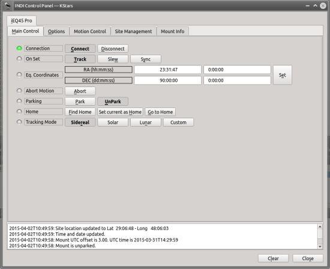

##   
Features

The driver supports the following iEQ mounts:

CEM60 (Firmware 140807 and later)  
CEM60-EC (Firmware 140807 and later)  
iEQ45 Pro (Firmware 140807 and later)  
iEQ45 Pro AA (Firmware 140807 and later)

Functions such as Track, Sync, Guiding, Home, and Park (including custom parking) are supported.

## Operation

On connection, the mount retrieves the controller time and location and updates the client accordingly. The driver also check if the driver is parked or not. You can either enter the parking coordinates manually, or slew to a parking position, then click on  **Current**  under parking options in the  **Site Management**  tab.

When using the driver for the first time, ensure to set the telescope's aperture and focal length in the  **Options**  tab.

You can set custom tracking and guiding rate if desired. You can also control the mount via a joystick by click on  **Enable Joystick**  under the  **Options**  tab.

