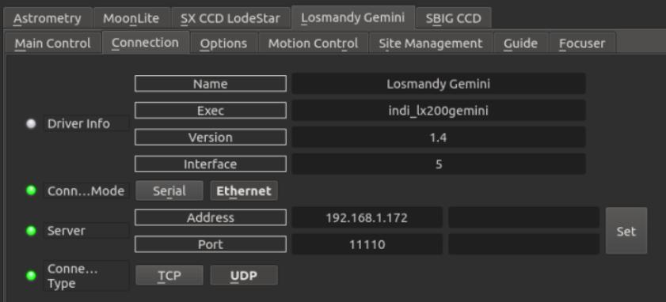
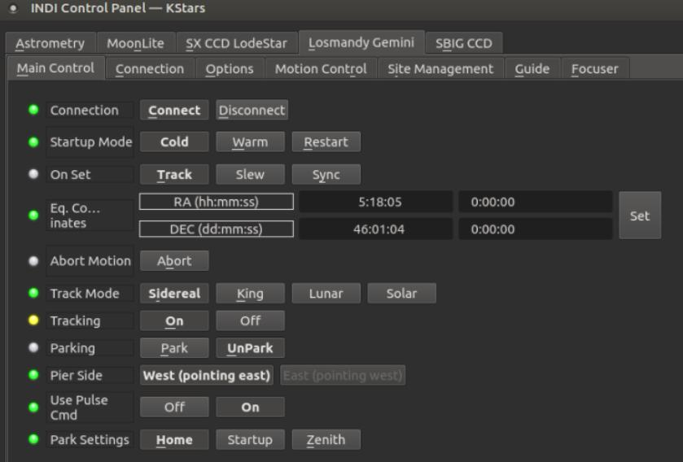
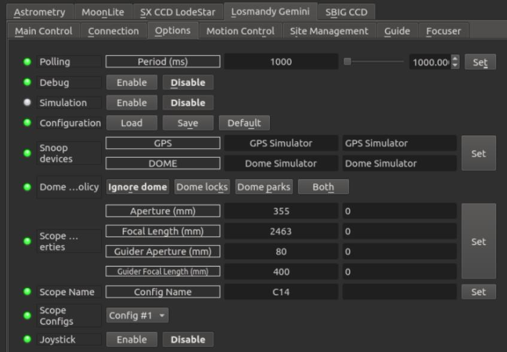
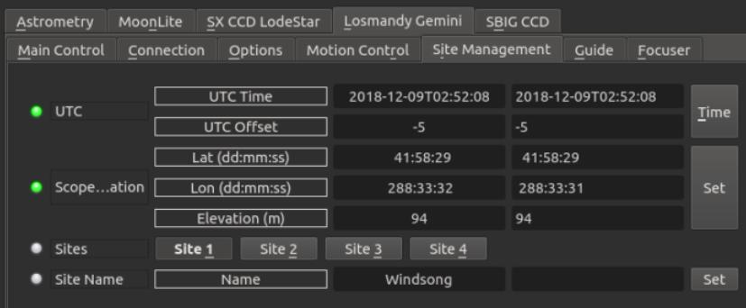

## Features

This driver control Losmany Gemini/Gemini2 mounts either via USB connection or Network.

Current features are:

-   Goto/Slew
-   Cold/Warm startup
-   Sidereal, lunar, solar and king track rates
-   Configurable custom parking positions
-   Pulse-guiding
-   ST4 Guiding
-   Focus Controls
-   Full joystick support

To utilize the driver, you must align the mount before connecting the INDI driver.

## Connectivity

### 1. USB

To connect to Losmandy Gemini mount from a PC or a device like Raspberry PI, use a  [Losmandy RS232 to USB](https://gemini-2.com/Losmandy_Serial_Cable.php)  cable. The driver shall detect all available serial ports on the system and attempt to connect to each one of them until it can establish connection to the mount. To disable this behavior, turn off  **Auto Search**  option. When turned off, the mount will only connect to the designated port and it will fail is no connection is established. It is recommended to use a  [serial mapper](https://www.youtube.com/watch?v=VQHUaO5Hmi0)  to assign permentant desigations to serial devices.

### 2. Network

To connect to the mount over the network. Make sure your PC/StellarMate is on the same subnet as the mount. Under the  **Connection**  tab in the INDI Control Panel, click on the  **Ethernet**  button and then enter the mount IP address and port. The default UDP port used by Gemini is  **11110**. Click on  **UDP**  to set the port type to UDP. To save the settings, go to  **Options**  tab and then click  _Save_  configuration.

### 4. First Time Connection

Before starting the driver, power the mount and make sure it is looking at the celestial pole with the weights down.

There are three startup modes:

1.  Cold
2.  Warm
3.  Restart

Select the appropiate startup mode before connecting depending on the state of your mount.

## Operation

Once Gemini is online, it loads mount and parking settings if they exist. Its location defaults to the celestial pole unless a custom parking position is set previously.

### Main Control

The main control tab is where the primary control of Gemini takes place. To track an object, enter the equatorial of date (JNow) coordinates and press Set. The mount shall then slew to an object and once it arrives at the target location, it should engage tracking at the selected tracking rate which default to Sidereal tracking. Slew mode is different from track mode in that it does not engage tracking when slew is complete. To sync, the mount must be already tracking. First change mode to Sync, then enter the desired coordinates then press Set. Users will seldom use this interface directly since many clients (e.g. KStars) can slew and sync the mount directly from the sky map without having to enter any coordinates manually.

With respect to meridian flips, the mount performs a meridian flip on a GOTO-command when within 2.5 degrees of the safety limit. You can set a GoTo limit with the handcontroller, meaning that when past this limit, the mount performs a meridian flip. If set to 90 degrees, it flips on a GoTo command at any positive hour angle. However, to be safe, it is recommended to set a hour angle at for instance 0.2 hours to be safe. Refer to the Gemini manual pages 69-70 on setting the GoTo limit.

The parking setting defaults to  **Home**  position but can be changed to  **Startup**  or  **Zenith**  as desired.

Home defaults to CWD but can be changed by user through the handcontrol. Unpark wakes the mount up in the same position as parked.

Four tracking modes are supported: Sidereal, Lunar, Solar, and King.

### Options

Under the options tab, you can configure many parameters before and after you connect to the mount.

-   **Snoop Devices**: Indicate which devices Gemini should communicate with:
    -   **GPS**: If using a GPS driver (e.g. INDI GPSD) then enter its name here. Gemini shall sync its time and location settings from the GPS driver.
    -   **Dome**: If using a Dome driver, put its name here so that Dome Parking Policy can be applied.
-   **Configuration**: Load or Save the driver settings to a file. Click default to restore default settings that were shipped with the driver.
-   **Simulation**: Enable to disable simulation mode for testing purposes.
-   **Debug**: Enable debug logging where verbose messaged can be logged either directly in the client or a file. If Debug is enabled, advanced properties are created to select how to direct debug output.  [Watch a video on how to submit logs](https://stellarmate.com/support/logs-submission.html).
-   #### Dome Parking Policy
    
    If a dome is used in conjunction with the mount, a policy can be set if parking the mount or dome can interfere with the safety of either. For example, you might want to always park the mount _before_ parking the dome, or vice versa. The default policy is to ignore the dome.
    
    -   **Ignore dome**: Take no action when dome parks or unparks.
    -   **Dome locks**: **Prevent** the mount from unparking when dome is parked.
    -   **Dome parks**: Park the mount if dome starts parking. This will disable the locking for dome parking, EVEN IF MOUNT PARKING FAILS.
    -   **Both**: Dome locks & Dome parks policies are applied.
-   **Scope Properties**: Enter the Primary and Seconday scope information. Up to six different configurations for _Primary_ and Secondary _Guider_ telescopes can be saved separately, each with an optional unique label in  **Scope Name**  property.
-   **Scope Config**: Select the active scope configuration.
-   **Joystick**: Enable or Disable joystick support. An INDI Joystick driver must be running for this function to work. For more details, check the  [INDI Telescope Joystick](https://stellarmate.com/support/tutorials/135-controlling-your-telescope-with-a-joystick.html)  tutorial.
-   **Backlash**: Set RA & DEC backlash in microsteps.

### Motion Control

Under motion control, manual motion controls along with slew speed, move speed, servo precision and PEC are configured. Some features are only available on higher firmware levels. Features which are not available will not be displayed in the UI.

-   **Motion N/S/W/E**: Directional manual motion control. Press the button to start the movement and release the button to stop.
-   **Slew Rate**: Rate of manual motion control above when 1x equals sidereal rate.
-   **Slew Target:** Last slew target.
-   **PEC Playback:** Displays and controls PEC playback. Press the "PEC ON" button to start, and "PEC OFF" button to stop.
-   **ENABLE PEC at BOOT:** PEC=1 will replay automatically at boot. PEC=0 will not replay PEC at boot.
-   **Servo Precision:** 1=4x precision, 0=1x precision, for both RA and DEC.
-   **PEC Commands:**
    -   **Start Training:** Starts PEC training. Once successfully trained, the PEC curve will be stored in the mount, and PEC replay will begin.
    -   **Abort Training:** Aborts PEC training if active.
-   **PEC State:**  
    -   **PEC Active:** PEC replay is active.
    -   **PEC freshly trained:** PEC was just recorded.
    -   **PEC training in progress:** PEC is currently being recorded.
    -   **PEC training just completed:** PEC recording has just completed, and is being processed.
    -   **PEC will train soon:** PEC is about to train.
    -   **PEC Data available:** The PEC curve is available to download. This can be accessed through the website hosted by the gemini firmware which can be accessed from the ethernet connection on the Gemini.
-   **Manual Slewing Speed:**  Speed (x Sidereal Rate) for mount slewing speed when using the N/S/W/E or keybad to move the mount around.
-   **Goto / Move / Centering Speed:** Sets the slew speeds that will be used by the  **Slew Rate**  selection.

### Site Management

Time, Location, and Park settings are configured in the Site Management tab.

-   **UTC**: UTC time and offsets must be set for proper operation of the driver upon connection. The UTC offset is in hours. East is positive and west is negative.
-   **Location**: Latitude and Longitude must be set for proper operation of the driver upon connection. The longitude range is 0 to 360 degrees increasing eastward from Greenwich.
-   **Sites**: Select current active sites from 4 sites stored in the hand controller.
-   **Site Name**: Enter and save current active site name

### Guide

-   **Guide N/S E/W:**  This section is not used directly by the user but by guiding software
-   **Guiding Speed:**  Set the Guiding speed of both RA and DEC
-   **Guiding Speed:**
    -   **W/E Rate:**  Set the guide rate for RA.
    -   **N/S Rate:** Set the guide rate for DEC.

### Firmware Data

-   Displays the Time/Date and Level of the Gemini firmware.