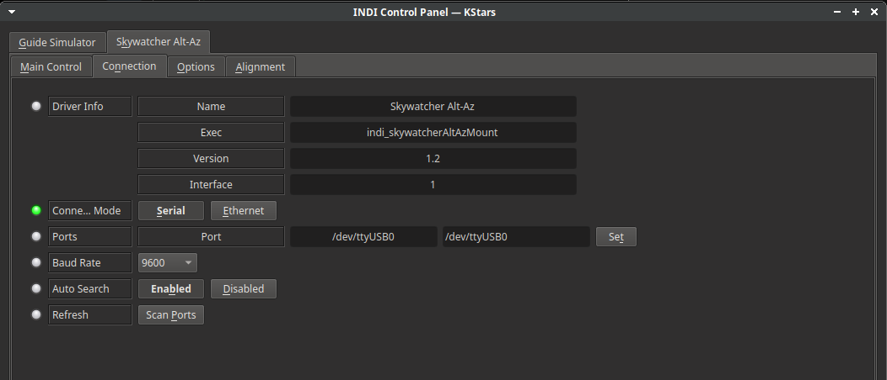
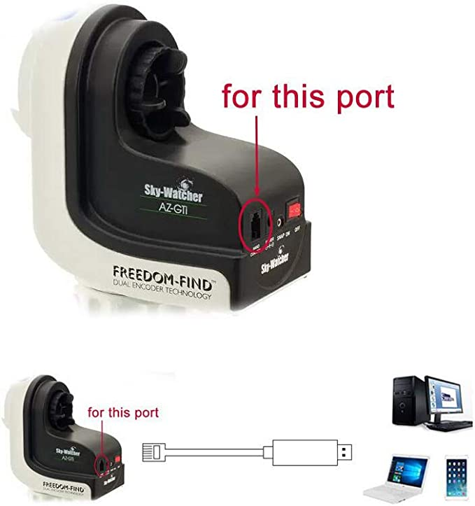
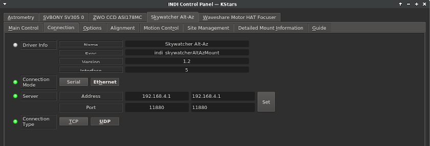
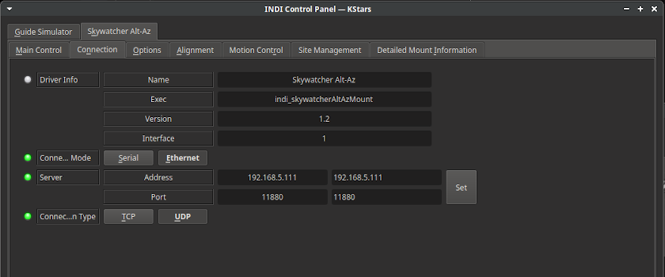
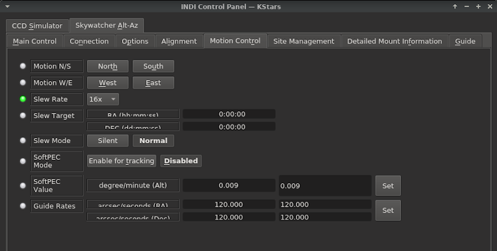
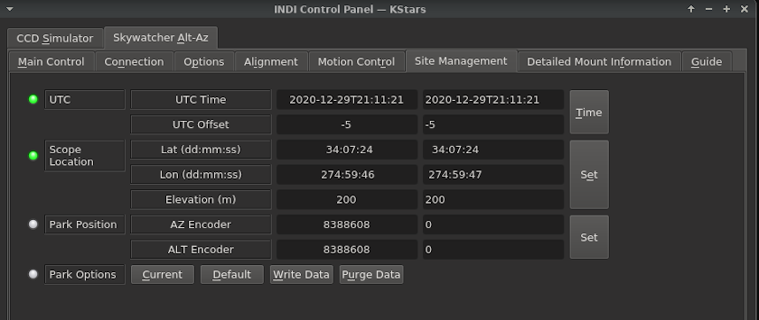
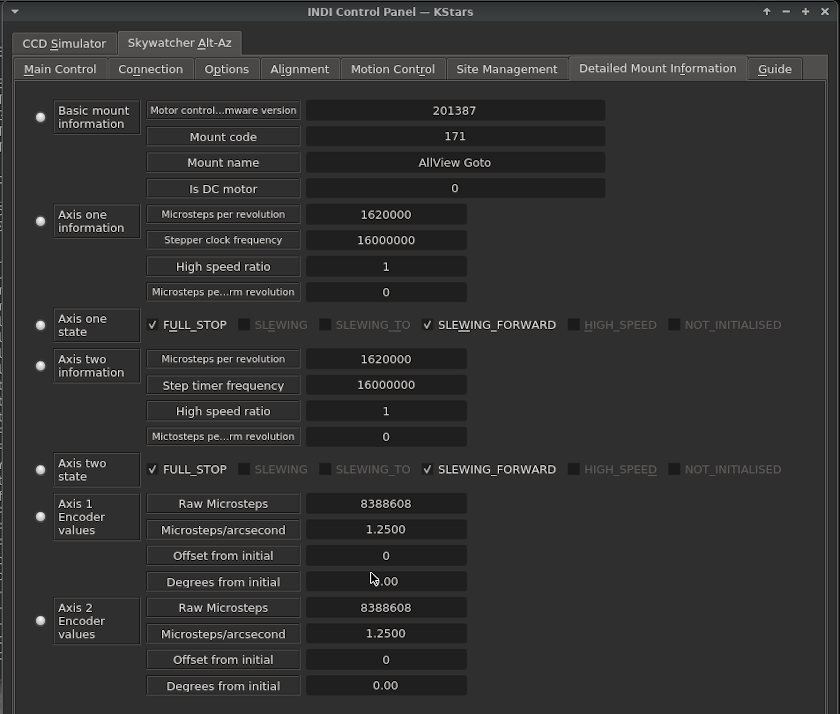
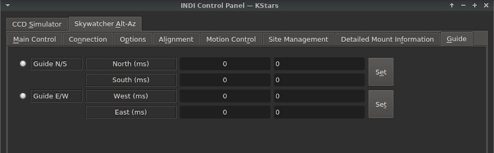

## Features

The driver uses SkyWatcher protocol to directly control Alt-Az mounts without the need for the Synscan hand controller. In addition to general Park/Unpark and GOTO (SLEW) capability, it supports SYNC, TRACK and pulse guiding. It is designed to work with KStars, Ekos and other INDI-compatible planetarium automation platforms.

Current features are:

-   GoTo Coordinates
-   Slew & Sync
-   Slew Rates
-   Sidereal Tracking rate
-   Full joystick support
-   Pulse Guiding

Mount should be in the Park Position (scope horizontal, pointing North) prior to driver connection for best results.

## Connectivity

To ensure proper mount operation and pointing accuracy, connect to mount using either Synscan App OR INDI driver - never both simultaneously. For initial alignment, first perform alignment using Synscan App, then fully disconnect Synscan App before connecting and controlling mount via INDI driver. Running both control systems concurrently will compromise the pointing system and may result in inaccurate GOTO operations.

## There are basically two way to connect your mount to your computer (PC or Raspberry PI/StellarMate): Direct serial cable or Network. In either case you are directly connecting to the motor controller of the mount and the driver does not utilize the services of the Synscan Hand Controller or Synscan app.

### 1. USB

Connect a USB cable from the mount  **directly**  to a USB port on your PC or StellarMate. Depending on your specific mount, you might need to change the default baudrate of 9600 to whichever rate supported by your mount. You can select the USB serial port from the available port detected on the system.

For AZ-GTi mounts in Alt-Az configuration, connect from the RJ12 port to PC/StellarMate using a proper cable.

### 2. Network (WiFi)

Network WiFi connectivity to current SkyWatcher models is available via a built-in WiFi device. Previous models require a WiFi dongle attached to the motor controller. Both WiFi devices operate in much the same way.

The default mode for both the internal and dongle WiFi is HOTSPOT/ADHOC mode and the default address of the motor controller is 192.168.4.1 and the default password is not set. This is important to note, as if no device connects to the motor controller within a given time period (15 minutes to 24 hours, depending on firmware version), the HOTSPOT resets to this default configuration. The default configuration uses DHCP to assign an address when connecting from your computer. The AZ-GTi driver shows a typical network diagram image [here.](https://stellarmate.com/telescopes/skywatcher/az-gti.html)

It is important to note the router in the SkyWatcher HOTSPOT is not robust, and while it will suffice for telescope control and visual astronomy, connecting multiple devices to the internal HOTSPOT router and porting images through it between devices may be beyond its capability. In this case, it may be advantageous to switch to Station Mode and configuring the Wifi as a client to connect to your local WiFi network. With the current model motor controllers that have internal WiFi, this is done using a computer, phone or tablet running the Synscan program or app, and as private netorks vary, is beyond the scope of this tutorial. The image above, however, shows a typical configuration for a home network (192.168.5.0/24) where the telescope address has been set via DCHP to permanently be 192.168.5.111. It is recommended that a static IP be used if setting up on a home WiFi network.

Note that the protocol is UDP and will not work if set to TCP. Presently, all SkyWatcher WiFi motor controllers communicate via UDP.

### 3. First Time Connecting

Enter the appropriate information into the **Connection** tab when running the driver for the first time, then select the **Options** tab and press **SAVE** to save the settings. You may also wish to enter telescope or accessory information in this tab. KStars, Ekos and other programs may make use of these data if provided. If you change settings in future, always remember to return to the **Options** tab to save your settings again.

## Operation

### Main Control

It is most practical to use Ekos or some other INDI client to control the mount, however some basic functions may be performed in the INDI Control Panel. The  **Main Control**  tab shows the current connection and park status. The "Connection" indicator must be green and the mount listed as UnParked for the driver to execute any motion commands. While it may not seem necessary for parking/unparking to be implemented on what is typically a portable mount, parking the scope at the end of the session and unparking it at the beginning of a session may improve initial slew accuracy and may be required for more permanent installations in a domed or automated roof environment. UnPark does not move the mount, however Park will slew the mount and return it to its parked position (horizontal, pointing North).

The "On Set" buttons govern the action to be taken after new "Eq. Coordinates" are set. They may be use to Slew or Sync the mount or simply begin tracking once the "Set" butten is pressed.

"Abort Motion" will command the mount motor system to stop all motion. It may be used to avoid a scope collision with an unexpected obstacle or to halt a slew started by a client or the  **Motion Control**  tab.

### Alignment

The  **Alignment**  tab in the default configuration show show one green indicator at startup for "Alignment Subsystem Active." Other settings on this tab are for specialty applications and advanced use beyond the scope of this tutorial. No adjustment for these parameters is required for general use.

### Motion Control

The "Motion N/S," (North/South) and "Motion W/E" "West/East" may be used to start the scope slewing at the listed "Slew Rate." If you are not using a Joystick or INDI Client with a mount simulator, it may be necessary to press the "Abort Motion" Abort button on the Main Control tab to stop the slew. It is not intended for fine adjustments.

The "Slew Rate" may be adjusted at any time. It is suggested that a low to moderate slew rate be selected initially, whether in the **Motion Control** tab or an INDI compatible Client. Remember to return to the **Option**s tab and save your settings once you have found a setting you like.

"Slew Mode" defaults to "Normal." "Silent" mode is not as loud, but may not allow some of the faster "Slew Rates" on some mounts.

Mounts without SoftPEC may enable "SoftPEC Mode" for tracking. Otherwise, the default setting is "Disabled." It is best to begin with the default SoftPEC value if you Enable SoftPEC.

"Guide Rates" are set to a default of 120.000 arcsec/second for both RA and DEC. Most guiding software will override these values and the current recommendation is to leave them at the default value.

### Site Management

It is critical that the information in the Site Management tab is accurate. KStars-Ekos, GPS add-on devices and some clients will populate these fields if properly configured, however some clients will not. If the startup time/date and Lat/Lon values are incorrect or missing, accurate pointing will not be possible.

### Detailed Mount Information

The  **Detailed Mount Information**  tab is primarily detail for troubleshooting. It shows real-time process during mount operations. The data elements displayed are polled from the mount by the indi driver upon startup.

### Guide

The  **Guide**  tab is for entries of minor adjustments to the pulse guiding system. In most cases, these adjustments are best made within the guiding software. Use with care.