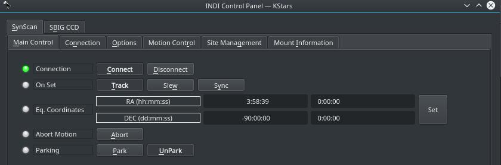
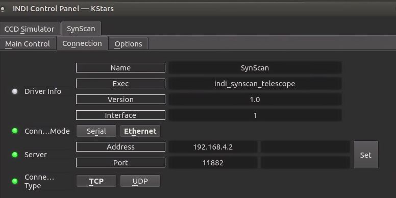
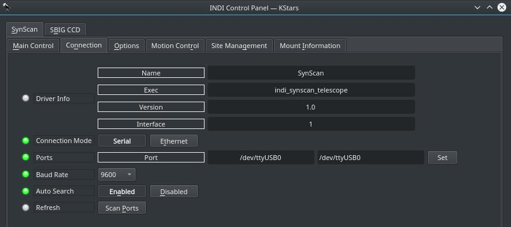
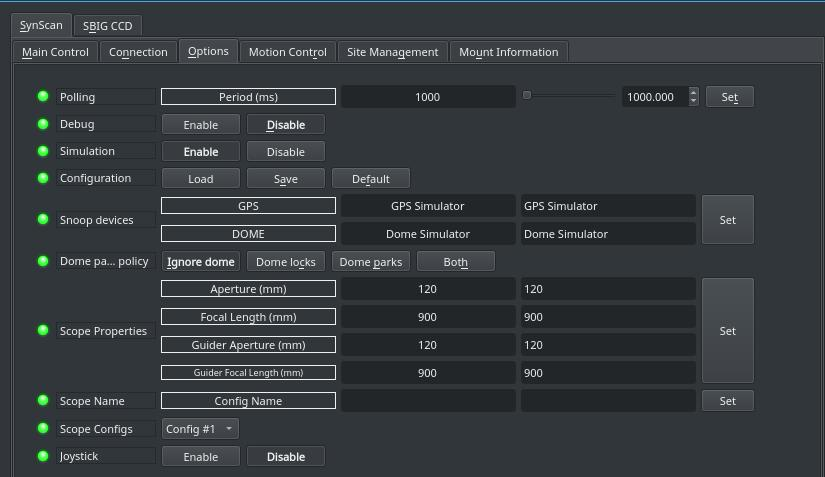
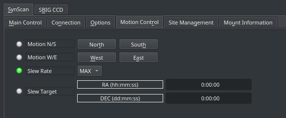
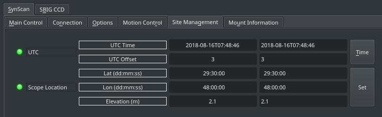

## Features

The driver can control any mount controllable by Synscan hand controller, it offers basic GoTo capability and parking.

Current features are:

-   Slew & Sync
-   Slew Rates
-   Sidereal, lunar, solar and custom trackrates
-   Full joystick support

Synscan Mount should already be aligned and ready before you connect to it.

## Connectivity

To ensure proper mount operation and pointing accuracy, connect to mount using either Synscan App OR INDI driver - never both simultaneously. For initial alignment, first perform alignment using Synscan App, then fully disconnect Synscan App before connecting and controlling mount via INDI driver. Running both control systems concurrently will compromise the pointing system and may result in inaccurate GOTO operations.

## 1. USB

To connect to Syncan from a PC or a device like Raspberry PI, you need an RS232 Serial To USB adapter. After you connect to the USB port, a device port will be created (e.g. /dev/ttyUSBX) that you can connect to in order control the mount.

### 2. Network (Synscan App)

You can connect wirelessly using Synscan App on iOS/Android devices.

1.  Power on the mount , you should see red light blinking and wifi signal with synscan_XXXX)
2.  Connect the iOS/Android device to mount wifi.
3.  Open the app ; connect in EQ mode.
4.  Do 1 star alignment or press up/down/left/right buttons on the app to see if the mount responds to App commands.
5.  Your device should most likely get 192.168.4.2 as the IP Address.
6.  SynScan recommends to keep the app open all times, so turn off display going to sleep on this device.
7.  Connect your Laptop/Desktop/RPI to Mount wifi (SynScan).
8.  Configure the connection options as below. Connection mode as Ethernet IP address to 192.168.4.2 ( IP address of the device having synscan app) Port 11882 Connection Type to TCP

### 4. First Time Connection

When running the driver for the first time, go to the  **Connection**  tab and select the port to connect to. You can also try connecting directly and the driver shall automatically scan the system for candidate ports. If connecting wireless, set the IP address and Port of the Synscan App. After making changes in the Connections tab, go to  **Options**  tab and save the settings.

## Operation

### Main Control

The main control tab is where the primary control of Synscan takes place. To track an object, enter the equatorial of date (JNow) coordinates and press Set. The mount shall then slew to an object and once it arrives at the target location, it should engage tracking at the selected tracking rate which default to Sidereal tracking. Slew mode is different from track mode in that it does not engage tracking when slew is complete. To sync, the mount must be already tracking. First change mode to Sync, then enter the desired coordinates then press Set. Users will seldom use this interface directly since many clients (e.g. KStars) can slew and sync the mount directly from the sky map without having to enter any coordinates manually.

### Options

Under the options tab, you can configure many parameters before and after you connect to the mount.

-   **Snoop Devices**: Indicate which devices Synscan should communicate with:
    -   **GPS**: If using a GPS driver (e.g. INDI GPSD) then enter its name here. Synscan shall sync its time and location settings from the GPS driver.
    -   **Dome**: If using a Dome driver, put its name here so that Dome Parking Policy can be applied.
-   **Configuration**: Load or Save the driver settings to a file. Click default to restore default settings that were shipped with the driver.
-   **Simulation**: Enable to disable simulation mode for testing purposes.
-   **Debug**: Enable debug logging where verbose messaged can be logged either directly in the client or a file. If Debug is enabled, advanced properties are created to select how to direct debug output.  [Watch a video on how to submit logs](https://stellarmate.com/support/logs-submission.html).
-   #### Dome Parking Policy
    
    If a dome is used in conjunction with the mount, a policy can be set if parking the mount or dome can interfere with the safety of either. For example, you might want to always park the mount _before_ parking the dome, or vice versa. The default policy is to ignore the dome.
    
    -   **Ignore dome**: Take no action when dome parks or unparks.
    -   **Dome locks**: **Prevent** the mount from unparking when dome is parked.
    -   **Dome parks**: Park the mount if dome starts parking. This will disable the locking for dome parking, EVEN IF MOUNT PARKING FAILS.
    -   **Both**: Dome locks & Dome parks policies are applied.
    
      
    
-   **Scope Properties**: Enter the Primary and Seconday scope information. Up to six different configurations for _Primary_ and Secondary _Guider_ telescopes can be saved separately, each with an optional unique label in  **Scope Name**  property.
-   **Scope Config**: Select the active scope configuration.
-   **Joystick**: Enable or Disable joystick support. An INDI Joystick driver must be running for this function to work. For more details, check the  [INDI Telescope Joystick](https://stellarmate.com/support/tutorials/135-controlling-your-telescope-with-a-joystick.html)  tutorial.

### Motion Control

Under motion control, manual motion controls along with slew rate controls are configured.

-   **Motion N/S/W/E**: Directional manual motion control. Press the button to start the movement and release the button to stop.
-   **Slew Rate**: Rate of manual motion control above when 1x equals sidereal rate.

### Site Management

Time and Locaiton settings are configured in the Site Management tab. These settings are usually set automatically by the client and do not need to be set manually by the user.

-   **UTC**: UTC time and offsets must be set for proper operation of the driver upon connection. The UTC offset is in hours. East is positive and west is negative.
-   **Location**: Latitude and Longitude must be set for proper operation of the driver upon connection. The longitude range is 0 to 360 degrees increasing eastward from Greenwich.

You can park the telescope by clicking on Park. If the telescope is already parked, click the park button to unpark it. You cannot perform any motion unless the telescope is first unparked!