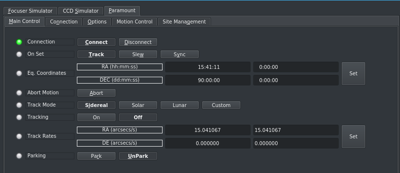
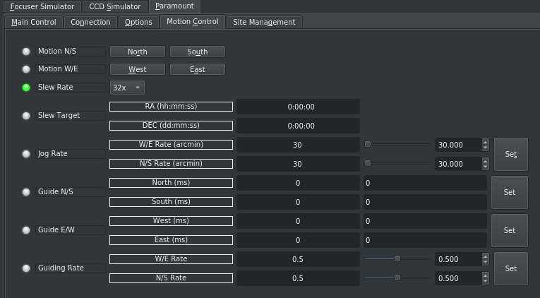
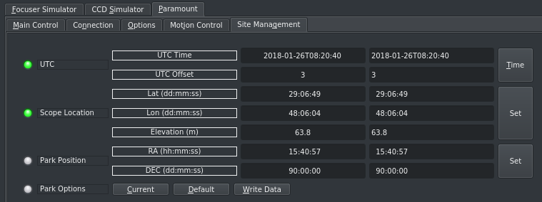
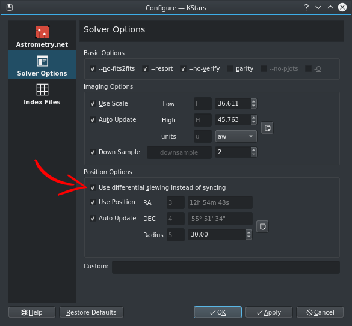

## Features

This INDI paramount driver interacts with Paramount mounts via TheSkyX TCP Server either locally on the same computer or across a network connection. Bisque does not permit a direct control of the mount and so TheSkyX must be started and configured first. To connect to TSX, the TCP server needs to be enabled. In TSX go to Tools->TCP Server. A pop up window will open. Click the check box  Listening For Connections. This option will stay enabled and persist across TSX restarts.

When running on the same computer as TSX, connect to the loopback address of your computer (127.0.0.1). If TSX is on a separate computer, obtain the IP address of the TSX server. The port should be 3040 by default.

Current features are:

-   Goto/Slew/Sync.
-   Park/Unpark with configurable custom parking positions.
-   Slew Rates adjustment
-   Jog Rates adjustment
-   Sidereal, lunar, solar and custom trackrates
-   Guide rate adjustment
-   Pulse-guiding.
-   Full joystick support
-   Ability to take advantage of TSX Tpoint pointing models for accurate pointing
-   Differential slews to target with the Alignment module in Ekos (identical to TSX Closed Loop Slew)

## TSX Preferences

In TheSkyX preferences, make sure to turn off TCP Responses close socket.

## Connectivity

When the INDI Paramount driver is used for the first time, you must set the TSX IP address and port. Go to  **Connection**  tab and see the values, then press set. Then go to  **Options**  tab and click  **Save**  next to Configuration property so that the IP & Port values are saved across sessions.

## Operation

Once Paramount is online, you can control it from your favorite client software just like any other INDI mount driver.

### Main Control

The main control tab is where the primary control of Paramount takes place. To track an object, enter the equatorial of date (JNow) coordinates and press Set. The mount shall then slew to an object and once it arrives at the target location, it should engage tracking at the selected tracking rate which default to Sidereal tracking. Slew mode is different from track mode in that it does not engage tracking when slew is complete. To sync, the mount must be already tracking. First change mode to Sync, then enter the desired coordinates then press Set. Users will seldom use this interface directly since many clients (e.g. KStars) can slew and sync the mount directly from the sky map without having to enter any coordinates manually.

Four tracking modes are supported: Sidereal, Lunar, Solar, and Custom. When using _Custom_ mode, the rates defined in **Track Rates** shall be used. Tracking can be enganged and disenganged by toggling the **Tracking** property.

### Options

Under the options tab, you can configure many parameters before and after you connect to the mount.

-   **Snoop Devices**: Indicate which devices Paramount should communicate with:
    -   **GPS**: If using a GPS driver (e.g. INDI GPSD) then enter its name here. EQMod shall sync its time and location settings from the GPS driver.
    -   **Dome**: If using a Dome driver, put its name here so that Dome Parking Policy can be applied.
-   **Configuration**: Load or Save the driver settings to a file. Click default to restore default settings that were shipped with the driver.
-   **Simulation**: Enable to disable simulation mode for testing purposes.
-   **Debug**: Enable debug logging where verbose messaged can be logged either directly in the client or a file. If Debug is enabled, advanced properties are created to select how to direct debug output. [Watch a video on how to submit logs](https://stellarmate.com/support/logs-submission.html).
-   #### Dome Parking Policy
    
    If a dome is used in conjunction with the mount, a policy can be set if parking the mount or dome can interfere with the safety of either. For example, you might want to always park the mount _before_ parking the dome, or vice versa. The default policy is to ignore the dome.
    
    -   **Ignore dome**: Take no action when dome parks or unparks.
    -   **Dome locks**: **Prevent** the mount from unparking when dome is parked.
    -   **Dome parks**: Park the mount if dome starts parking. This will disable the locking for dome parking, EVEN IF MOUNT PARKING FAILS.
    -   **Both**: Dome locks & Dome parks policies are applied.
-   **Scope Properties**: Enter the Primary and Seconday scope information. Up to six different configurations for _Primary_ and Secondary _Guider_ telescopes can be saved separately, each with an optional unique label in **Scope Name** property.
-   **Scope Config**: Select the active scope configuration.
-   **Joystick**: Enable or Disable joystick support. An INDI Joystick driver must be running for this function to work. For more details, check the [INDI Telescope Joystick](https://stellarmate.com/support/tutorials/135-controlling-your-telescope-with-a-joystick.html) tutorial.

### Motion Control

Under motion control, manual motion controls along with speed and guide controls are configured.

-   **Motion N/S/W/E**: Directional manual motion control. Press the button to start the movement and release the button to stop.
-   **Slew Rate**: Rate of manual motion control above when 1x equals sidereal rate.
-   **Jog Rate**: Jogging rate of N/S/W/E motion in arcmins.
-   **Guide N/S/W/E**: Guiding pulses durations in milliseconds. This property is meant for guider application (e.g. PHD2) and not intended to be used directly.
-   **Guiding Rate**: Guiding Rate for RA & DE. 0.3 means the mount shall move at 30% of the sidereal rate when the pulse is active. The sideral rate is ~15.04 arcseconds per second. So at 0.3x, the mount shall move 0.3*15.04 = 4.5 arcsecond per second. When receving a pulse for 1000ms, the total theoritical motion 4.5 arcseconds.

### Site Management

Time, Locaiton, and Park settings are configured in the Site Management tab.

-   **UTC**: UTC time and offsets must be set for proper operation of the driver upon connection. The UTC offset is in hours. East is positive and west is negative.
-   **Location**: Latitude and Longitude must be set for proper operation of the driver upon connection. The longitude range is 0 to 360 degrees increasing eastward from Greenwich.
-   **Parking**: By default, the parking position is when the OTA to be looking directly at the celestial pole. To restore parking position to the default value, please Default under Park option. You can set a custom parking position using two methods. The mount must be unparked before you can set a new position:
    -   Enter the desired RA & DE values for the custom parking position, then press Set and then press Write Data to save the new parking position.
    -   Slew the mount to the desired parking position, then press Current to sync the encoders position to this value, and then Write Data to save.

You can park the telescope by clicking on Park. If the telescope is already parked, click the park button to unpark it. You cannot perform any motion unless the telescope is first unparked!

If you are using KStars as your INDI client, you can click on any object or location on the Sky Map and then set it as the desired parking position as illustrated below:

### Alignment

Most users of TSX use TPoint to build and maintain the mount model. When using Ekos Alignment Module to perform mount alignment, using the default Slew then Sync behavior might adversely influence the T-Point model. Therefore, it is recommended to turn on Differential Slewing. When differential slewing is used, no syncs are sent to Paramount. The different between actual vs. reported mount position is used to correct for the discrepency. Enable this option in Ekos Alignment Options.

