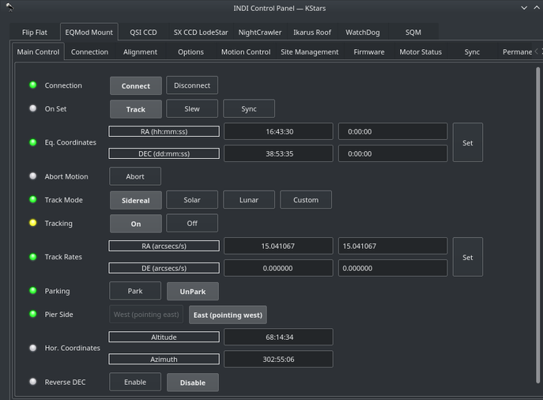
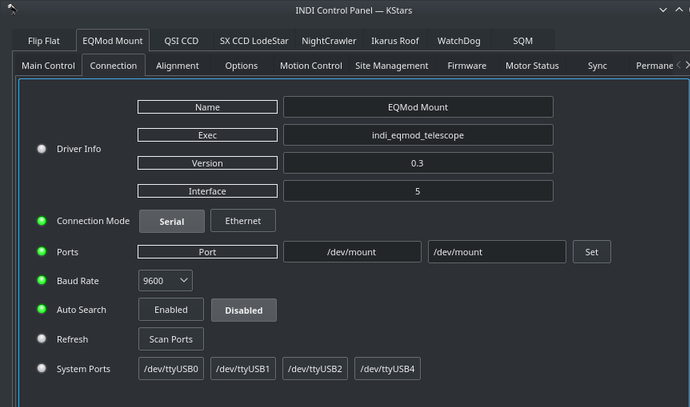
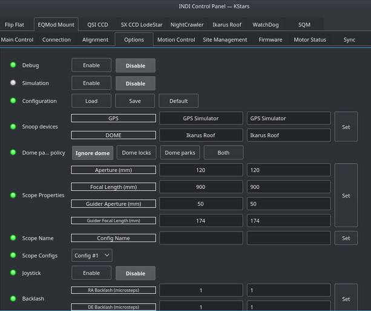
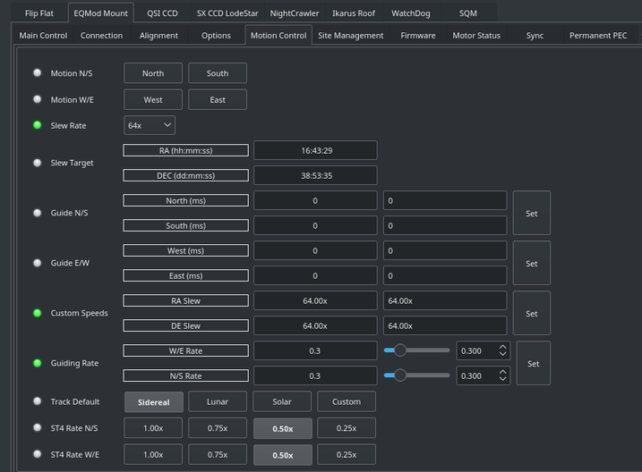
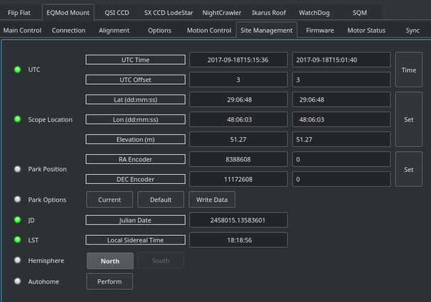
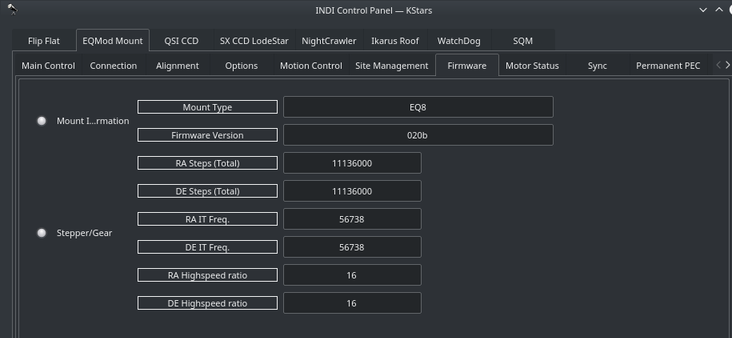

## Installation

INDI Vixen Starbook Driver is released as a 3rd party driver and requires INDI Library >= v1.7.4.

> This is article stub, and still needs update, for more actuall guide head to  [https://github.com/indilib/indi/tree/master/3rdparty/indi-starbook](https://github.com/indilib/indi/tree/master/3rdparty/indi-starbook)

## Features

TODO

Current features are:

-   Goto/Slew

## Connectivity

TODO

### 4. First Time Connection

Before starting the driver, power the mount and make sure it is looking at the celestial pole with the weights down.

When running the driver for the first time, go to the  **Connection**  tab and select the port to connect to. You can also try connecting directly and the driver shall automatically scan the system for candidate ports. If Vixen Starbook is connected the network via a Serial-TCP (Ethernet or WiFi) adapter, then you can select  _Ethernet_  mode and enter the IP address and port for the adapter connected to the mount. After making changes in the Connections tab, go to  **Options**  tab and save the settings.

## Operation

Once Vixen Starbook is online, it loads mount, alignment, parking, and horizontal limits settings if they exist. Its location defaults to the celestial pole unless a custom parking position is set previously.

### Main Control

The main control tab is where the primary control of Vixen Starbook takes place. To track an object, enter the equatorial of date (JNow) coordinates and press Set. The mount shall then slew to an object and once it arrives at the target location, it should engage tracking at the selected tracking rate which default to Sidereal tracking. Slew mode is different from track mode in that it does not engage tracking when slew is complete. To sync, the mount must be already tracking. First change mode to Sync, then enter the desired coordinates then press Set. Users will seldom use this interface directly since many clients (e.g. KStars) can slew and sync the mount directly from the sky map without having to enter any coordinates manually.

Four tracking modes are supported: Sidereal, Lunar, Solar, and Custom. When using  _Custom_  mode, the rates defined in  **Track Rates**  shall be used. Tracking can be enganged and disenganged by toggling the  **Tracking**  property.

### Options

Under the options tab, you can configure many parameters before and after you connect to the mount.

-   **Snoop Devices**: Indicate which devices Vixen Starbook should communicate with:
    -   **GPS**: If using a GPS driver (e.g. INDI GPSD) then enter its name here. Vixen Starbook shall sync its time and location settings from the GPS driver.
    -   **Dome**: If using a Dome driver, put its name here so that Dome Parking Policy can be applied.
-   **Configuration**: Load or Save the driver settings to a file. Click default to restore default settings that were shipped with the driver.
-   **Simulation**: Enable to disable simulation mode for testing purposes.
-   **Debug**: Enable debug logging where verbose messaged can be logged either directly in the client or a file. If Debug is enabled, advanced properties are created to select how to direct debug output.  [Watch a video on how to submit logs](https://stellarmate.com/support/logs-submission.html).
-   #### Dome Parking Policy
    
    If a dome is used in conjunction with the mount, a policy can be set if parking the mount or dome can interfere with the safety of either. For example, you might want to always park the mount _before_ parking the dome, or vice versa. The default policy is to ignore the dome.
    
    -   **Ignore dome**: Take no action when dome parks or unparks.
    -   **Dome locks**: **Prevent** the mount from unparking when dome is parked.
    -   **Dome parks**: Park the mount if dome starts parking. This will disable the locking for dome parking, EVEN IF MOUNT PARKING FAILS.
    -   **Both**: Dome locks & Dome parks policies are applied.
    
      
    
-   **Scope Properties**: Enter the Primary and Seconday scope information. Up to six different configurations for _Primary_ and Secondary _Guider_ telescopes can be saved separately, each with an optional unique label in  **Scope Name**  property.
-   **Scope Config**: Select the active scope configuration.
-   **Joystick**: Enable or Disable joystick support. An INDI Joystick driver must be running for this function to work. For more details, check the  [INDI Telescope Joystick](https://stellarmate.com/support/tutorials/135-controlling-your-telescope-with-a-joystick.html)  tutorial.
-   **Backlash**: Set RA & DEC backlash in microsteps.

### Motion Control

Under motion control, manual motion controls along with speed and guide controls are configured.

-   **Motion N/S/W/E**: Directional manual motion control. Press the button to start the movement and release the button to stop.
-   **Slew Rate**: Rate of manual motion control above when 1x equals sidereal rate.
-   **Guide N/S/W/E**: Guiding pulses durations in milliseconds. This property is meant for guider application (e.g. PHD2) and not intended to be used directly.
-   **Guiding Rate**: Guiding Rate for RA & DE. 0.3 means the mount shall move at 30% of the sidereal rate when the pulse is active. The sideral rate is ~15.04 arcseconds per second. So at 0.3x, the mount shall move 0.3*15.04 = 4.5 arcsecond per second. When receving a pulse for 1000ms, the total theoritical motion 4.5 arcseconds.
-   **Custom Speeds**: Customs speeds in RA & DEC axis when performing slew motion.
-   **Track Default**: Default tracking rate to be used on startup.
-   **ST4 N/S/W/E**: If the mount is receiving guiding pulses via ST4, apply this rate.

### Site Management

Time, Locaiton, and Park settings are configured in the Site Management tab.

-   **UTC**: UTC time and offsets must be set for proper operation of the driver upon connection. The UTC offset is in hours. East is positive and west is negative.
-   **Location**: Latitude and Longitude must be set for proper operation of the driver upon connection. The longitude range is 0 to 360 degrees increasing eastward from Greenwich.
-   **Parking Position**: Upon connection to the mount, Ekos loads these values into the mount's motor controller to initialize the (stepper) motor step values. The default values represent the home position where the mount points to the celestial pole - i.e. 0 deg RA, 90 deg DEC.
-   **Parking**: To set the parking position of the mount to the home position, click “Default”, then "Write Data" - this saves the home values as the parking values. To set the parking position of the mount to a custom position, slew the mount to the desired position and click “Current”, then "Write Data" - this saves the current motor step values as the parking values.
    -   **IMPORTANT**: For the first time Ekos connects to the mount, or if for any reason the parking position has become incorrect. Make sure the mount is in the home position, power up the mount, connect Ekos and set the parking position to home by clicking “Default”, then "Write Data".

Firmware

Firmware tab displays information on the detected mount type and firmware version. Furthermore, the RA/DE steps, frequencies, and gear ratios are displayed.

### Motor Status

The stepper motors positions and work periods are displayed in addition to the status of each motor. If the mount is equipment with auxiliary encoders, then their position shall be displayed

### Alignment

By default the alignment mode is set to N-Star, every time you perform a sync, a new sync point is added to the model. You need to save the alignment points file if you want the driver to utilize them on the next startup. You can perform all these operations in the  _Align_  tab. The Vixen Starbook driver is currently transition to the INDI Alignment Subsystem and this section shall be updated when the transition is over to avoid duplicate information.

Under Options, you can select to utilize INDI's Alignment Subsystem instead of Vixen Starbook's own alignment system. However, the Alignment Subsystem is currently not stable so it is recommended to use Vixen Starbook alignment system which is on by default.

### PEC

PEC training works the same way as with the handcontroller. Guide on a star, engage PEC training and the firmware will wait for the mount pass the worm indexer and then records the resulting speeds in the EEPROM of the motor microcontroller. When it has finished (worm indexer) it toggles a status bit and you can see in the INDI Control panel the status of PEC training becoming green (whereas it remains busy/yellow while training).

PEC/PEC training is enabled in INDI Vixen Starbook for mounts which supports it, EQ8, AZEQ5/6, EQ6R too apparently. It is a motor controller firmware feature, the INDI driver just sends the corresponding commands to start/stop PEC/PEC training and do not then bother about it. Please note that the firmware PEC+guiding may not be a good idea as the firmware changes the motor speed unconditionnally, so some guide commands may be lost.

### Horizon Limits

For horizon limit just slew to the points along the horizon you want to set and hit the Add current button. The order of points is significant as Horizon uses a linear approximation between them. When you have finished hit the Write File button (saved in ~/.indi/HorizonData.txt which you can manually edit also).