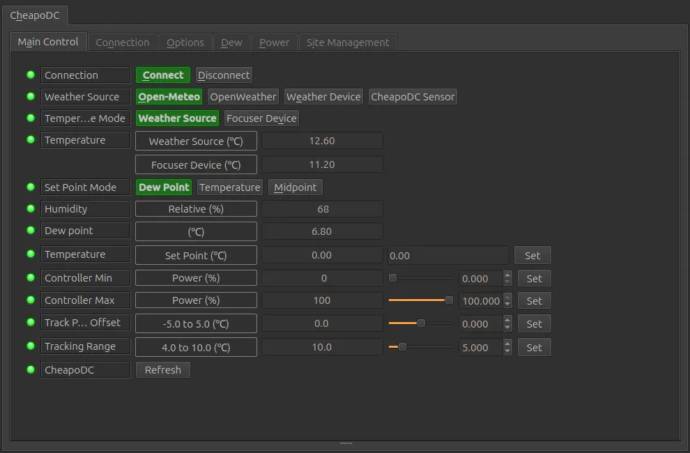
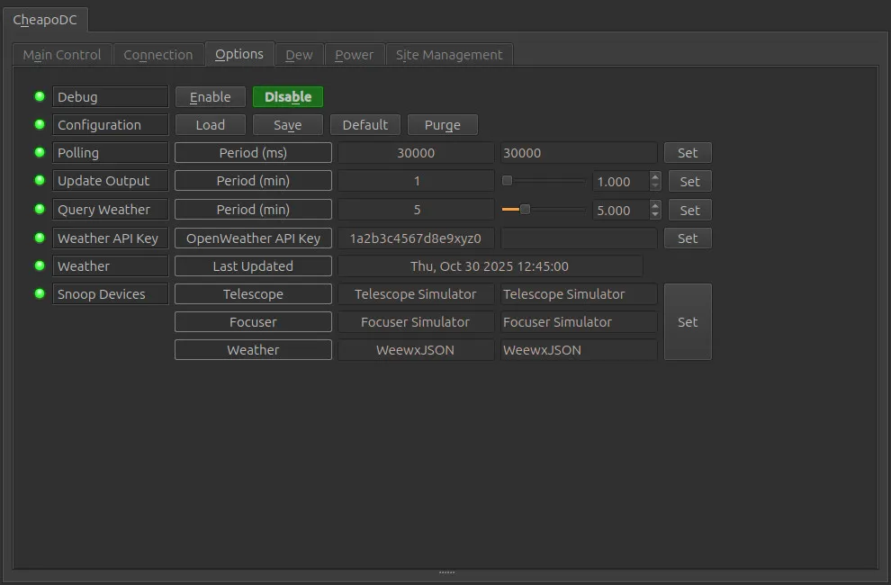
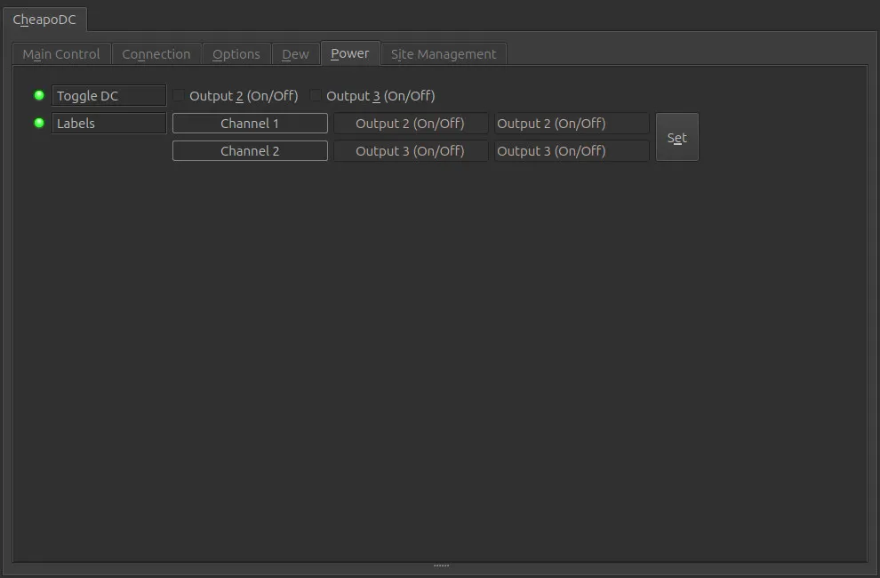

The Cheapo Dew Controller, or CheapoDC, is a low cost, low component count, easy to build DIY dew controller based on an ESP32-C3 supermini. Parts required include the ESP32-C3 supermini, one to five MOSFET modules, a 12V to 5V buck converter, some protoboard, a couple of RCA sockets, a 12V barrel socket and wire. Optionally an SHT-30 humidity module may also be configured. Cost of the parts should be less than $20 for a unit that controls 2 dew heater straps.

## Features

The Cheapo Dew Controller, or CheapoDC, is a low cost, low component count, easy to build DIY dew controller based on an ESP32-C3 supermini. Parts required include the ESP32-C3 supermini, one to five MOSFET modules, a 12V to 5V buck converter, some protoboard, a couple of RCA sockets, a 12V barrel socket and wire. Optionally an SHT-30 humidity module may also be configured. Cost of the parts should be less than $20 for a unit that controls 2 dew heater straps. Details for build and operation of CheapoDC can be found on the [project site](https://github.com/hcomet/CheapoDC)

Current features include:

*   Automated tracking using either [OpenWeather](https://openweathermap.org/) or [Open-Meteo](https://open-meteo.com/) to retrieve ambient temperature, humidity and dew point.
*   Support for an internal Humidity/Temperature sensor for autonomous operation (as of firmware V2.3.0).
*   Designed to work with INDI including the ability to leverage geographic coordinates from your mount, temperature/humidity from a weather device and temperature from your focuser temperature probe.
*   Controller modes supporting both Automated and Manual operation.
*   Flexible dew condition tracking modes supporting multiple methods to calculate output power to the dew controller output channels.
*   Can operate in WiFi Access Point mode in either a semi-Automated or Manual mode if no network or Internet connectivity is available.

A primary goal was to keep the build simple with minimal parts for a minimal low complexity build while also supporting the ability to create a more fully featured autonomous build. This is done by leveraging an ESP32 C3 and a set of off-the-shelf modules. The ESP32 WiFi capability to query one of the open weather service APIs. API queries are used for ambient temperature, humidity and dew point. This is then used for calculating CheapoDC's power output.

Many astrophotographers already have a temperature probe for their electronic focuser and these may be leveraged through the INDI driver. If using one of the INDI weather device drivers these may also be used instead of directly querying an open weather service. However, some may not have internet access or a weather device at there astrophotography rig for weather information. In this case the CheapoDC can also be built with an optional SHT-30 humidity sensor.

The responsiveness and aggressiveness of the controller can be adjusted through the CheapoDC configuration settings. All temperature values reported in the driver interface are in degrees celsius.

When running the driver for the first time, the default Server Address, **cheapodc.local**, should work. If not, go to the **Connection** tab to change the Server Address. Enter your CheapoDC IP address or modified hostname then retry the connection using the Connect button on the **Main Control** tab. After connecting successfully go to the **Options** tab and save the settings.

### Controller Power Output Calculation

Controller output is calculated by determining the position of a reference temperature withing a tracking range. This is outlined below.

#### Output Calculation Variables:

**Set Point** = **_SP_**

* a temperature point set using the **Set Point Mode** selection.

**Reference Temperature** = **_RT_**

* as set using the **Temperature Mode** selection.

**Track Point** = **_TP_**

* the calculated temperature point where the **Tracking Range** starts. A **Reference Temperature** less than or equal to the **Track Point** will cause the controller to use **Maximum Output**.

**Track Point Offset** = **_TPO_**

* a temperature offset applied to the **Set Point** when calcualting the **Track Point** relative to the **Set Point**. The **Track Point Offset** may be set from -5.0&deg;C to 5.0&deg;C. The default is 0.0&deg;C.

**Tracking Range** = **_TR_**

* the temperature range, with the lower end starting at the **Track Point**. The controller output ramps up from **Minimum Output** at the high end of the range to **Maximum Output** at the low end of the range. The range may be set to values from 4.0&deg;C to 10.0&deg;C. The default is 4.0&deg;C.

**Power Output** = **_PO_**

* the percentage of power the controller is outputting to the dew straps. It varies from the **Minimum Output** setting to the **Maximum Output** setting.

**Minimum Output** = **_MinO_**

* the minimum percent power setting for the controller to output when not in the **Off** Controller Mode. Defaults to 0%.

**Maximum Output** = **_MaxO_**

* the maximum percent power setting for the controller to output when at full output. Defaults to 100%.

#### Output Calculation

**TP = SP + TPO**

**IF (RT <= TP) THEN PO=MaxO**

**IF (RT >= (TP + TR)) THEN PO = MinO**

**IF (RT < (TP + TR)) THEN PO=MinO + (MaxO - MinO) \* (1 - ((RT - TP) / TR))**

#### Output Example

The Power Output (PO) curve is shown relative to the Track Point (TP) and the Tracking Range (TR). While the Reference Temperature (RT) is greater than the high end of the Tracking Range the Power Output is set to Minimum Output (MinO). The Power Output ramps up linearly through the Tracking Range from the Minimum Output to the Maximum Output (MaxO) as the Reference Temperature drops.

*   This example shows a Reference Temperature, RT = 8&deg;C, which is greater than the upper end of the Tracking Range,  causing Power Output to be set to Minimum Output. In this case Minimum Output is set to 10%.
*   The upper end of the Tracking Range, at 7&deg;C, is determined from the Set Point (SP = -2&deg;C) plus the Track Point Offset (TPO = 4&deg;C), creating a Tack Point, TP = 2&deg;C, plus the Tracking Range (TR = 5&deg;C).

**Note** The Set Point and the Reference Temperature values may vary from one output calculation to the next with each weather update.

## Operation

### Connection Tab

Connection details are based on the configuration of the hostname set in the CheapoDC CDCWiFi.json file installed on the controller. Only TCP/IP network connections are supported.

*   **Connection Mode**: Only Network is supported.
*   **Server**: CheapoDC uses mDNS with a default hostname of **cheapodc.local** which should allow for an automatic connection. If you changed your CheapoDC hostname you will need to update the server address. Use the default port number of 58000.
*   **Connection Type**: Only TCP is supported.

### Main Control Tab

The Main Control tab is where the different parameters used by the CheapoDC dew controller power output calculation may be set. CheapoDC supports up to 6 outputs numbered 0 through 5. The power to outputs 0 and 1 is always managed by the dew controller settings. Power output or Duty Cycle details for the dew controller is shown in the Dew Tab.

If you can have upt to four additional outputs, numbered 2 through 5. Each output may be set to one of four Output Modes:

*   **Disabled:** Output is disabled. Disabled Outputs will not be displayed.
*   **Controller:** Output power is managed by the dew controller settings.
*   **PWM:** Output power is manually settable from 0 to 100 percent. This is controlled on the Dew Tab.
*   **Boolean:** Output power is either On or Off. This is controlled on the Power Tab.

The configuration of the 6 Outputs **must** be done through the CheapoDC Web UI on the [Device Management](https://github.com/hcomet/CheapoDC/#cheapodc-device-management) page.

**NOTE**: The CheapoDC INDI driver must be stopped and restarted to pick up Output mode changes made through the Web UI.

*   **Connection**: Shows current connection state as well as the ability to **Connect** or **Disconnect**.
*   **Weather Source**: The source used for getting the local weather temperature and humidity which are used by the CheapoDC device to calculate the dew point and output power. The weather source may be:
    *   **Open-Meteo**: The CheapoDC will query the Open-Meteo service every Query Weather seconds for weather updates. Open-Meteo is the default.
    *   **OpenWeather**: The CheapoDC will query the OpenWeather service every Query Weather seconds for weather updates. An API Key is required for weather services from OpenWeather.
    *   **Weather Device**: The CheapoDC will NOT query a weather service but will use temperature and humidity values pushed to it via it's API. A Weather Device must be configured ont the Options Tab in the Snoop Devices section for this setting to work properly. The weather update period is defined by the weather device and should be settable in the weather device driver's configuration tabs.
    *   **CheapoDC Sensor**: The CheapoDC will use temperature and humidity values read from it's internal humidity sensor. This requires CheapoDC firmware 2.3.0 or newer and a humidity sensor properly configured on the device.
*   **Temperature Mode**: Sets the method used for determining the Reference Temperature to use in power output calculations.
    *   **Weather Source**: When in Weather Source mode the Ambient Temperature retrieved from the selected Weather Source will be used for the Reference Temperature. (Default)
    *   **Focuser Device**: When in Focuser Device mode the focuser's temperature will be used for the Reference Temperature. This is the mode to use when snooping temperature values from a Focuser device with a temperature probe. A Focuser Device must be configured on the Options Tab in the Snoop Devices section for this setting to work properly.
*   **Temperature**: Temperature values that may be used for calculating power output.
    *   **Weather Source (&deg;C)**: Ambient temperature returned from the selected Weather Source.
    *   **Focuser Device (&deg;C)**: Temperature returned from a focuser device.
*   **Set Point Mode**: Selects which temperature set point to use in the dew controller output calculation:
    *   **Dew Point**: Use the dew point temperature.
    *   **Temperature**: Use the set point temperature set below.
    *   **Midpoint**: Use a temperature set point calculated as the midpoint between
*   **Humidity**: The relative humidity in percent returned from the selected Weather Source.
*   **Dew Point**: The dew point in &deg;C returned from the selected Weather Source.
*   **Temperature - Set Point**: The temperature to use as the set point when Set Point Mode is set to Temperature.
*   **Controller Min**: Minimum % duty cycle for controller outputs. 0 to (Controller Maximum - 1) (Default 0).
*   **Controller Max**: Maximum % duty cycle for controller outputs. (Controller Minimum + 1) to 100 (Default 100).
*   **Track Point Offset**: Number of degrees celsius to adjust the Track Point. -5.0 to 5.0 (Default 0.0).
*   **Tracking Range**: Number of degrees celsius over which the Output Power will ramp when the Reference Temperature is in this range. 4.0 to 10.0 (Default 5.0).
*   **Refresh**: Force a refresh of values retrieved from CheapDC.

### Options Tab

Under the Options tab, you can configure options for the CheapoDC driver.

*   **Debug**: Not currently supported.
*   **Configuration**: Load/Save/set to Default/Purge the configuration for connection setup as well as Snoop Location and Snoop Temperature settings. CheapoDC controller settings are automatically saved in the controller.
*   **Polling**: Polling defines the period in milliseconds that the driver uses to retrieve data from the dew controller. The default is 30,000 milliseconds or 30 seconds. This is the recommended polling period with an Update Output period of 1 minute.
*   **Update Output**: Period for recalculation of the Output Power in minutes. 1 to 20 (Default 1).
*   **Query Weather**: Period for weather service API or CheapoDC internal sensor queries in minutes. 1 to 20 (Default 5).
*   **Weather API Key**: An API key is required to use [OpenWeather](https://openweathermap.org/) which can be acquired after registering for a free OpenWeather account. If [Open-Meteo](https://open-meteo.com/) is used then no API key is required.
*   **Weather Last Updated**: The date and time of the last weather report update. For Open-Meteo and OpenWeather the update time is taken from service API response. For Weather Device the update time is set every time a weather device value is pushed to the CheapoDC. For CheapoDC Sensor the update time is set on every query of the sensor. The time is reported using local time based on the UTC Offset shown in the Site Management tab.
*   **Snoop Devices**:Set the appropriate active device to be snooped for CheapoDC configuration and updates. Snoop for any of the devices can be disabled by setting the device to blank.
    *   **Telescope**: The telescope driver used to configure GEOGRAPHIC\_COORD for LAT and LONG values shown on the Site Management tab. The UTC Offset is also set from the telescope driver. It is important to configure this correctly so that CheapoDC weather queries are made for the correct geolocation. Default device is Telescope Simulator.
    *   **Focuser**: May be set to a focuser driver if the focuser has a temperature probe. When set the probe temperature will be sent to the CheapoDC and be shown on the Main Control tab in the Temperature - Focuser Device field. If the CheapoDC Temperature Mode is set to Focuser Device then the focuser temperature will be used as the Reference Temperature for calculating output power. Default device is Focuser Simulator.
    *   **Weather**: May be set to a weather driver if there is an indilib weather device such as a personal weather station co-located with your observation location. When set, the temperature and humidity reported by the weather device can be used by CheapoDC. The CheapoDC Weather Source must be set to Weather Device for these values to be pushed to the CheapoDC and be used for calculating output power. Default device is Weather Simulator.

After setting up the device Options, save the configuration using the Configuration - Save button.

### Dew Tab

The Dew Tab is generated as part of the IND::Power Interface. It allows for the enabling of automatic or manual control of dew channels.

*   **Over Voltage**: Not applicable to CheapoDC.
*   **Power Off**: Not applicable to CheapoDC.
*   **Auto Dew Control**: Enables/Disables automatic dew control of the controller outputs. Disabling automatic dew will turn off the controller outputs. Enabling puts the controller outputs in automatic mode.
*   **Toggle Dew**: Toggles Controller and PWM outputs between Manual control and off.
*   **Duty Cycles**: Displays power output as percent of duty cycle (0% to 100%). Also allows for duty cycle adjustments for outputs that have been enabled in the Toggle Dew settings. The default labels are automatically generated by the Output Mode for each CheapoDC output. It is recommended that they not be changed in the Label setting below.
    
    There will always be at least one output channel, the Controller Output channel representing CheapoDC outputs 0 and 1. The duty cycle value will show the current dew controller output. To place the controller in Manual mode, first Auto Dew Control must be disabled then Toggle Dew for Controller Output enabled.
    
    If your CheapoDC has addtional outputs configured, outputs 2 to 5, then Controller and PWD mode outputs will also be displayed. The label for those outputs will be "Output # (mode)" where # is the output number and mode is either Controller or PWM. Controller mode outputs are tied to the dew controller and cannot be enabled or have their duty cycles modified independent of the Controller Output. PWM mode outputs may be enabled or disabled individually. When disabled they are off and when enabled the Duty Cycle may be modified.
    
*   **Labels**: Allows for customization of the dew channel labels. Since the labels are automatically generated by the driver based on your CheapoDC output configuration it is NOT recommended to modify the labels.

### Power Tab

The Power tab is generated by the INDI::Power Interface. A Power tab will be present only if your CheapoDC has at least one of the additional outputs (2 to 5) configured in Boolean Output mode. This makes the outputs On/Off 12V power ports.

*   **Toggle DC**: Turn On/Off a 12V output.
*   **Labels**: Allows for customization of the power channel labels. Since the labels are automatically generated by the driver based on your CheapoDC output configuration it is NOT recommended to modify the labels.

### Site Management Tab

The site management tab may be used to configure the device location used by CheapoDC when making weather queries. By default the CheapoDC driver is configured to get location geographic coordinates from another device such as a telescope or mount. This the preferred configuration.

*   **Location**:
    *   **Lat (dd:mm:ss)**: The Latitude in degrees, minutes and seconds. Values: -90:00:00 to 90:00:00.
    *   **Lon (dd:mm:ss)**: The Longitude in degrees, minutes and seconds. Values: 00:00:00 to 360:00:00.
*   **Device Time**: The local time on the CheapoDC device.
    *   **Local Time**: Local date and time based on UTC offset. Info - Name. (Default Telescope Simulator).
    *   **UTC Offset**: The offset from UTC time in hours. Should be set from the Telescope device. If no telescope device is set then it will be pulled from the CheapoDC device settings.

## Issues

There are no known bugs for this driver. If you find a bug, please report it at INDI's [Github issues](https://github.com/indilib/indi/issues) page.