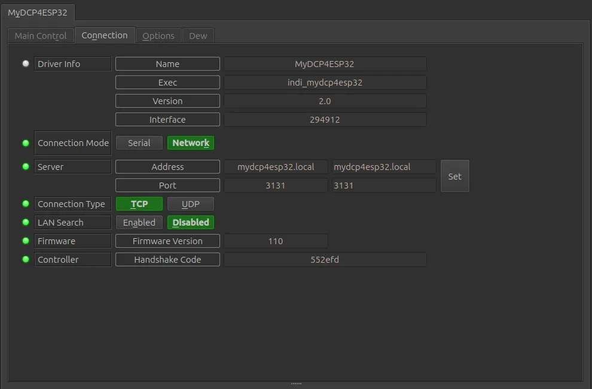
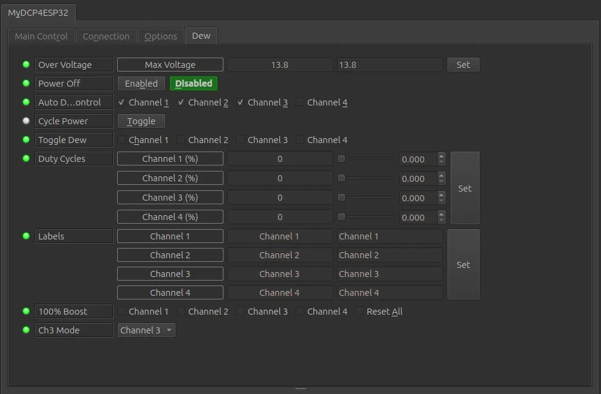

The MyDCP4ESP32 is an enhanced 4-Channel automated Dew Controller designed by Robert Brown, based on an ESP32 WiFi chip. The project is open sourced with details found on the [project site.](https://sourceforge.net/projects/esp32-dew-controller/)

## Features

Current features include:

*   Fully automated standalone operation or monitoring/control from any device
*   4 channel temperature probes and dew channel outputs
*   Tracking modes - Ambient, Midpoint, Dew point
*   Tracking offset can be set to adjust response
*   Offsets can be applied to each channel for compensate for probe variations
*   Channel override support for temporary 100% power boost
*   3rd channel standard, manual and mirroring modes to mirror channels 1 and 2

Before starting the driver, make sure all temperature probes are connected and then power on the controller. All temperature values reported in the driver interface are in degrees celsius.

When running the driver for the first time, go to the **Connection** tab and select Network and the port to connect to. After making changes in the Connection tab, go to **Options** tab and save the settings.

### Determining Power Output to the Dew Straps
    
This information is taken from the project site and is &copy;Robert Brown.

There needs to be a way to calculate how much power to apply to the dew straps based on some value (tracking mode) as well as a range of temperature bands (range) over which the dew strap power is altered.

In general, most dew controllers operate relative to the dew point temperature, and try to maintain the telescope optics temperature at some delta point above the dew point. The myDCP4ESP32 controller has three different methods of maintaining optics temperature which are

*   Ambient
*   Dew point
*   Midpoint

Users are advised to spend an evening session monitoring the values, trying various tracking modes and offset values to determine what they feel is best for their equipment setup. Having the flexibility of adjustment provided by the myDCP4ESP32 unit should meet even the most demanding of situations.

#### Temperature Tracking Algorithms

Power output to a dew controller channel is determined by the tracking mode and the adjusted temperature of channels temperature probe. The output is determined as indicated in the following table.

#### Tracking Examples

**Ambient**

Power output for a channel is determined by the number of degrees celsius the probe temperature is below ambient temperature. If the probe temperature is 5 degrees below ambient then the power output is set to 50% for the dew strap port.

**Dew point**

Power output for a channel is determined by the number of degrees celsius the probe temperature is away from the calculated dew point temperature. As the probe temperature drops towards the dew point power to the dew strap port is increased until it reaches 100% at 1 degree above the dew point.

**Midpoint**

Power output for a channel is determined by the number of degrees celsius the probe temperature is relative to the midpoint between the ambient temperature and the dew point. If the ambient temperature is 20  &deg;C and the dew point is 2  &deg;C then the midpoint is 11  &deg;C, _(AT-DP)/2_. If the probe temperature is at or above 20  &deg;C then output is 0% but as the probe temperature drops below 17  &deg;C, _AT<3_, power is set to 10%. When the probe temperature drops to the midpoint, 11  &deg;C, then power is set to 20% until probe temperature drops to 9  &deg;C, _AT-(((AT-DP)/2)+2)_ where power is set to 50%. At the dew point, 2  &deg;C, and below power is 100%.

**Tracking Offset**

Tracking offset is set in the **Options** tab and affects the algorithms by adjusting them by the offset. For example with Ambient tracking a tracking offset of 3 would adjust the ambient algorithm up 3  &deg;C. This would cause output to be 10% at 2  &deg;C above ambient temperature instead of 1  &deg;C below ambient temperature.

## Operation

### Connection Tab

Connection support is based on the configuration of the firmware when built and installed on the controller. TCP/IP network connections are recommended but serial connections via USB is also supported.

*   **Network**: WiFi connectivity in either Access Point Mode or Station Mode. Use TCP with the default port number of 3131. mDNS support is available with a default name of mydcp4esp32.local otherwise and IP address will need to be used. LAN Search if enable also works if you don't know the IP address.
*   **Serial**: Serial connectivity via USB is supported with a default speed of 57,600 baud.

### Main Control Tab

The Main Control tab is where the tracking mode used for setting the outputs of the dew controller is set and the primary information used by the controller is reported.

*   **Connection**: Shows current connection state as well as the ability to **Connect** or **Disconnect**.
*   **Tracking Mode**: Shows the current tracking mode as well as the ability to change the tracking mode. Details on the tracking modes and how they affect power output is explained above.  
*   **Temperature Ambient**: The adjusted ambient temperature. The raw ambient temperature detected by the controller's sensor plus the **Ambient T Offset**.
*   **Humidity**: The relative humidity detected by the controller's sensor.
*   **Dew Point**: The dew point calculated by the dew controller based on the ambient temperature and relative humidity.
*   **Sensors**: Indicates which dew channels are active based on detecting the presence of a temperature probe. Only those channels with a temperature probe will be active. Channel 3 may be used in Manual mode or Channel 1 or 2 mode (if they are active) even if Channel 3 has no temperature probe. This is a readonly control, clicking on the radio buttons will not cause an action to be executed.
*   **Temperature**: The temperature for each channel. If a channel has no probe then it is not active and will show 0.00  &deg;C.
    *   **Channel 1**: Adjusted temperature reported for channel 1. The raw temperature detected by temperature probe 1 plus the **Channel 1 T Offset**.
    *   **Channel 2**: Adjusted temperature reported for channel 2. The raw temperature detected by temperature probe 2 plus the **Channel 2 T Offset**.
    *   **Channel 3**: Adjusted temperature reported for channel 3. The raw temperature detected by temperature probe 3 plus the **Channel 3 T Offset**.
        *   **Note**: A temperature may only be reported for Channel 3 if the **Ch3 Mode** is set to **Channel 3**.
    *   **Channel 4**: Adjusted temperature reported for channel 4. The raw temperature detected by temperature probe 4 plus the **Channel 4 T Offset**.

### Options Tab

Under the Options Tab, you can configure parameters to optimize the operation of the dew controller.

*   **Debug**: Not currently supported.
*   **Configuration**: Load/Save/set to Default/Purge the configuration. Only the Connection and Polling settings are affected by this control. All other configuration information is automatically saved and recovered from the myDCP4ESP32 dew controller.
*   **Polling**: Polling defines the period in milliseconds that the driver uses to retrieve data from the dew controller. The default is 10,000 milliseconds or 10 seconds. This is also the shortest recommended polling period.
*   **T Offset**: Temperature Offset for the different temperatures reported and used by the controller.
    *   **Tracking**: Temperature Offset used to adjust the three tracking algorithms. The tracking algorithm may be selected on the **Main Control** tab.
    *   **Ambient**: Temperature Offset used to adjust the reported ambient temperature. This will also affect the calculation of the dew point.
    *   **Channel 1**: Temperature Offset used to adjust the reported temperature for Channel 1.
    *   **Channel 2**: Temperature Offset used to adjust the reported temperature for Channel 2.
    *   **Channel 3**: Temperature Offset used to adjust the reported temperature for Channel 3.
    *   **Channel 4**: Temperature Offset used to adjust the reported temperature for Channel 4.

### Dew Tab

The Dew Tab is where channel output is displayed and controlled.

*   **Over Voltage**: Not applicable to the MyDCP4ESP32.
*   **Power Off**: Not applicable to the MyDCP4ESP32.
*   **Auto Dew Control**: Will be enabled for channels with an active temperature probe. Only channel 3 can be disabled if enabled, putting channel 3 into manual mode.
*   **Cycle Power**: Toggle will cause the dew controller to reboot. The MyDCP3ESP32 driver will attempt to reconnect every 10 seconds for up to 60 seconds.
*   **Toggle Dew**: Only channel 3 may be enabled and placed in manual mode.
*   **Duty Cycle**: Shows the current output for a channel. Will allow the output for channel 3 to be manually adjusted if channel 3 is in manual mode.
*   **100% Boost**: Set one or multiple channels to 100% override power for the dew strap. 100% Boost will automatically cancel for each channel after 1 minute. A channel must be active for the 100% override to activate.
*   **Ch3 Mode**: Select the operating mode for Channel 3:
    *   **Disabled**: Disable the operation of Channel 3. No power will be output to the Channel 3 dew strap port.
    *   **Channel 1**: Channel 3 will mirror Channel 1. The power output to the Channel 3 dew strap will be the same as for Channel 1.
    *   **Channel 2**: Channel 3 will mirror Channel 2. The power output to the Channel 3 dew strap will be the same as for Channel 2.
    *   **Manual**: The Channel 3 dew strap power output is manually controlled using the **Duty Cycle** control for Channel 3.
    *   **Channel 3**: If Channel 3 is active the dew strap power will be controlled based on the Channel 3 temperature probe.

## Issues

There are no known bugs for this driver. If you find a bug, please report it at INDI's [Github issues](https://github.com/indilib/indi/issues) page