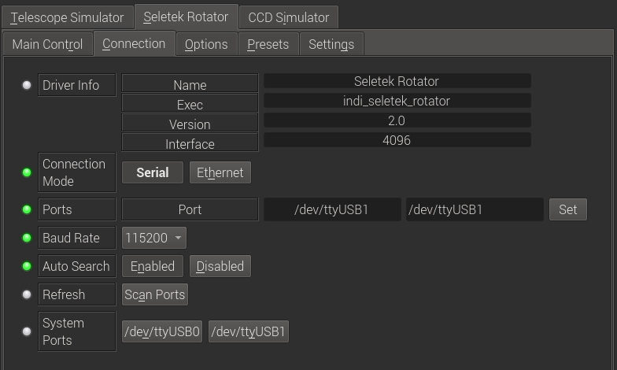
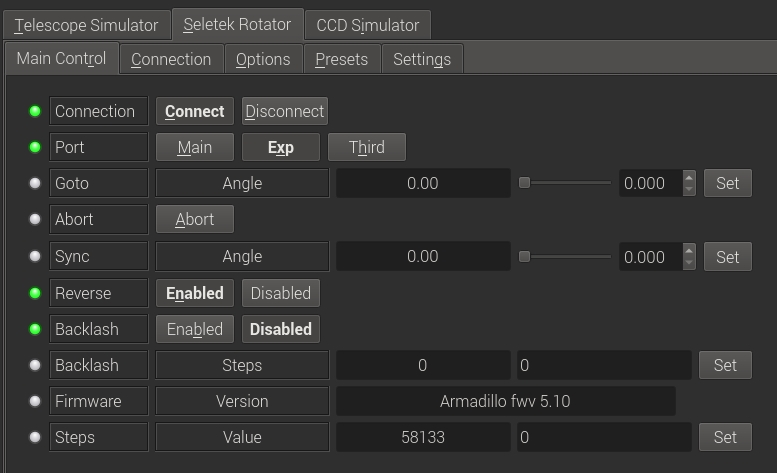
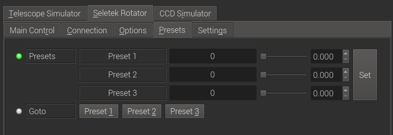
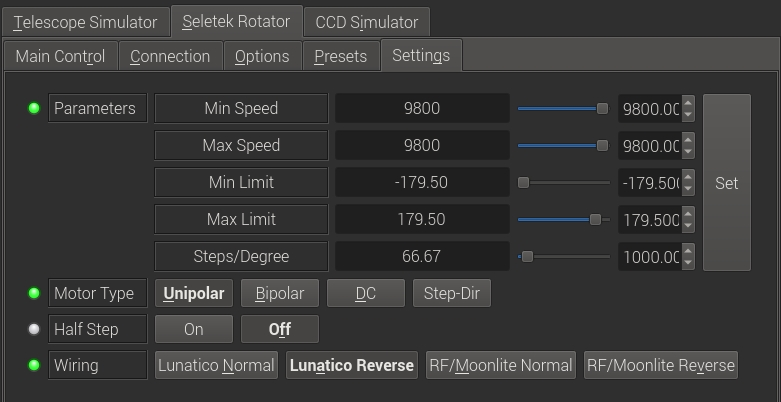

## Features

The Seletek Aramadillo and Playtubus controllers support control for focuser, rotator, and filter wheels. Therefore, any stepper motor can be configured to act as a rotator. There is no primary difference between a focuser and a rotator when using the Seletek controller board, the difference is in the function it serves. For rotators, you are limited by a travel distance from +180 to -180 degrees. Zero degrees is defined as when the camera is pointing UP and completely level.

### Connection

Before connecting, specify the connection port (default /dev/ttyUSB0). You can select from the detected serial ports next to  **System Ports**  property. If you are using a network-enabled controller, click the  _Ethernet_  button and set the IP address and port accordingly. Finally, in the Main Control tab, set which controller port the rotator is connected to (Main, Exp, or Third).

### Main Control

Once connected the current rotator steps and firmware are detected. Upon connecting for the first time, you must first configure the  **Settings**  before commanding any motion.

You can control the rotator by setting the  **Angle**  in the Goto property or by directly specifying the steps in the  **Steps**  property at the bottom. Use  **Sync**  to synchronize the current position angle to the desired value. This does not move the rotator, it only sets its current angle.

The motion direction can be  **Reversed**  if desired, and the backlash compensation can be enabled after setting the desired backlash value in steps.

### Presets

You may set up to 3 preset positions. When you make a change, the new values will be saved in the driver's configuration file and are loaded automatically in subsequent uses.

### Settings

Configure the motion parameters and motor type in settings:

-   **Speed**: Set the minimum and maximum speeds in usec/step.
-   **Limits**: Set the minimum and maximum permitted rotation angle. By default, the rotator can rotate CCW to -179.5 degrees and the same for +179.5. Rotator will always take the shortest distance to the target but it would not cross over the limit. For example, if the rotator is a 170 degrees, and the next target was -170, then it would travel CCW 340 degrees until it rearched the target angle.
-   **Steps/Degree**: How many steps in one degree. Without this setting, angle control will not work.
-   **Motor Type**: Must select the correct motor type (Unipolar, Bipolar, DC, Step-Dir)
-   **Half Step**: Toggle on/off
-   **Wiring**: Select how the rotator is connected to the board.

Warning! All the settings must be correctly set  **before**  command any motor motion. Neglecting the settings may lead to permenant damage to the motor and/or controller.